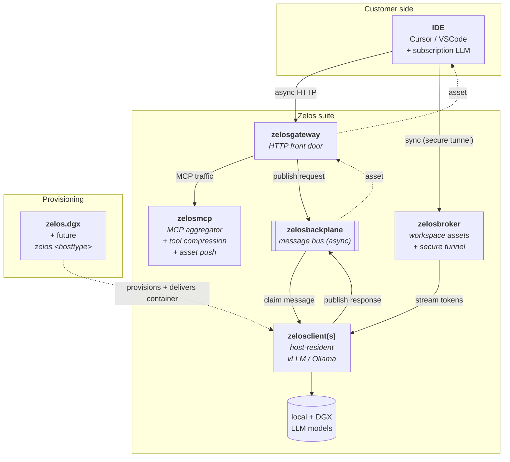

# zelosai

> Parent repository for the Zelos suite — architecture documentation, suite-wide
> templates, and (in a later pass) the Kubernetes operator + Helm charts +
> shared libraries that deliver the rest of the suite.

The Zelos suite sits between developer IDEs (Cursor, VSCode + subscription
LLMs) and a fleet of local + datacenter-hosted models, with two goals:

1. **Reduce subscription token spend** — compress tool catalogs, push reusable
   IDE assets, only spend frontier-LLM tokens on the synthesis step.
2. **Offload work to cheaper compute** — route inference to local single-host
   models, single-DGX systems, or full Kubernetes clusters as appropriate.

## Suite at a glance



| Component | Repo | Lang | Role |
|---|---|---|---|
| **zelosai** | this repo | docs + Go | Architecture hub + suite templates (here). Also hosts the Kubernetes operator (Go + kubebuilder). |
| **zelosmcp** | [ZelosAI/zelosmcp](https://github.com/ZelosAI/zelosmcp) | Python | MCP aggregator + reverse proxy + tool-description compression + IDE asset push. |
| **zelosgateway** | [ZelosAI/zelosgateway](https://github.com/ZelosAI/zelosgateway) | Go | HTTP front door — auth, rate-limit, sync/async dispatch. |
| **zelosbackplane** | [ZelosAI/zelosbackplane](https://github.com/ZelosAI/zelosbackplane) | Go | Message bus / event stream (async path). |
| **zelosclient** | [ZelosAI/zelosclient](https://github.com/ZelosAI/zelosclient) | Go | Host-resident LLM worker (vLLM / Ollama). Runs on provisioned hosts, NOT in Kubernetes. |
| **zelosbroker** | [ZelosAI/zelosbroker](https://github.com/ZelosAI/zelosbroker) | Go | Sync-conversation channel + ephemeral-workspace-share coordinator. Used by BOTH sync (WebSocket subagent channel) and async (workspace mount-coords in NATS envelopes) flows. |
| **zelos-vscode** | [ZelosAI/zelos-vscode](https://github.com/ZelosAI/zelos-vscode) | TypeScript | VS Code extension — IDE-side initiator. Configures broker/MCP endpoints, drives OAuth, opens and tears down workspace shares. |
| **zelosserver** | [ZelosAI/zelosserver](https://github.com/ZelosAI/zelosserver) | Python | Scope TBD — UI / monitoring / doc-config candidate. |
| **zelos.dgx** | [ZelosAI/zelos.dgx](https://github.com/ZelosAI/zelos.dgx) | Ansible | Ansible collection — provisions DGX-class hosts AND delivers zelosclient onto them. |

**Languages per repo.** The four async-path / sync-path daemons
(`zelosgateway`, `zelosbackplane`, `zelosclient`, `zelosbroker`) are Go —
small static binaries, concurrent I/O, no interpreter in the image. The
operator in `zelosai` is also Go (kubebuilder). `zelosmcp` stays Python
(mature FastMCP-based codebase), `zelosserver` stays Python until its
scope firms up, and `zelos-vscode` is TypeScript (VS Code extension).

## Where to start

- **Architecture overview:** [docs/architecture/00-overview.md](./docs/architecture/00-overview.md) — start here.
- **Async path:** [docs/architecture/01-async-path.md](./docs/architecture/01-async-path.md) — IDE → gateway → backplane → client → asset.
- **Sync path:** [docs/architecture/02-sync-path.md](./docs/architecture/02-sync-path.md) — IDE → broker (secure tunnel) → LLM host.
- **Provisioning:** [docs/architecture/03-provisioning.md](./docs/architecture/03-provisioning.md) — bringing hosts online via Ansible.
- **Per-component pages:** [docs/architecture/04-components/](./docs/architecture/04-components/).
- **Suite-wide gitflow:** [docs/architecture/05-gitflow.md](./docs/architecture/05-gitflow.md) — every repo follows this.
- **Naming conventions:** [docs/architecture/06-naming-conventions.md](./docs/architecture/06-naming-conventions.md).

## Templates

The canonical templates every component repo derives from live in
[docs/template/](./docs/template/) — CLAUDE.md, lint/release CI workflows,
Dockerfiles, Makefile, PR template, gitignore, editorconfig, CODEOWNERS.
See [docs/template/README.md](./docs/template/README.md) for the substitution
rules.

## Kubernetes operator (v0.2.0)

This repo now ships a **Go + kubebuilder** operator that manages the rest of
the Zelos suite in Kubernetes. Two CR shapes:

- **Umbrella**: [`ZelosPlatform`](./docs/architecture/08-crds.md#zelosplatform-umbrella)
  composes every component into a single deployable unit.
- **Per-component**: `ZelosGateway`, `ZelosBackplane`, `ZelosMCP`, `ZelosBroker`,
  `ZelosServer`, `ZelosClient` for users who don't want the umbrella.

### Quick start

```bash
# Install the operator (CRDs + RBAC + manager into zelos-system).
kubectl apply -k deploy/operator/

# Bring up a minimum-scaled deployment.
kubectl create namespace zelos
kubectl create secret docker-registry ghcr-pull-secret \
  --namespace=zelos \
  --docker-server=ghcr.io \
  --docker-username=<gh-user> \
  --docker-password=<PAT-with-read:packages>
kubectl apply -f deploy/minimum/zelosplatform.yaml
```

Full step-by-step: [docs/runbooks/minimum-deployment.md](./docs/runbooks/minimum-deployment.md).

### Architecture docs (start here for any operator work)

| # | Doc | Topic |
|---|---|---|
| [07](./docs/architecture/07-container-contract.md) | container-contract | Env vars, secret file paths, persistent state, probes, ports, OTel envs |
| [08](./docs/architecture/08-crds.md) | crds | CRD field reference + mermaid class diagram |
| [09](./docs/architecture/09-dependencies.md) | dependencies | NATS / Redis / Kafka / OAuth / GHCR pull secret / vLLM |
| [10](./docs/architecture/10-image-registry.md) | image-registry | GHCR conventions + pull-secret recipe |
| [11](./docs/architecture/11-telemetry.md) | telemetry | OpenTelemetry logs/metrics/traces pipeline |

### Future direction

Still scoped out of this pass:

- **Helm umbrella chart** with `values-dgx-single.yaml` and `values-k8s-multi.yaml`
  profiles (the operator + Kustomize bundle covers the gap for now).
- **Shared libraries** (`schemas/`) — JSON-Schema envelopes for the backplane,
  distributed as `zelosai-schemas` (Python) and `@zelosai/schemas` (TS).
- The **`zelos-ansible-runner`** container image used by host-provisioning Jobs.

## License

MIT — see [LICENSE](./LICENSE).
