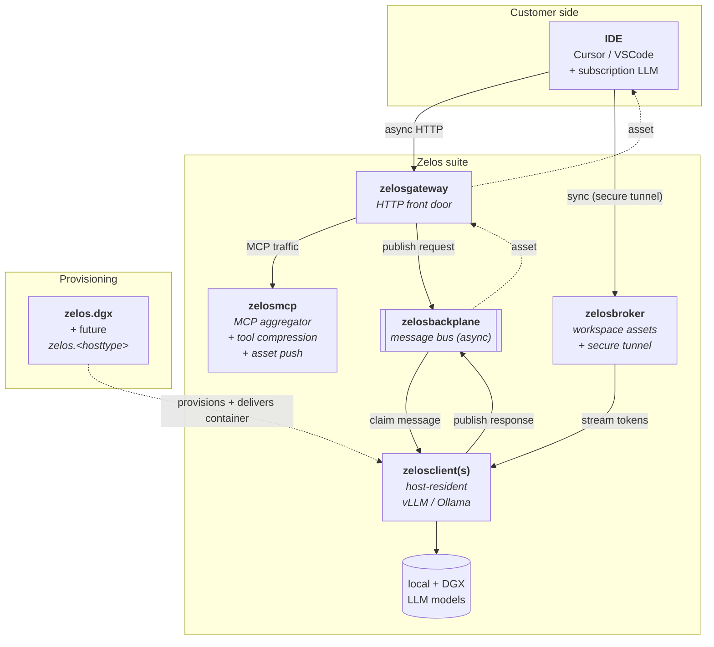

# zelosai

> Parent repository for the Zelos suite — architecture documentation, suite-wide
> templates, and (in a later pass) the Kubernetes operator + Helm charts +
> shared libraries that deliver the rest of the suite.

The Zelos suite sits between developer IDEs (Cursor, VSCode + subscription
LLMs) and a fleet of local + datacenter-hosted models, with two goals:

1. **Reduce subscription token spend** — compress tool catalogs, push reusable
   IDE assets, only spend frontier-LLM tokens on the synthesis step.
2. **Offload work to cheaper compute** — route inference to local single-host
   models, single-DGX systems, or full Kubernetes clusters as appropriate.

## Suite at a glance

| Component | Repo | Role |
|---|---|---|
| **zelosai** | this repo | Architecture hub + suite templates (here). Future: operator + charts + shared libs. |
| **zelosmcp** | [ZelosAI/zelosmcp](https://github.com/ZelosAI/zelosmcp) | MCP aggregator + reverse proxy + tool-description compression + IDE asset push. |
| **zelosgateway** | [ZelosAI/zelosgateway](https://github.com/ZelosAI/zelosgateway) | HTTP front door — auth, rate-limit, sync/async dispatch. |
| **zelosbackplane** | [ZelosAI/zelosbackplane](https://github.com/ZelosAI/zelosbackplane) | Message bus / event stream (async path). |
| **zelosclient** | [ZelosAI/zelosclient](https://github.com/ZelosAI/zelosclient) | Host-resident LLM worker (vLLM / Ollama). Runs on provisioned hosts, NOT in Kubernetes. |
| **zelosbroker** | [ZelosAI/zelosbroker](https://github.com/ZelosAI/zelosbroker) | Asset puller + secure tunnel for synchronous IDE↔LLM (sync path). |
| **zelosserver** | [ZelosAI/zelosserver](https://github.com/ZelosAI/zelosserver) | Scope TBD — UI / monitoring / doc-config candidate. |
| **zelos.dgx** | [kmechlin/ansible-dgx-collection](https://github.com/kmechlin/ansible-dgx-collection) | Ansible collection — provisions DGX-class hosts AND delivers zelosclient onto them. |

## Where to start

- **Architecture overview:** [docs/architecture/00-overview.md](./docs/architecture/00-overview.md) — start here.
- **Async path:** [docs/architecture/01-async-path.md](./docs/architecture/01-async-path.md) — IDE → gateway → backplane → client → asset.
- **Sync path:** [docs/architecture/02-sync-path.md](./docs/architecture/02-sync-path.md) — IDE → broker (secure tunnel) → LLM host.
- **Provisioning:** [docs/architecture/03-provisioning.md](./docs/architecture/03-provisioning.md) — bringing hosts online via Ansible.
- **Per-component pages:** [docs/architecture/04-components/](./docs/architecture/04-components/).
- **Suite-wide gitflow:** [docs/architecture/05-gitflow.md](./docs/architecture/05-gitflow.md) — every repo follows this.
- **Naming conventions:** [docs/architecture/06-naming-conventions.md](./docs/architecture/06-naming-conventions.md).

## Templates

The canonical templates every component repo derives from live in
[docs/template/](./docs/template/) — CLAUDE.md, lint/release CI workflows,
Dockerfiles, Makefile, PR template, gitignore, editorconfig, CODEOWNERS.
See [docs/template/README.md](./docs/template/README.md) for the substitution
rules.

## Future direction

In a follow-up pass, this repo will also contain:

- A **Python + kopf Kubernetes operator** that reconciles the suite onto either
  a large multi-node cluster or a single NVIDIA DGX on k3s.
- A **Helm umbrella chart** with `values-dgx-single.yaml` and `values-k8s-multi.yaml`
  profiles, wrapping one sub-chart per component.
- **Shared libraries** (`schemas/`) — JSON-Schema envelopes for the backplane,
  OpenAPI specs for the HTTP surfaces, distributed as `zelosai-schemas` (Python)
  and `@zelosai/schemas` (TS).
- The **`zelos-ansible-runner`** container image used by the operator's
  `BareMetalHost` Jobs to invoke `zelos.<hosttype>` Ansible collections.

These are scoped out of the current pass; this pass is **repo bootstrapping**.

## License

MIT — see [LICENSE](./LICENSE).
