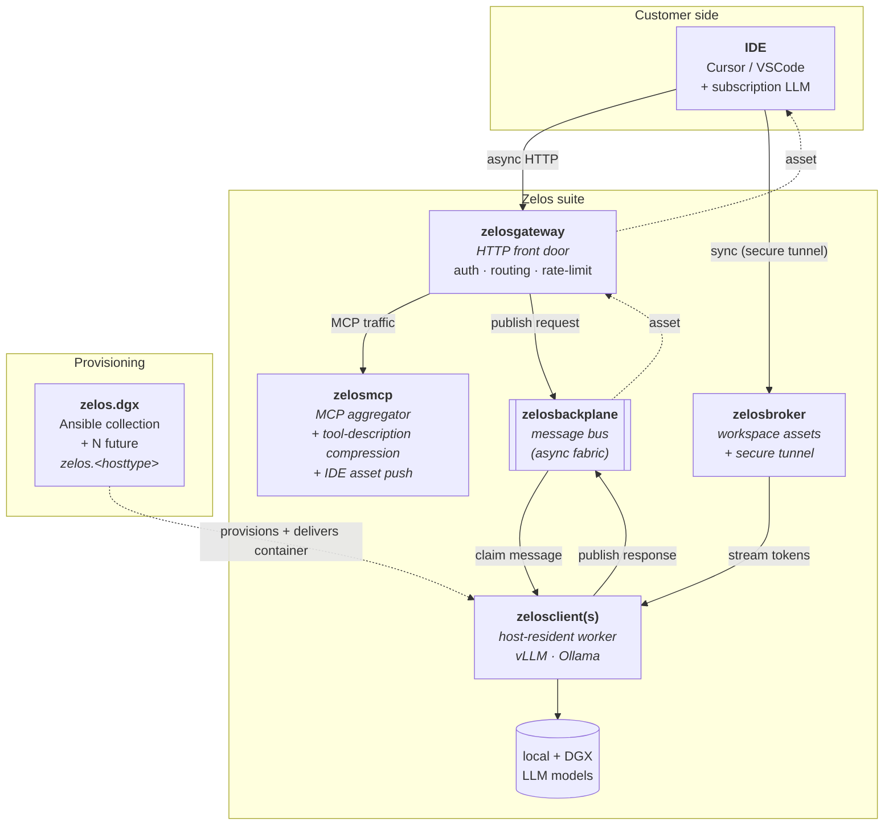
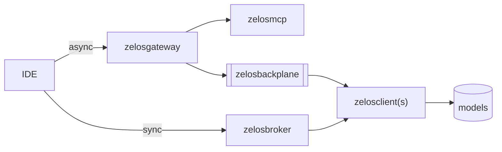

# 00 — Zelos suite overview

## What Zelos is

Zelos is a suite of components that sits between developer IDEs (Cursor, VSCode,
and the like, talking to **subscription LLMs** like Claude or GPT) and a fleet
of **local + datacenter-hosted models** that you control. Its two reasons to exist:

1. **Reduce subscription token spend.** Tool catalogs, repetitive context, and tasks
   that don't need a frontier model all waste budget. Zelos intercepts and reshapes
   that traffic — compressing tool descriptions, managing IDE assets centrally,
   and only spending subscription tokens on the work that genuinely needs them.
2. **Offload work to compute you already own.** Many tasks can run on smaller local
   models or on larger datacenter-hosted models without ever touching the subscription
   LLM. Zelos exposes those models as resources the IDE can route work to, then
   feeds the results back to the IDE as pre-digested **assets** the subscription
   LLM can synthesize over cheaply.

## Components

| Component | Repo | Lang | Role | Status |
|---|---|---|---|---|
| **zelosai** | [ZelosAI/zelosai](https://github.com/ZelosAI/zelosai) | docs | Architecture hub + suite templates. Will also host the future Kubernetes operator, Helm charts, and shared libs. | Bootstrapping |
| **zelosmcp** | [ZelosAI/zelosmcp](https://github.com/ZelosAI/zelosmcp) | Python | MCP aggregator + reverse proxy + tool-description compression + IDE asset push. The "save subscription tokens on tool catalogs" piece. | Mature |
| **zelosgateway** | [ZelosAI/zelosgateway](https://github.com/ZelosAI/zelosgateway) | Go | HTTP front door — terminates IDE / client requests, applies auth and rate-limits, dispatches to zelosmcp (sync MCP) and zelosbackplane (async inference). | Scaffold |
| **zelosbackplane** | [ZelosAI/zelosbackplane](https://github.com/ZelosAI/zelosbackplane) | Go | Message bus / event stream. The async fabric: clients pick up requests, run inference, publish responses. NATS first; substrate kept swappable. | Scaffold |
| **zelosclient** | [ZelosAI/zelosclient](https://github.com/ZelosAI/zelosclient) | Go | Single long-running container that runs **on a provisioned host (not in Kubernetes)**, subscribes to backplane topics, bridges to a local vLLM / Ollama runtime, publishes responses. | Scaffold |
| **zelosbroker** | [ZelosAI/zelosbroker](https://github.com/ZelosAI/zelosbroker) | Go | Asset broker + secure-tunnel endpoint. Pulls customer workspace assets so LLM hosts have the context they need, AND opens a secure tunnel for the sync IDE↔LLM path. The sync-path counterpart to zelosbackplane. | Scaffold |
| **zelosserver** | [ZelosAI/zelosserver](https://github.com/ZelosAI/zelosserver) | Python | Operator-facing **UI portal + config-store API** (dual-purpose): surfaces suite state and stores IDE assets / rules / agents / hooks. Not a monitoring backend. Scope pinned in [13-zelosserver-scope.md](./13-zelosserver-scope.md). | MVP (v0.4) |
| **zelos.dgx** | [kmechlin/ansible-dgx-collection](https://github.com/kmechlin/ansible-dgx-collection) | Ansible | Ansible collection that provisions an NVIDIA DGX-class host AND delivers a `zelosclient` container onto it. First of N future `zelos.<hosttype>` collections. | v0.1.0, not yet hw-validated |

The four async-path / sync-path daemons (`zelosgateway`, `zelosbackplane`,
`zelosclient`, `zelosbroker`) were rewritten in Go after the v0.1.0
bootstrapping pass: long-running concurrent-I/O daemons fit Go's goroutines
+ single-binary distribution better than asyncio + container-with-interpreter.
`zelosmcp` keeps its mature FastMCP-based Python codebase; `zelosserver`
stays Python until scope firms up.

## Two communication paths

Zelos has **two parallel paths** between the IDE and the model fleet, chosen by
latency requirement and workload shape:

- **Async path** — IDE → `zelosgateway` → `zelosbackplane` → `zelosclient`(s) →
  asset published back. Use for heavy or fan-out work where a few seconds of
  queueing is fine: code generation, large-context analysis, plan synthesis.
  See [01-async-path.md](./01-async-path.md).
- **Sync path** — IDE → `zelosbroker` (secure tunnel) → LLM host (synchronous).
  Use for low-latency interactive scenarios where the IDE needs the response in-band:
  short completions, quick chat. See [02-sync-path.md](./02-sync-path.md).

A single IDE session may use both paths concurrently.

## Two deployment targets

The same Zelos suite is designed to run on either of:

- A **large multi-node Kubernetes cluster** (production / shared).
- A **single NVIDIA DGX running k3s** (developer / single-site).

Provisioning and onboarding for the DGX target is handled by the
[`zelos.dgx`](https://github.com/kmechlin/ansible-dgx-collection) Ansible collection;
future host classes will get their own `zelos.<hosttype>` collections following
the same pattern. See [03-provisioning.md](./03-provisioning.md).

## Two paths at a glance

## Where to read next

- [01-async-path.md](./01-async-path.md) — the async request-to-asset flow in detail
- [02-sync-path.md](./02-sync-path.md) — the broker / tunnel sync flow
- [03-provisioning.md](./03-provisioning.md) — bringing hosts online with the Ansible collections
- [04-components/](./04-components/) — one page per component
- [05-gitflow.md](./05-gitflow.md) — the suite-wide gitflow every repo follows
- [06-naming-conventions.md](./06-naming-conventions.md) — repo / image / topic / tag names
- [12-auth.md](./12-auth.md) — OIDC auth termination at the gateway + internal identity propagation
- [13-zelosserver-scope.md](./13-zelosserver-scope.md) — zelosserver's pinned role (UI portal + config-store API)
- [14-deployment-strategies.md](./14-deployment-strategies.md) — the solo / split / full EA topologies
- [15-ansible-collection-conventions.md](./15-ansible-collection-conventions.md) — conventions for all `zelos.*` Ansible collections
- [16-dns-and-hostname-standard.md](./16-dns-and-hostname-standard.md) — the suite DNS / hostname standard (`<service>.<bed-or-cluster>.<product>.<domain>`), dual-cert + split-horizon TLS, and the unified `/oidc` + `/verify-auth` contract
