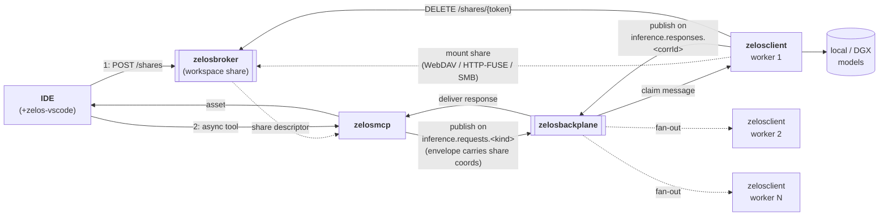
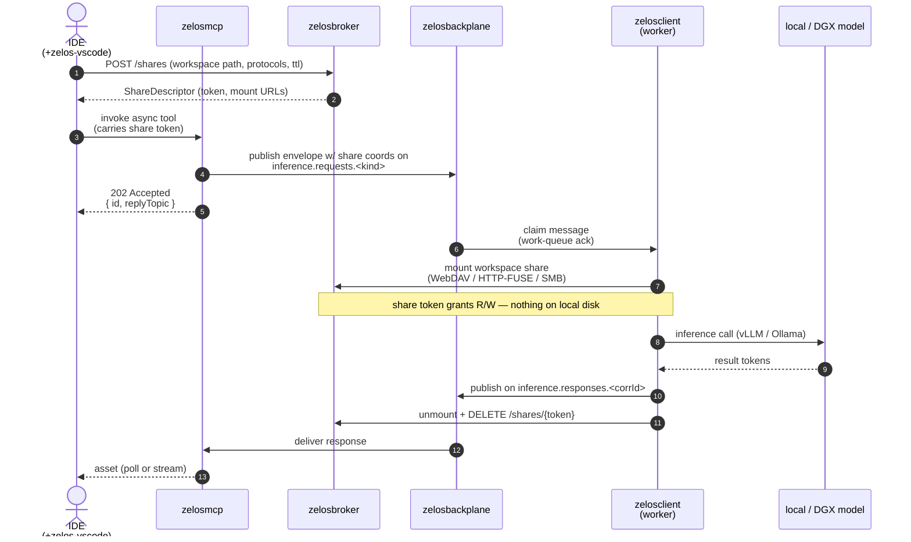

# 01 — Async path

> **TL;DR.** The async path moves work from the IDE to the model fleet through a
> message bus. Latency is bounded by queueing + inference time, not by a single
> HTTP round-trip. Use it for everything that doesn't need to be inline with the
> IDE's keystroke loop.

## When to use it

- Code generation, refactors, multi-file edits — work that may take seconds and
  benefits from being offloaded so the IDE's frontier model only synthesizes the
  final result.
- Analysis tasks: "summarize this repo", "find every place X is wired in",
  "produce a migration plan for Y".
- Anything that fans out — multiple workers can subscribe to the same topic and
  parallelize across hosts in the fleet.

For interactive low-latency turns (short completions, chat replies that need to
be in-band), prefer the [sync path](./02-sync-path.md) via `zelosbroker`.

## Flow

The same flow, step by step (sequence form):

Step by step (narrative):

1. **IDE opens a share.** The [zelos-vscode](./04-components/zelos-vscode.md) extension asks the broker for an ephemeral share of the workspace. The broker returns a `ShareDescriptor` with per-protocol mount URLs and a token.
2. **IDE → zelosmcp (async tool).** The IDE invokes an async-flavoured MCP tool — for example, "analyze this repo" or "generate a multi-file refactor." The invocation carries the share token.
3. **zelosmcp → zelosbackplane.** zelosmcp publishes a request envelope onto a topic on the backplane (e.g. `inference.requests.codegen`). **The envelope carries the share coords** (`share_token`, `share_url`, `share_protocol`, `mount_hint`) — see the envelope JSON-Schemas in [zelosbackplane/schemas/envelopes/v1/](https://github.com/ZelosAI/zelosbackplane/tree/main/schemas/envelopes/v1).
4. **zelosclient(s) → backplane.** One or more workers are subscribed to the topic. The first available worker claims the message (work-queue semantics).
5. **Worker mounts the share.** Using the protocol from the envelope, the worker mounts the broker-served workspace at `mount_hint` on the LLM host. **The customer's files do not land on the worker's local disk** — every read/write streams through the broker.
6. **Inference runs through the mount.** The worker runs inference via its configured runtime (vLLM, Ollama), with the model's tools reading and writing through the mounted share path.
7. **Response published + share released.** Worker publishes the response onto the reply-to topic, then calls `DELETE /shares/{token}` on the broker. The broker signals unmount; the worker drops its FUSE handle. No cache to clear.
8. **Asset back to IDE.** zelosmcp (or a subscribed client-side component) reads the response off the reply-to topic and returns it to the IDE. The IDE's frontier subscription LLM may then **synthesize over** this pre-digested asset rather than producing the heavy content itself.

## Why "assets"

The async path's deliverable is a **usable asset** — a structured response that
the IDE's subscription LLM can consume directly. Examples:

- A code-generation worker doesn't return prose; it returns a diff or a
  set of files that the IDE applies (or that the subscription LLM
  summarizes for the user).
- A repo-analysis worker returns a structured summary (a JSON tree of findings),
  not a long narrative — the subscription LLM is cheaper at narrating over
  data than at producing the data itself.

The token-economics point: subscription LLMs only pay tokens on the
**synthesis** step, not on the heavy work that produced the asset.

## Topic shape

Topic names live in the shared `zelosbackplane` schemas (see
[zelosbackplane/schemas](https://github.com/ZelosAI/zelosbackplane/tree/main/schemas)).
At a minimum:

- `inference.requests.<kind>` — work-queue, retained as a work queue
  (consumed by exactly one worker)
- `inference.responses.<corrId>` — request/reply correlation topic
- `provisioning.events` — events emitted by `BareMetalHost` Ansible Jobs
  and other lifecycle work
- `metrics.*` — optional metrics fan-out

## Components involved

- [zelos-vscode](./04-components/zelos-vscode.md) — IDE-side initiator that
  asks the broker for the workspace share before the tool fires.
- [zelosmcp](./04-components/zelosmcp.md) — receives the IDE tool call and
  publishes the envelope; reads the response back.
- [zelosbroker](./04-components/zelosbroker.md) — coordinates the workspace
  share that the worker mounts. Same primitive the [sync path](./02-sync-path.md) uses.
- [zelosbackplane](./04-components/zelosbackplane.md) — the bus itself
  (NATS for v0.x; substrate kept swappable through a connector abstraction).
- [zelosclient](./04-components/zelosclient.md) — host-resident worker that
  subscribes, mounts the share, runs inference, publishes responses.
- The model fleet — provisioned by [zelos.dgx](./04-components/zelos.dgx.md) on
  DGX-class hosts; future `zelos.<hosttype>` collections will provision other
  host classes the same way.

## Failure modes (for v1 awareness)

- **Worker crash mid-inference.** Work-queue topics with explicit ack mean the
  message becomes redeliverable after a visibility timeout. Pick durable + ack
  semantics on `inference.requests.*`. The replacement worker calls into the
  broker with the same share token and remounts; the share TTL is sized to
  cover one redelivery cycle.
- **Slow worker.** The IDE shouldn't block. zelosmcp returns a request ID
  immediately; the IDE polls or subscribes for the response.
- **Share TTL expiry.** The broker rejects mount calls past TTL. The envelope
  includes a "share-stale" hint so a too-late worker gives up instead of
  failing partway through.
- **Backplane partition.** The [sync path](./02-sync-path.md) via the
  broker's WebSocket channel is the fallback when NATS is unreachable but
  the IDE still needs an answer (same broker, different conversation transport).
