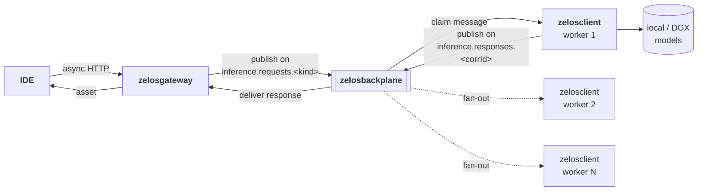
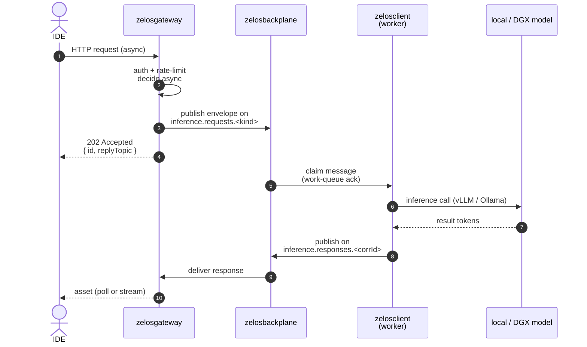

# 01 — Async path

> **TL;DR.** The async path moves work from the IDE to the model fleet through a
> message bus. Latency is bounded by queueing + inference time, not by a single
> HTTP round-trip. Use it for everything that doesn't need to be inline with the
> IDE's keystroke loop.

## When to use it

- Code generation, refactors, multi-file edits — work that may take seconds and
  benefits from being offloaded so the IDE's frontier model only synthesizes the
  final result.
- Analysis tasks: "summarize this repo", "find every place X is wired in",
  "produce a migration plan for Y".
- Anything that fans out — multiple workers can subscribe to the same topic and
  parallelize across hosts in the fleet.

For interactive low-latency turns (short completions, chat replies that need to
be in-band), prefer the [sync path](./02-sync-path.md) via `zelosbroker`.

## Flow

The same flow, step by step (sequence form):

Step by step (narrative):

1. **IDE → zelosgateway.** The IDE issues an HTTP request to the gateway.
   The gateway authenticates the caller, applies rate limits, and decides
   "this is async work" based on the request type (or an explicit header).
2. **zelosgateway → zelosbackplane.** Gateway publishes a request envelope onto
   a topic on the backplane (e.g. `inference.requests.codegen`). The envelope
   carries: `id`, `ts`, `source`, `kind`, `traceId`, `payload`. The payload
   includes prompt, model hint, context refs, and a reply-to topic.
3. **zelosclient(s) → backplane.** One or more `zelosclient` workers are
   subscribed to the relevant topic. The first available worker claims the
   message (work-queue semantics), runs inference via its configured runtime
   (vLLM, Ollama, …), and publishes the response onto the reply-to topic.
4. **Asset back to IDE.** The gateway (or a subscribed client-side component)
   reads the response off the reply-to topic and returns it to the IDE.
   The IDE's frontier subscription LLM may then **synthesize over** this
   pre-digested asset rather than producing the heavy content itself.

## Why "assets"

The async path's deliverable is a **usable asset** — a structured response that
the IDE's subscription LLM can consume directly. Examples:

- A code-generation worker doesn't return prose; it returns a diff or a
  set of files that the IDE applies (or that the subscription LLM
  summarizes for the user).
- A repo-analysis worker returns a structured summary (a JSON tree of findings),
  not a long narrative — the subscription LLM is cheaper at narrating over
  data than at producing the data itself.

The token-economics point: subscription LLMs only pay tokens on the
**synthesis** step, not on the heavy work that produced the asset.

## Topic shape

Topic names live in the shared `zelosbackplane` schemas (see
[zelosbackplane/src/zelosbackplane/schemas](https://github.com/ZelosAI/zelosbackplane/tree/main/src/zelosbackplane/schemas)).
At a minimum:

- `inference.requests.<kind>` — work-queue, retained as a work queue
  (consumed by exactly one worker)
- `inference.responses.<corrId>` — request/reply correlation topic
- `provisioning.events` — events emitted by `BareMetalHost` Ansible Jobs
  and other lifecycle work
- `metrics.*` — optional metrics fan-out

## Components involved

- [zelosgateway](./04-components/zelosgateway.md) — terminates the IDE request,
  decides sync vs. async, publishes onto the backplane.
- [zelosbackplane](./04-components/zelosbackplane.md) — the bus itself
  (NATS first; substrate kept swappable through a connector abstraction).
- [zelosclient](./04-components/zelosclient.md) — host-resident worker that
  subscribes, runs inference, publishes responses.
- The model fleet — provisioned by [zelos.dgx](./04-components/zelos.dgx.md) on
  DGX-class hosts; future `zelos.<hosttype>` collections will provision other
  host classes the same way.

## Failure modes (for v1 awareness)

- **Worker crash mid-inference.** Work-queue topics with explicit ack mean the
  message becomes redeliverable after a visibility timeout. Pick durable + ack
  semantics on `inference.requests.*`.
- **Slow worker.** The IDE shouldn't block. The gateway returns a request ID
  immediately; the IDE polls or subscribes for the response.
- **Backplane partition.** The sync path via `zelosbroker` is the fallback for
  scenarios where the async fabric is unavailable but the IDE still needs an answer.
