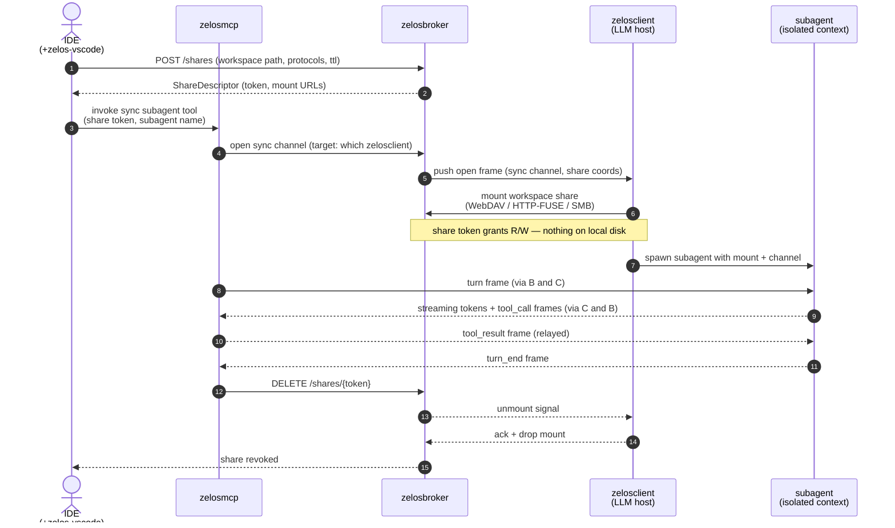

# 02 — Sync path

> **TL;DR.** The sync path is for interactive sub-agent runs where the IDE
> wants a response *in-band* with a live conversation. zelosmcp routes
> the call to a sync subagent on a specific LLM-host client via a
> **WebSocket channel** terminated at zelosbroker, and the subagent reads
> and writes through a broker-coordinated **ephemeral workspace share**.

## When to use it

- Custom subagents defined as a zelosmcp tool, where the IDE invokes the tool
  to start a focused conversation with isolated context (e.g. "review this PR",
  "refactor this file", "search the workspace for X and summarize").
- Short multi-turn interactions where the IDE needs to see streaming tokens
  *and* the subagent needs to call back into zelosmcp tools.
- Any case where dispatching to a NATS work-queue would feel slow because the
  conversation involves many small turns.

For batch or fan-out work — many independent tasks dispatched to whichever
zelosclient is free — prefer the [async path](./01-async-path.md).

## Flow

Step by step:

1. **IDE opens a share.** Via the [zelos-vscode](./04-components/zelos-vscode.md) extension, the IDE asks the broker to stage an ephemeral share of the workspace directory. The broker returns a `ShareDescriptor` with per-protocol mount URLs and a token.
2. **IDE invokes a sync tool exposed by zelosmcp.** This is what makes it "sync" — the tool maps to a custom subagent definition. The IDE passes the share token along with the invocation.
3. **zelosmcp opens a sync channel through the broker.** WebSocket bidi. The broker picks (or is told) which specific zelosclient to relay to.
4. **The chosen zelosclient mounts the share.** Using whichever protocol the descriptor offers (and the customer prefers). The share token is the only credential.
5. **Subagent runs with isolated context.** A separate conversation thread on the LLM host, with its own system prompt + skills + hooks (loaded from zelosmcp artifacts). Reads and writes go through the mount.
6. **Streaming turns flow back.** Tokens stream IDE-ward through MCP → broker → IDE in real time. Tool calls flow the other way; tool results come back from MCP.
7. **Teardown.** When the subagent finishes (or the IDE closes the session), zelosmcp signals broker `DELETE /shares/{token}`; broker tells all mounting clients to unmount; both sides clean up. No files persist.

## Two reasons the broker exists

### Reason 1 — file safety

The customer's workspace bytes should not land on the LLM host's local disk.
The mount streams every read/write through the broker; when the share is
revoked there's nothing to clean up because there was never a cache. The same
share mechanism is used by the async path (see [01-async-path.md](./01-async-path.md)) — the broker is the single primitive both flows route through for workspace access.

### Reason 2 — isolated conversation context

Custom subagents are useful precisely because they have a *narrower* context
window than the IDE's main subscription LLM. A "review-this-PR" subagent
doesn't need (and should not see) the rest of the IDE's conversation history.
The sync channel keeps the subagent's turns isolated from the user's main
chat — they share zero context unless zelosmcp explicitly forwards material.

## Share protocols

Three protocols, chosen per-share via the IDE-side preference:

| Protocol | Best for | Status |
|---|---|---|
| **WebDAV over HTTPS** | macOS, mixed-OS deployments | v0.3 ([#11](https://github.com/ZelosAI/zelosbroker/issues/11)) |
| **HTTP-FUSE** | Linux LLM-host containers (zero external mount tool) | v0.3 ([#11](https://github.com/ZelosAI/zelosbroker/issues/11)) |
| **SMB** | Windows IDE hosts, native Finder on macOS | v0.4 ([#13](https://github.com/ZelosAI/zelosbroker/issues/13)) |

See [zelosbroker/docs/share-protocols.md](https://github.com/ZelosAI/zelosbroker/blob/main/docs/share-protocols.md).

## Sync channel transport

WebSocket over HTTPS, library `coder/websocket`. Bi-directional, long-lived,
plays well with corporate egress. See [zelosbroker/docs/sync-channel.md](https://github.com/ZelosAI/zelosbroker/blob/main/docs/sync-channel.md)
for the frame schema and lifecycle.

## Optional WireGuard wrap

For customers who want IDE↔LLM-host traffic in an encrypted overlay, the
broker can emit WG peer configs and signal both sides to bring up the tunnel.
**Optional** — HTTPS already provides auth + encryption end-to-end. Lands in
[#12](https://github.com/ZelosAI/zelosbroker/issues/12).

## Components involved

- [zelos-vscode](./04-components/zelos-vscode.md) — the IDE-side initiator.
  Configures broker URL, signs in, opens shares, surfaces status.
- [zelosbroker](./04-components/zelosbroker.md) — share coordinator + sync
  channel.
- [zelosmcp](./04-components/zelosmcp.md) — tool surface; routes the IDE
  invocation either to the sync channel (this path) or the async queue.
- [zelosclient](./04-components/zelosclient.md) — runs on the LLM host; mounts
  the share and runs the subagent process.

## Relationship to the async path

Both paths share the broker for workspace mounts. The difference is the
**conversation transport** between zelosmcp and the LLM-host client:

| | Sync path | Async path |
|---|---|---|
| Conversation transport | WebSocket via zelosbroker | NATS topics via zelosbackplane |
| Worker selection | broker picks one specific zelosclient | any zelosclient subscribed to the topic |
| Latency | one RTT + inference | enqueue + dequeue + RTT + inference |
| Workspace access | broker share (same primitive) | broker share (same primitive) |
| Use case | interactive subagent runs | batch / fan-out work |
| Response shape | streaming tokens + tool calls | one structured envelope back |

A single IDE session uses both — sync for custom subagent tools, async for
"run this analysis across the whole repo."
