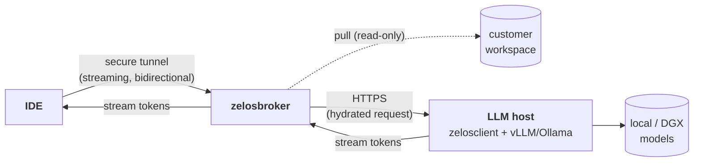
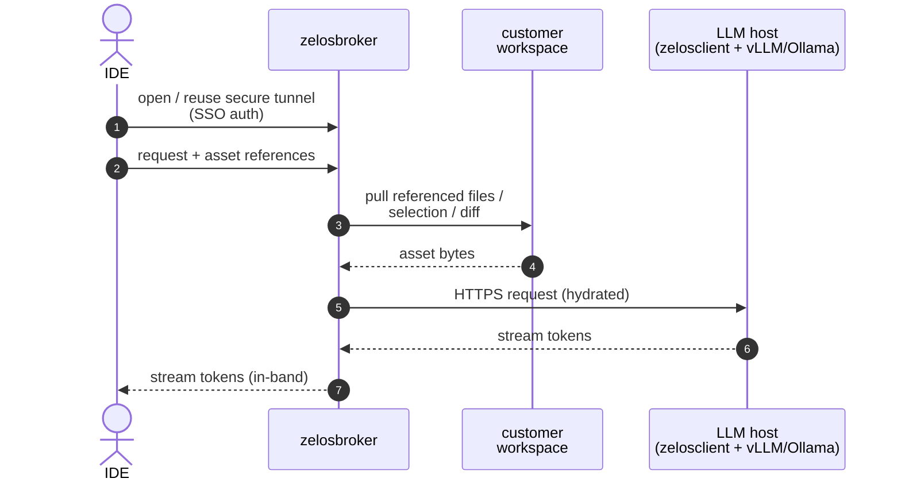

# 02 — Sync path

> **TL;DR.** The sync path lets the IDE talk directly to a Zelos LLM host
> through a secure tunnel managed by `zelosbroker`. Use it when the IDE needs the
> response *in-band* (low-latency, interactive) and queueing through the
> async backplane would feel slow.

## When to use it

- Short completions where the user is actively typing.
- Quick chat / Q&A turns under a couple of seconds.
- Any scenario where a few hundred milliseconds of queueing latency would be
  user-perceptible.
- Fallback path when the async backplane is unreachable.

For heavy work, large contexts, or fan-out — prefer the
[async path](./01-async-path.md).

## Flow

The same flow, step by step (sequence form):

Step by step (narrative):

1. **IDE → zelosbroker.** The IDE opens (or reuses) a long-lived secure tunnel to
   the broker. Authentication uses the same SSO / token issuer the rest of the
   suite trusts.
2. **Asset hydration.** Before forwarding the request, the broker pulls any
   referenced **workspace assets** (specific files, the active selection, a
   diff range) from the IDE's workspace so the LLM host has the context it
   needs without the IDE having to inline it.
3. **Broker → LLM host.** Broker forwards the (hydrated) request directly to a
   chosen LLM host's HTTP endpoint — typically an OpenAI-compatible vLLM or
   Ollama API on a `zelosclient`-equipped host. The response streams back through
   the same tunnel in real time.
4. **Response → IDE.** The IDE receives the streaming response inline, the same
   way it consumes a subscription LLM today.

## Why a broker (and not just a direct call)?

- **Workspace asset access without leaking the IDE host.** The broker has narrow,
  audited access to the customer workspace; the LLM host never reaches into the
  IDE machine.
- **Tunnel multiplexing.** A single secure tunnel handles many concurrent IDE
  requests across many LLM hosts. Each host doesn't need its own ingress.
- **Routing.** The broker picks the right LLM host per request (model hint,
  free capacity, locality) so the IDE doesn't have to know the fleet shape.
- **Authentication boundary.** Customer-side auth (SSO / IDE tokens) terminates
  at the broker; Zelos-side auth to LLM hosts is internal.

## Transport (v1)

Transport substrate is **not pinned** in v1 — candidates include Tailscale,
WireGuard, mTLS over WebSocket, or an SSH-tunnel based scheme. The choice
should be:

- **Bidirectional, streaming**, so token-by-token responses flow back to the IDE.
- **Long-lived**, so per-turn setup cost is amortized.
- **Compatible with the customer's network policy** — many customers will run
  this from inside corp networks behind TLS-intercepting proxies.

Decision and rationale live in
[zelosbroker/docs/](https://github.com/ZelosAI/zelosbroker/tree/main/docs)
once chosen.

## Components involved

- [zelosbroker](./04-components/zelosbroker.md) — the broker / tunnel endpoint
  on the customer side.
- An LLM host running [zelosclient](./04-components/zelosclient.md) (or the
  vLLM / Ollama HTTP API that zelosclient fronts) — the actual inference.
- The model fleet, provisioned by [zelos.dgx](./04-components/zelos.dgx.md)
  (and future `zelos.<hosttype>` collections).

## Relationship to the async path

Both paths share the same model fleet and the same auth substrate. The
difference is the **transport** between IDE and fleet:

| | Sync path | Async path |
|---|---|---|
| Carrier | secure tunnel via `zelosbroker` | message bus via `zelosbackplane` |
| Latency | RTT + inference | queue + RTT + inference |
| Use case | interactive, short turns | heavy or fan-out work |
| Fan-out | one tunnel per request | N workers can subscribe to one topic |
| Response shape | streaming tokens | a structured asset |

A single IDE session uses both — sync for typing-loop turns, async for
"run this analysis across the whole repo".
