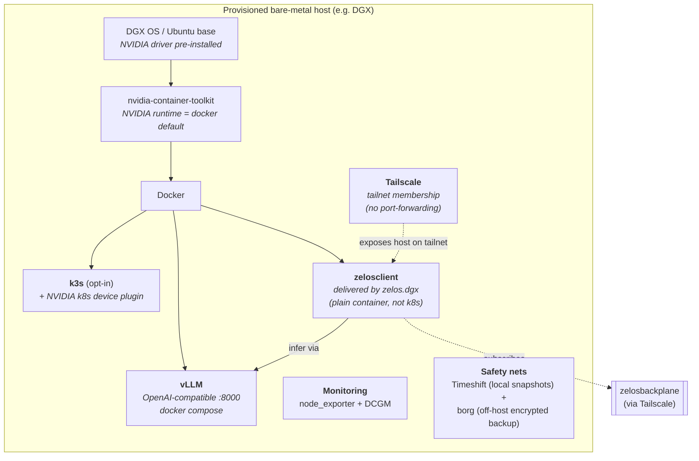
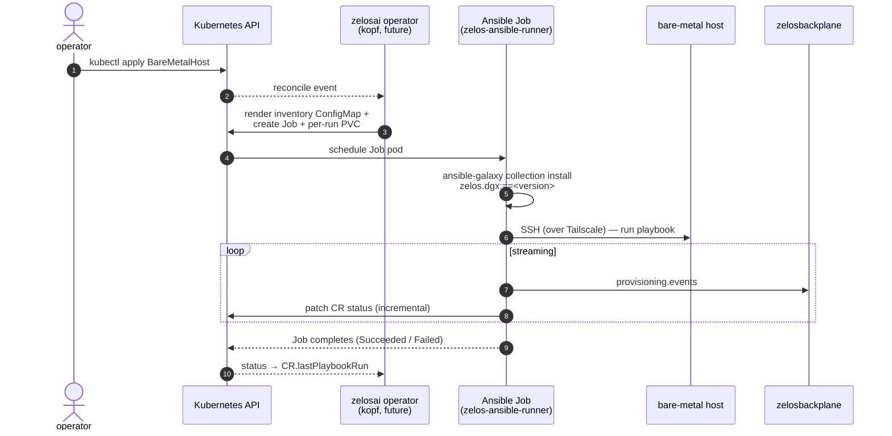

# 03 — Provisioning the model fleet

> **TL;DR.** Zelos provisions bare-metal LLM hosts with **Ansible collections**, one per
> host class. [`zelos.dgx`](https://github.com/kmechlin/ansible-dgx-collection) is
> the first — it brings up an NVIDIA DGX-class workstation end-to-end and drops a
> [`zelosclient`](./04-components/zelosclient.md) container onto it. More collections
> (one per host class) will follow.

## What the collection does

The shape of a host after `make site` runs:



Each provisioning collection is responsible for everything between "OS installed"
and "ready to serve LLM traffic":

- **Drivers + container runtime.** NVIDIA drivers, Docker, nvidia-container-toolkit
  with the NVIDIA runtime as default.
- **Network onboarding.** Tailscale joined to the corp / lab tailnet, so the host
  is reachable from `zelosbroker` and the rest of the suite without per-host
  ingress plumbing.
- **Inference runtime.** vLLM and/or Ollama (or whatever the host class is meant
  to run), exposed locally so `zelosclient` can talk to it.
- **Optional k3s.** A single-node k3s install with the NVIDIA k8s device plugin,
  so the host can also accept Kubernetes-scheduled workloads (this is the path
  that lets the same Zelos suite deploy to a "single DGX on k3s").
- **Observability.** `node_exporter` + DCGM exporter for Prometheus.
- **Safety nets.** Timeshift snapshots for in-place rollback; borg for off-host
  encrypted backups.
- **Container delivery.** A `zelosclient` container is pulled and started, wired
  to the local inference runtime and to the suite's backplane endpoint.

## How the operator invokes it (future direction)



In the v1 of `zelosai`'s Kubernetes operator (deferred to a later planning pass),
a `BareMetalHost` CR will trigger an Ansible Job that:

1. Renders an inventory ConfigMap from the CR's `address`, `sshUser`, and `vars`.
2. Mounts an SSH key Secret and an ansible-vault-encrypted vars Secret.
3. Runs in a `zelos-ansible-runner` image that contains ansible-core +
   ansible-runner but **NOT** the collection itself — the collection is pulled
   at start (`ansible-galaxy collection install zelos.dgx:==<version>`).
4. Streams stdout into the `provisioning.events` topic on the backplane and
   incrementally updates the CR's `status.lastPlaybookRun`.

This pattern lets every provisioning collection stay in its own repo with its
own release cycle. The operator is just a Job-spawner; the playbook is the
source of truth for what "provisioned" means on a given host class.

For the manual path today (no operator yet), `make site` from the collection
repo is the entrypoint:

```bash
git clone https://github.com/kmechlin/ansible-dgx-collection.git
cd ansible-dgx-collection
make bootstrap   # one-time interactive: create the ansible user
make setup       # one-time: borg + clean-baseline snapshot
make site        # repeatable: pre-flight snapshot + full provision
```

## Where `zelosclient` fits

Each provisioned host runs **one long-running `zelosclient` container**. The
client:

- Subscribes to one or more `zelosbackplane` topics.
- Forwards inference requests to the local runtime (vLLM, Ollama, …).
- Publishes responses back to the backplane.

The client is **not a Kubernetes workload**. It's a plain container on the host
(typically managed by `docker compose` or `systemd`). This matters because
the provisioned hosts may not be running k3s — only ones explicitly opted in
with `k3s_install: true` (in the case of `zelos.dgx`) participate as Kubernetes
nodes.

## Future host classes

The `zelos.dgx` collection is the canonical pattern. Expected future siblings:

| Collection | Target | Notes |
|---|---|---|
| `zelos.dgx` | NVIDIA DGX-class workstations (PGX, DGX Station, DGX Spark) | Exists. |
| `zelos.singlenode` (planned) | Generic single-GPU Linux nodes | Smaller scope; no DGX-OS specifics. |
| `zelos.cluster` (planned) | Multi-node GPU cluster nodes | Adds shared storage + cluster-aware vLLM tensor-parallel config. |
| `zelos.edge` (planned) | Lightweight edge boxes (no GPU, CPU-only Ollama) | For low-cost ambient inference. |

Each follows the same shape: an Ansible collection that brings the host up
**and** delivers a `zelosclient` container connected to the backplane. None of
the suite's other components need to know about the host class — the contract is
"host runs a `zelosclient` that subscribes to the right topics".

## See also

- [zelos.dgx component page](./04-components/zelos.dgx.md)
- [zelosclient component page](./04-components/zelosclient.md)
- [00-overview.md](./00-overview.md)
