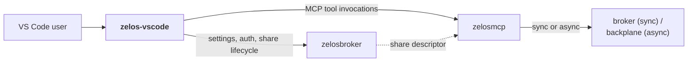

# zelos-vscode

- **Repo:** [ZelosAI/zelos-vscode](https://github.com/ZelosAI/zelos-vscode)
- **Distribution:** VS Code extension (`.vsix`), eventually published to the
  Marketplace.
- **Status:** v0.0.1 scaffold (just the manifest + a stub `activate`). The
  v0.1 implementation is queued as feature [#1 in zelos-vscode](https://github.com/ZelosAI/zelos-vscode/issues/1).

## Role in the suite

The IDE-side initiator for the suite's workspace-share primitive. Without it,
the customer would configure broker endpoints in env files and the IDE would
have no way to know when a Zelos workspace share is live for a given session.

Responsibilities:

1. **Configuration.** Surfaces settings for the broker URL, the zelosmcp URL,
   the customer's preferred mount protocol (`webdav` / `http-fuse` / `smb` /
   `auto`), and OAuth-provider preferences.
2. **Authentication.** VS Code `AuthenticationProvider` over OIDC via the
   broker / gateway. "Sign in to Zelos" command.
3. **Share lifecycle.** When the IDE invokes a sync-subagent or async-task
   tool exposed by zelosmcp, the extension asks the broker for a share
   descriptor and threads the share token through the invocation. Status bar
   item + sidebar TreeView show the share's state (`idle` / `staging` /
   `live` / `tearing-down`).
4. **Cleanup.** When the LLM response is delivered, or the user closes the
   session, the extension calls `DELETE /shares/{token}` on the broker so the
   share is revoked and the LLM-host clients unmount.

## Where it fits



## Why a VS Code extension (and not just CLI)?

- The IDE is where the user already lives. Share status, sign-in, and
  configuration belong as VS Code primitives (status bar, sidebar, settings
  schema) rather than in an external tool.
- `AuthenticationProvider` is the right shape for the OAuth flow — VS Code
  handles the system browser hop natively.
- The extension can react to workspace changes (which the broker needs to know
  the path for) without polling.

## Settings (v0.0.1 scaffold; commands land in v0.1)

```jsonc
{
  "zelos.brokerURL": "",                  // base URL of the Zelos broker
  "zelos.mcpURL": "",                     // base URL of zelosmcp
  "zelos.preferredMountProtocol": "auto"  // auto | webdav | http-fuse | smb
}
```

## Commands (planned for v0.1)

| Command | Effect |
|---|---|
| `Zelos: Sign in` | OAuth code flow via the broker / gateway. |
| `Zelos: Sign out` | Clears the cached token. |
| `Zelos: Open workspace share` | POSTs `/shares` to the broker; stores the descriptor; updates the status bar. |
| `Zelos: Close workspace share` | DELETEs the current share. |
| `Zelos: Show share info` | Opens the sidebar with the live share's protocol, mount URL, claimants. |

## Out of scope for v0.1

- Inline turn-stream rendering for sync subagents (the sync subagent's output
  surfaces via the IDE's standard chat surface, not a custom view).
- Async task queue viewer.
- Marketplace publish pipeline (CI builds a `.vsix`; Marketplace listing is
  manual until v0.2 of the extension).

## See also

- [zelosbroker component page](./zelosbroker.md) — the API this extension drives.
- [zelosmcp component page](./zelosmcp.md) — the tool surface the extension forwards user clicks to.
- [02-sync-path.md](../02-sync-path.md) — sync flow that starts in this extension.
- [01-async-path.md](../01-async-path.md) — async flow that this extension also initiates.
