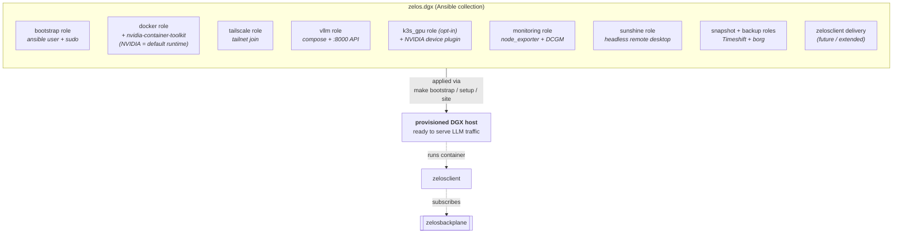

# zelos.dgx

- **Repo:** [kmechlin/ansible-dgx-collection](https://github.com/kmechlin/ansible-dgx-collection)
  *(Ansible collection FQCN: `zelos.dgx`; eventual migration to `ZelosAI/zelos.dgx` is out of scope for now.)*
- **Status:** v0.1.0 scaffold. **Not yet validated against real hardware.**

## Role in the suite

The first of N planned `zelos.<hosttype>` Ansible collections, each responsible
for taking a freshly-OS'd host of its class from zero to "ready to participate
in the Zelos suite".



`zelos.dgx` targets NVIDIA DGX-class workstations: Lenovo PGX, DGX Station,
DGX Spark, running DGX OS. It brings up:

- **Drivers + container runtime** — Docker, nvidia-container-toolkit, NVIDIA
  default runtime.
- **Tailscale** — joins the tailnet so the host is reachable from the rest of
  the suite without per-host ingress.
- **vLLM** — OpenAI-compatible inference server on `:8000`, Docker-managed.
- **k3s (opt-in)** — single-node k3s with the NVIDIA k8s device plugin, for
  hosts that should also accept Kubernetes-scheduled workloads.
- **Remote desktop** — Sunshine + Moonlight over Tailscale (virtual display via
  generated EDID) for headless GPU workstations.
- **Observability** — node_exporter + DCGM exporter, Prometheus-scrapeable over
  Tailscale.
- **Safety nets** — timeshift snapshots for in-place rollback, borg for off-host
  encrypted backups, both wired to a `make rollback` / `make restore`
  recovery hierarchy.

## Container delivery

Beyond provisioning, `zelos.dgx` is also responsible for **dropping a
[`zelosclient`](./zelosclient.md) container onto the host** and wiring it to:

- The local vLLM runtime on `:8000`.
- The suite's `zelosbackplane` endpoint via Tailscale.

This is the contract every future `zelos.<hosttype>` collection will follow:
*provision the host AND deliver `zelosclient`*. The suite's other components
don't need to know what host class they're talking to — only that there's a
`zelosclient` subscribing to the right backplane topics.

## How it runs today

```bash
git clone https://github.com/kmechlin/ansible-dgx-collection.git
cd ansible-dgx-collection
make bootstrap   # one-time interactive: create the ansible user
make setup       # one-time: baseline borg backup + clean snapshot
make site        # repeatable: pre-flight snapshot + full provision
```

Recovery hierarchy:

- Bad `make site` run → `make rollback` (latest pre-flight snapshot).
- Cumulative drift → `make rollback ASK='-e snapshot_target=clean-baseline'`.
- Disk loss → reinstall OS, `make bootstrap`, restore from borg.

## How it will run under the future operator

Once `zelosai`'s Kubernetes operator lands, a `BareMetalHost` CR will trigger
a Kubernetes Job that runs the collection's playbooks against an inventory
rendered from the CR spec. The Job's container image (`zelos-ansible-runner`)
contains ansible-core + ansible-runner but **not** the collection itself — the
collection is pulled at start (`ansible-galaxy collection install zelos.dgx:==<version>`)
so collection releases are decoupled from operator releases.

See [03-provisioning.md](../03-provisioning.md) for the full provisioning story.

## Future siblings

Expected:

- `zelos.singlenode` — generic single-GPU Linux nodes (no DGX-OS specifics).
- `zelos.cluster` — multi-node GPU cluster nodes with shared storage and
  cluster-aware vLLM tensor-parallel config.
- `zelos.edge` — CPU-only Ollama hosts for low-cost ambient inference.

Each follows the same shape; the contract with the rest of the suite stays the
same.

## See also

- [03-provisioning.md](../03-provisioning.md)
- [zelosclient component page](./zelosclient.md)
- [The collection's CLAUDE.md](https://github.com/kmechlin/ansible-dgx-collection/blob/main/CLAUDE.md)
