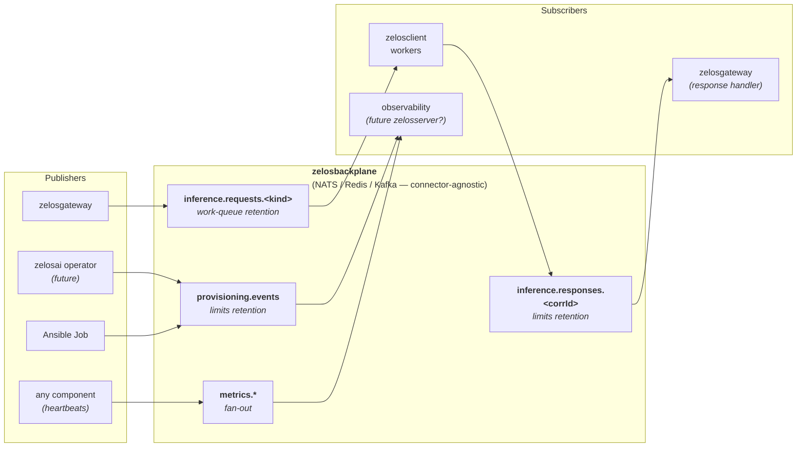

# zelosbackplane

- **Repo:** [ZelosAI/zelosbackplane](https://github.com/ZelosAI/zelosbackplane)
- **Image:** `ghcr.io/zelosai/zelosbackplane`
- **Status:** Scaffold — v0.1.0, connector interfaces + schema skeleton, no
  substrate chosen yet.

## Role in the suite

The async fabric. A message bus / event stream that decouples request-issuing
components (`zelosgateway`) from request-processing components (`zelosclient`
workers). Carries:

- `inference.requests.*` — work-queue topics; one of N subscribed workers claims
  each message.
- `inference.responses.<corrId>` — request/reply correlation.
- `provisioning.events` — events emitted by Ansible Jobs and other lifecycle work.
- `metrics.*` — optional fan-out for cluster-wide metrics.

See [06-naming-conventions.md](../06-naming-conventions.md#backplane-topics) for
the topic-naming rules and
[01-async-path.md](../01-async-path.md) for how requests flow through here.



## Substrate

**Not pinned in v1.** The repo defines a substrate-agnostic connector interface
(`src/zelosbackplane/connectors/`) with skeleton implementations for NATS, Redis
Streams, and Kafka. NATS is the most likely first choice (lightweight, native
work-queue semantics via JetStream, fits single-node deployments well), but the
abstraction stays so the suite can swap later without rewriting consumers.

## Schemas

The repo holds the canonical **envelope schema** (`schemas/envelopes/v1/`) and
the topic catalog (`schemas/topics.yaml`). Every publisher and subscriber in
the suite validates against the envelope. The envelope:

```
{
  "id":       "<uuid>",
  "ts":       "<rfc3339>",
  "source":   "<component-name>",
  "kind":     "<event/request kind>",
  "traceId":  "<distributed-trace-id>",
  "payload":  { ... }
}
```

Bumps to the schema use semver inside `schemas/VERSION`; consumers pin to a
version and CI runs contract tests on bumps.

## Deployment shape (future)

When `zelosai`'s operator lands, a `Backplane` CR will own the runtime:

- `dgx-single` profile → NATS StatefulSet, `replicas: 1`, local-path PVC.
- `k8s-multi` profile → NATS cluster, `replicas: 3`, JetStream + cluster storage.

For now, the repo just ships the connector library + a topic-bootstrap sidecar.

## See also

- [01-async-path.md](../01-async-path.md)
- [00-overview.md](../00-overview.md)
- [06-naming-conventions.md](../06-naming-conventions.md)
