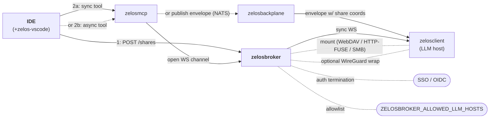

# zelosbroker

- **Repo:** [ZelosAI/zelosbroker](https://github.com/ZelosAI/zelosbroker)
- **Image:** `ghcr.io/zelosai/zelosbroker`
- **Language:** Go (`net/http` + chi router for the control plane;
  share-protocol implementations in `internal/share/`; optional WireGuard
  wrapper in `internal/tunnel/`).
- **Status:** v0.1.0 scaffold. The design has moved to the **share-coordinator
  + sync-channel** model below; implementation lands with features
  [#11](https://github.com/ZelosAI/zelosbroker/issues/11) /
  [#12](https://github.com/ZelosAI/zelosbroker/issues/12) /
  [#13](https://github.com/ZelosAI/zelosbroker/issues/13).

## Role in the suite

The broker is **the one primitive that both flows depend on**. Two
responsibilities, one component:

### 1. Ephemeral workspace share — used by sync AND async flows

The broker stands up a short-lived, token-scoped, remotely-mountable share of
the customer's workspace directory. Any LLM-host client (sync or async) mounts
that share at a known path and operates on it. **The user's files never land
on the LLM host's disk** — every read/write streams back through the broker
for the share's lifetime, then teardown is signal-based.

| Flow | Who asks the broker for a share? | Who mounts it? |
|---|---|---|
| **Sync** | zelosmcp, when an IDE-invoked sync subagent tool fires | The one LLM-host client the broker hands the sync channel to |
| **Async** | zelosmcp, before publishing the request envelope to the backplane | Whichever zelosclient dequeues the envelope from NATS |

Share lifecycle is a REST API on the broker:

- `POST /shares` — create. Body: `{ workspacePath, protocols[], ttl, callerID }`. Returns a `ShareDescriptor` with per-protocol mount URLs.
- `POST /shares/{token}/claim` — record that a client has mounted.
- `DELETE /shares/{token}` — revoke. Triggers unmount signals to all claimants.

See [zelosbroker/docs/share-protocols.md](https://github.com/ZelosAI/zelosbroker/blob/main/docs/share-protocols.md) for the full protocol-level detail.

### 2. Synchronous conversation channel

For interactive sub-agent runs where async-queue latency would be felt,
zelosmcp opens a **WebSocket** channel through the broker to one specific
zelosclient. The channel carries conversation turns + tool calls between
zelosmcp (on behalf of the IDE) and a subagent process running with **isolated
context** on the LLM host. The subagent uses the same broker-coordinated share
for file access.

See [zelosbroker/docs/sync-channel.md](https://github.com/ZelosAI/zelosbroker/blob/main/docs/sync-channel.md) for the framing, lifecycle, and turn schema.

## Why a single primitive for both flows

The historical framing was "sync path uses the broker, async path uses the
backplane." That was wrong: both paths need workspace file access, and we
didn't want to ship two different share mechanisms. By making the broker own
the share lifecycle, zelosmcp can ask for a share *before* deciding whether
this particular tool invocation is sync or async — and the LLM-host clients
have one mount-and-teardown pattern regardless of which queue served them.

## Where it fits in the flow



## Share protocols

Pluggable per the `EnabledShareProtocols` CRD field:

| Protocol | Server side | Client side | Status |
|---|---|---|---|
| **WebDAV over HTTPS** | `golang.org/x/net/webdav` | Native macOS Finder, Linux via `davfs2`, Windows via `net use` | v0.3 ([#11](https://github.com/ZelosAI/zelosbroker/issues/11)) |
| **HTTP-FUSE** | Thin REST file API (read range, write, list) | Pure-Go FUSE driver in zelosclient | v0.3 ([#11](https://github.com/ZelosAI/zelosbroker/issues/11)) |
| **SMB** | Samba sidecar in the broker Pod | Native Windows / macOS, Linux via `cifs-utils` | v0.4 ([#13](https://github.com/ZelosAI/zelosbroker/issues/13)) |

The customer's IDE-side preference is exposed via the
[zelos-vscode](./zelos-vscode.md) extension's `zelos.preferredMountProtocol`
setting. When `auto`, the broker picks the first supported protocol for the
client OS.

## Optional WireGuard wrap

For customers who want all IDE↔LLM-host traffic inside an encrypted overlay,
the broker can emit WireGuard peer configs. **Optional** — HTTPS terminates
auth and encryption end-to-end without it. Tracked in [#12](https://github.com/ZelosAI/zelosbroker/issues/12).

## CRD fields (target shape after feature #11)

```yaml
apiVersion: zelos.zelosai.io/v1alpha1
kind: ZelosBroker
spec:
  enabledShareProtocols: [webdav, http-fuse]   # smb adds in v0.4
  shareTTL: 30m
  syncChannelListen: ":8081"
  allowedLLMHosts:
    - https://llm-host-1.zelos.example.com
    - https://llm-host-2.zelos.example.com
  authProviderSecretRef:
    name: zelos-broker-auth
  wireGuard:                                    # optional, v0.3
    enabled: false
  sambaSidecar:                                 # optional, v0.4
    enabled: false
```

## What it is NOT

- Not an inference engine — the broker never runs a model.
- Not the async front door — that's [zelosgateway](./zelosgateway.md).
- Not a workspace replica — the broker streams reads/writes through to the
  IDE-host mount it serves; it does not cache or persist customer bytes.
- Not the only path for workspace access — but it IS the only path the LLM
  hosts use to *see* the workspace.

## See also

- [02-sync-path.md](../02-sync-path.md) — sync flow walk-through.
- [01-async-path.md](../01-async-path.md) — async flow walk-through; uses the
  broker for share coordination even though the message bus is NATS.
- [zelos-vscode component page](./zelos-vscode.md) — IDE-side initiator.
- [zelosmcp component page](./zelosmcp.md) — tool surface that triggers sync
  vs async.
- [zelosclient component page](./zelosclient.md) — mount + subagent consumer.
- [09-dependencies.md](../09-dependencies.md) — external deps.
