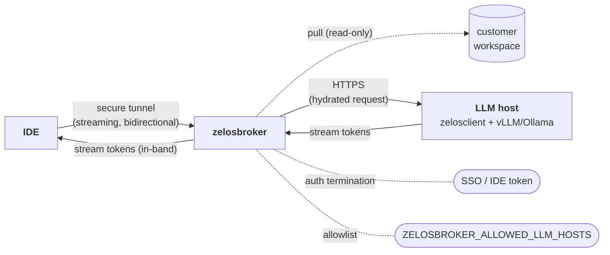

# zelosbroker

- **Repo:** [ZelosAI/zelosbroker](https://github.com/ZelosAI/zelosbroker)
- **Image:** `ghcr.io/zelosai/zelosbroker`
- **Status:** Scaffold — v0.1.0, asset-puller and tunnel-handler skeletons.
  Transport substrate (Tailscale / WireGuard / mTLS-WS / SSH-tunnel) not yet pinned.

## Role in the suite

The sync-path counterpart to [zelosbackplane](./zelosbackplane.md). Two
responsibilities:

1. **Customer workspace asset pulling.** Pulls specific files, selection ranges,
   diffs — whatever workspace context the LLM hosts need to answer a sync request —
   so the IDE doesn't have to inline that context into every prompt.
2. **Secure tunnel.** Maintains a long-lived, authenticated, bidirectional
   streaming tunnel between the IDE and the Zelos LLM hosts. When the IDE wants
   a synchronous response from a Zelos-hosted LLM, the request flows through
   here.

## Why this exists (vs. just calling the LLM host directly)

- The customer IDE machine should **not** be on the same network as the LLM hosts.
  The broker is the controlled boundary.
- Workspace asset access lives **inside** the customer's network. The broker has
  narrow, audited access; the LLM host never reaches into the IDE machine.
- The broker handles **routing** (pick the right host per request) and
  **multiplexing** (one tunnel, many concurrent requests).
- The broker terminates **customer-side auth**; Zelos-side auth to LLM hosts is
  internal and different.

## Where it fits in the flow

See [02-sync-path.md](../02-sync-path.md) for the request-by-request walk-through
and the sync-vs-async decision matrix.

## Transport (v1)

**Not pinned.** Candidates being weighed in the repo's docs:

- **Tailscale** — least operator overhead; rides on existing tailnet membership
  already used by `zelos.dgx`-provisioned hosts. Requires customer to join
  the tailnet.
- **WireGuard** — same model without the Tailscale layer; more ops weight.
- **mTLS over WebSocket** — works through HTTPS proxies; needs cert management.
- **SSH tunnel** — universal, but framing for streaming token responses is awkward.

Whichever wins, the requirements are: bidirectional, streaming, long-lived,
and able to traverse common corporate egress policies.

## What it is NOT

- Not an inference engine — the broker never runs a model.
- Not the async front door — that's [zelosgateway](./zelosgateway.md).
- Not a global proxy — it brokers a small set of well-defined customer-side
  surfaces, not arbitrary internet traffic.

## See also

- [02-sync-path.md](../02-sync-path.md)
- [00-overview.md](../00-overview.md)
- [zelosclient component page](./zelosclient.md)
