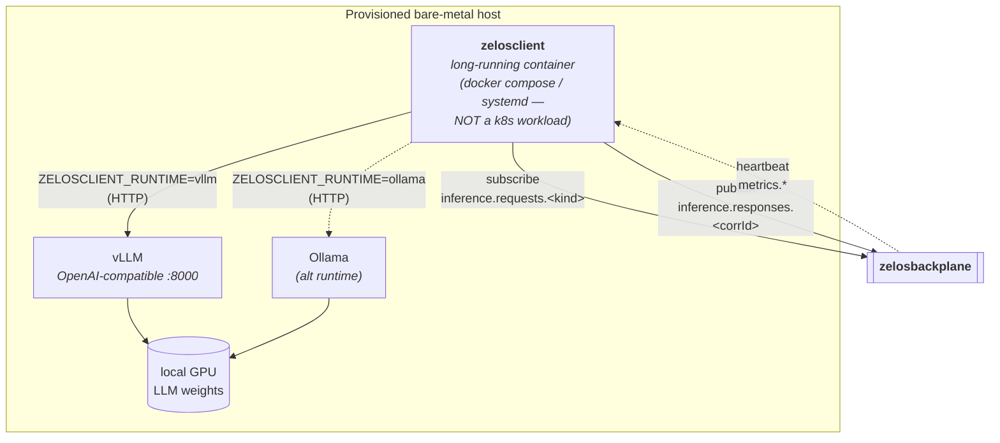

# zelosclient

- **Repo:** [ZelosAI/zelosclient](https://github.com/ZelosAI/zelosclient)
- **Image:** `ghcr.io/zelosai/zelosclient`
- **Language:** Go.
- **Status:** Scaffold — v0.1.0, subscribe-loop + runtime-adapter skeletons.

## Role in the suite

The host-side LLM worker. A long-running container that runs **on a provisioned
host** — not in a Kubernetes cluster — and bridges
[zelosbackplane](./zelosbackplane.md) to a local inference runtime.

Responsibilities:

1. **Subscribe** to one or more `inference.requests.*` topics on the backplane.
2. **Forward** each claimed request to the local inference runtime — vLLM via
   its OpenAI-compatible HTTP API, Ollama via its native API, or another backend
   the runtime adapter implements.
3. **Publish** the response back onto the correlation topic.
4. **Heartbeat / health** to the backplane so the rest of the suite can route
   intelligently.

## Why not a Kubernetes workload?

Provisioned hosts (DGX-class workstations, single-node Linux GPU boxes, edge
boxes) may not all run Kubernetes. Where they do, k3s is single-node and the
client is happily a `docker compose` or `systemd` unit anyway. Keeping
`zelosclient` as a plain container:

- Removes the "every host must be a k8s node" requirement.
- Simplifies the Ansible delivery path — the provisioning collection just
  needs to pull the image and start it.
- Keeps the IDE-fleet round-trip path short: gateway → backplane → client →
  local vLLM, no extra Kubernetes scheduling hops.

## Runtime adapters

`internal/runtime/` holds one adapter per inference backend:

| Adapter | Backend | Notes |
|---|---|---|
| `vllm.go` | vLLM OpenAI-compatible API on `:8000` | Default on `zelos.dgx`-provisioned hosts. |
| `ollama.go` | Ollama native API | For smaller models / edge boxes. |
| (future) | TGI, llama.cpp server, … | Add an adapter, register it. |

Configuration (`internal/config/`) picks the adapter from
`ZELOSCLIENT_RUNTIME=vllm|ollama`.

## How it gets onto a host

Each [zelos.<hosttype> Ansible collection](./zelos.dgx.md) is responsible for
delivering `zelosclient` onto the hosts it provisions. In `zelos.dgx`:

- vLLM role brings up the inference runtime on `:8000`.
- A future / extended role pulls `ghcr.io/zelosai/zelosclient:<pinned-tag>` and
  starts it pointed at `localhost:8000` and at the suite's `zelosbackplane`
  endpoint via Tailscale.

The collection determines the client's pinned version, not the operator —
this lets host-class collections control their own compatibility matrix.

## Configuration surface

See `.env.example` in the repo. Key vars:

- `ZELOSBACKPLANE_URL` — connection string for the backplane (substrate-specific).
- `ZELOSCLIENT_RUNTIME` — `vllm` | `ollama` | …
- `ZELOSCLIENT_RUNTIME_URL` — HTTP endpoint for the chosen runtime.
- `ZELOSCLIENT_MODEL` — model name to advertise to the backplane.
- `ZELOSCLIENT_SUBSCRIBE_TOPICS` — comma-separated topic list.

## See also

- [01-async-path.md](../01-async-path.md)
- [03-provisioning.md](../03-provisioning.md)
- [zelos.dgx component page](./zelos.dgx.md)
