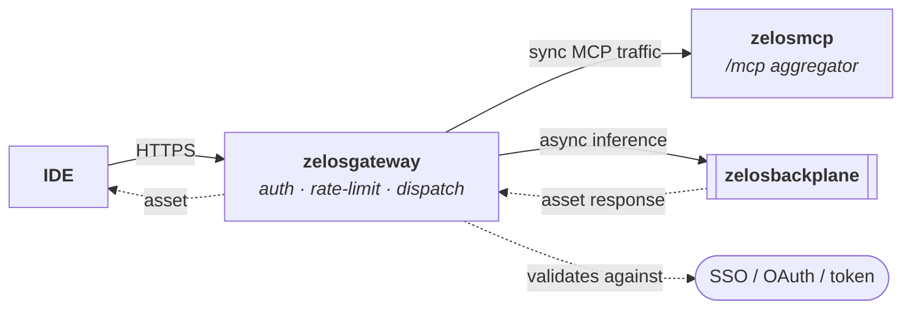

# zelosgateway

- **Repo:** [ZelosAI/zelosgateway](https://github.com/ZelosAI/zelosgateway)
- **Image:** `ghcr.io/zelosai/zelosgateway`
- **Status:** Scaffold — v0.1.0, Python / FastAPI skeleton, no live functionality yet.

## Role in the suite

The HTTP front door. The single surface IDE clients hit for any Zelos-mediated
request. Responsibilities:

- **Authentication.** Terminate caller identity (SSO / OAuth / token).
- **Rate limiting.** Per-tenant / per-key quotas.
- **Routing decisions.** Sync vs. async path? Which MCP backend? Which
  inference topic?
- **Dispatch.**
  - Sync MCP traffic → [zelosmcp](./zelosmcp.md).
  - Async inference traffic → [zelosbackplane](./zelosbackplane.md) (publish
    request envelope, return correlation id; the IDE polls or subscribes for
    the response).

## What it is NOT

- The gateway is not an inference engine. It never runs a model.
- It is not the secure-tunnel endpoint for sync IDE↔LLM traffic — that's
  [zelosbroker](./zelosbroker.md).
- It is not a per-tenant proxy chain — auth terminates here, and downstream
  traffic uses suite-internal identities.

## Where it fits in the flow

## v1 surface (target)

- `POST /v1/mcp/...` — passthrough / multiplex to zelosmcp.
- `POST /v1/inference` — enqueue an inference request onto the backplane,
  return `{ id, replyTopic }`.
- `GET  /v1/inference/{id}` — poll for the response (alternative to subscribing
  to the reply topic).
- `GET  /healthz`, `GET  /readyz`.

Concrete API definition lives in the
[zelosbackplane OpenAPI](https://github.com/ZelosAI/zelosbackplane) and in
the gateway's own `src/zelosgateway/routes/` once it lands.

## See also

- [00-overview.md](../00-overview.md)
- [01-async-path.md](../01-async-path.md)
- [02-sync-path.md](../02-sync-path.md)
