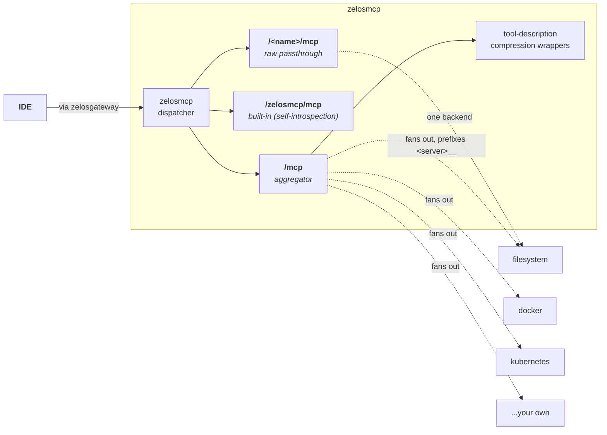

# zelosmcp

- **Repo:** [ZelosAI/zelosmcp](https://github.com/ZelosAI/zelosmcp)
- **Image:** `ghcr.io/zelosai/zelosmcp`
- **Status:** Mature — has a production-shape Kubernetes manifest, multi-stage
  Docker build, full Makefile lifecycle, Cursor + Copilot rule generator.

## Role in the suite

MCP aggregator + reverse proxy. The single web server an IDE plugs into so it
sees **one** stable URL but gets fan-out across many MCP backends — stdio,
SSE, or Streamable-HTTP. Tools are namespaced `<server>__<tool>` under a single
aggregator endpoint `/mcp`. Each backend is also reachable as a raw passthrough
at `/<name>/mcp`. There's an always-on built-in MCP at `/zelosmcp/mcp` for
self-introspection (rule generation, tool catalog, etc.).

One backend worth calling out: the **Zelos operator console** co-serves an MCP
endpoint at `/api/mcp` — one tool per verb of every installed `zelos.*`
collection (`proxmox__host_prep`, `foundry__environment`, …). Front it as a
`streamable-http` backend and an IDE reaches the whole infrastructure toolset
through the same aggregated `/mcp` URL, with zelosmcp's compression on top. See
[21-mcp-surface.md](../21-mcp-surface.md) and
[zelosmcp's configuration docs](https://github.com/ZelosAI/zelosmcp/blob/main/docs/configuration.md).

## Why it matters for the cost thesis

Three of the suite's biggest subscription-token wins live here:

1. **Tool-description compression.** `get_tool_schema` + `invoke_tool` wrappers
   keep the per-request tool-catalog cost flat regardless of how many backends
   are mounted.
2. **IDE asset push.** zelosmcp generates and pushes rule files (Cursor `.mdc`,
   Copilot `copilot-instructions.md`) and curates skills / agents / hooks into
   the IDE so it doesn't re-derive the same context every session.
3. **Subagent off-routing.** zelosmcp exposes IDE-facing tools that, when
   invoked, run on a Zelos-hosted LLM in an isolated conversation context —
   not on the IDE's subscription model. See "Sync subagent + async task tools"
   below.

## Sync subagent + async task tools

zelosmcp's tool surface has two routing flavors. The IDE invokes a tool the
same way; what changes is how zelosmcp dispatches it:

| Tool flavor | Routing | When to use it |
|---|---|---|
| **Sync subagent tool** | Opens a [WebSocket sync channel](../02-sync-path.md) through [zelosbroker](./zelosbroker.md) to one specific [zelosclient](./zelosclient.md). The subagent runs with isolated context on the LLM host. | Interactive multi-turn subagent runs — "review this PR", "refactor this file", "search the workspace and summarize". |
| **Async task tool** | Publishes a request envelope to [zelosbackplane](./zelosbackplane.md) on `inference.requests.<kind>`. Any subscribed zelosclient picks it up; the response comes back on a correlation topic. | Batch / fan-out work that doesn't need streaming back to the IDE turn-by-turn. |

**Both flavors share the broker-coordinated workspace share.** Before
publishing an async envelope or opening a sync channel, zelosmcp asks the
broker for a `ShareDescriptor` (or accepts one the IDE already created) and
threads the coords through the request. The chosen worker mounts the share,
processes, then releases. See [02-sync-path.md](../02-sync-path.md) and
[01-async-path.md](../01-async-path.md).

### Custom subagent artifacts

zelosmcp also owns the artifact loader for custom subagent **definitions**:

- **Subagent manifest** — name, description, system prompt reference, model hint, tool-list scope.
- **Skills** — small reusable prompt fragments the subagent can call.
- **Hooks** — pre / post turn callbacks (e.g., "before each turn, refresh the
  share TTL"; "after the final turn, archive the asset").

Source-of-truth shape mirrors the existing IDE asset stores (`src/zelosmcp/static/`, asset / auth / savings SQLite stores). At runtime, when zelosmcp opens a
sync channel, the chosen subagent's manifest + skills + hooks are sent as the
sync-channel `open` frame so the zelosclient can bootstrap the subagent
process on the LLM host.

## Where it fits in the flow

The gateway routes sync MCP traffic to zelosmcp. The IDE never talks to
individual backend MCPs directly — only to zelosmcp's aggregated `/mcp`.

## Future direction

zelosmcp is built as a developer-local proxy today but the same dispatcher +
reverse-proxy + aggregator surface is intended to run as a **shared
Kubernetes service**, deployed by `zelosai`'s future operator. The existing
[deploy/kubernetes/zelosmcp.yaml](https://github.com/ZelosAI/zelosmcp/blob/main/deploy/kubernetes/zelosmcp.yaml)
manifest is the basis for the future `charts/zelosmcp/` Helm chart in `zelosai`.

## See also

- [00-overview.md](../00-overview.md) — suite overview
- [01-async-path.md](../01-async-path.md) — how async-task tools work end-to-end
- [02-sync-path.md](../02-sync-path.md) — how sync-subagent tools work end-to-end
- [zelosbroker component page](./zelosbroker.md) — the sync channel + share primitive zelosmcp drives
- [zelos-vscode component page](./zelos-vscode.md) — IDE-side counterpart
- [zelosmcp's README](https://github.com/ZelosAI/zelosmcp#readme)
