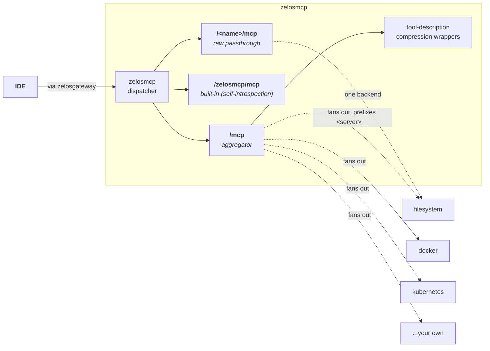

# zelosmcp

- **Repo:** [ZelosAI/zelosmcp](https://github.com/ZelosAI/zelosmcp)
- **Image:** `ghcr.io/zelosai/zelosmcp`
- **Status:** Mature — has a production-shape Kubernetes manifest, multi-stage
  Docker build, full Makefile lifecycle, Cursor + Copilot rule generator.

## Role in the suite

MCP aggregator + reverse proxy. The single web server an IDE plugs into so it
sees **one** stable URL but gets fan-out across many MCP backends — stdio,
SSE, or Streamable-HTTP. Tools are namespaced `<server>__<tool>` under a single
aggregator endpoint `/mcp`. Each backend is also reachable as a raw passthrough
at `/<name>/mcp`. There's an always-on built-in MCP at `/zelosmcp/mcp` for
self-introspection (rule generation, tool catalog, etc.).

## Why it matters for the cost thesis

Two of the suite's biggest subscription-token wins live here:

1. **Tool-description compression.** `get_tool_schema` + `invoke_tool` wrappers
   keep the per-request tool-catalog cost flat regardless of how many backends
   are mounted.
2. **IDE asset push.** zelosmcp generates and pushes rule files (Cursor `.mdc`,
   Copilot `copilot-instructions.md`) and curates skills / agents / hooks into
   the IDE so it doesn't re-derive the same context every session.

## Where it fits in the flow

The gateway routes sync MCP traffic to zelosmcp. The IDE never talks to
individual backend MCPs directly — only to zelosmcp's aggregated `/mcp`.

## Future direction

zelosmcp is built as a developer-local proxy today but the same dispatcher +
reverse-proxy + aggregator surface is intended to run as a **shared
Kubernetes service**, deployed by `zelosai`'s future operator. The existing
[deploy/kubernetes/zelosmcp.yaml](https://github.com/ZelosAI/zelosmcp/blob/main/deploy/kubernetes/zelosmcp.yaml)
manifest is the basis for the future `charts/zelosmcp/` Helm chart in `zelosai`.

## See also

- [00-overview.md](../00-overview.md) — suite overview
- [01-async-path.md](../01-async-path.md)
- [zelosmcp's README](https://github.com/ZelosAI/zelosmcp#readme)
