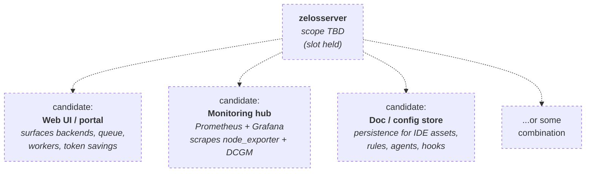

# zelosserver

- **Repo:** [ZelosAI/zelosserver](https://github.com/ZelosAI/zelosserver)
- **Image:** `ghcr.io/zelosai/zelosserver` *(once role is defined)*
- **Status:** **Scope TBD.** Bootstrapped as a stub so the name doesn't churn later.

## Role in the suite

**Undecided.** The candidate roles under consideration are:

1. **Web UI** — a portal that surfaces the suite's state (which backends are
   loaded in zelosmcp, what's queued on the backplane, which clients are
   subscribed, recent provisioning events, token-savings dashboards).
2. **Monitoring / observability hub** — Grafana + Prometheus or an equivalent
   stack centralized for the suite, instead of every component shipping its own.
3. **Document / config store** — a shared persistence layer for IDE assets,
   rule files, agent definitions, and other configuration data the suite needs
   to keep around between runs.
4. **Some combination** of the above.

## Why bootstrap if scope is undecided?

To **hold the slot.** Repo names and image names are sticky once they're in use,
and the suite is being assembled in a few-month window. Holding
`ZelosAI/zelosserver` and `ghcr.io/zelosai/zelosserver` now keeps later
decision-making cheap.

## What's in the repo today

The standard scaffold:

- CLAUDE.md (template), README.md, LICENSE, CHANGELOG.md.
- `.gitignore`, `.editorconfig`, `pyproject.toml` (Python placeholder).
- `.github/workflows/{lint,release}.yml`.
- `docs/SCOPE_TBD.md` — explicit "scope is undecided" doc with the candidate
  list above so future-you (or another contributor) can resume the decision.
- An empty `src/zelosserver/` package to keep the Python layout valid.

## Decision pipeline

When scope gets nailed down, the resolution path is:

1. Pick one of the candidate roles (or a combination) in `docs/SCOPE_TBD.md`.
2. Update this page (`04-components/zelosserver.md`) to match.
3. Update the [00-overview.md component map](../00-overview.md) and the
   relevant path doc (most likely [02-sync-path.md](../02-sync-path.md) for a
   UI, or a new "observability" doc for a monitoring stack).
4. Replace `docs/SCOPE_TBD.md` in the repo with real documentation.

## See also

- [00-overview.md](../00-overview.md)
- [SCOPE_TBD.md in the repo](https://github.com/ZelosAI/zelosserver/blob/main/docs/SCOPE_TBD.md)
