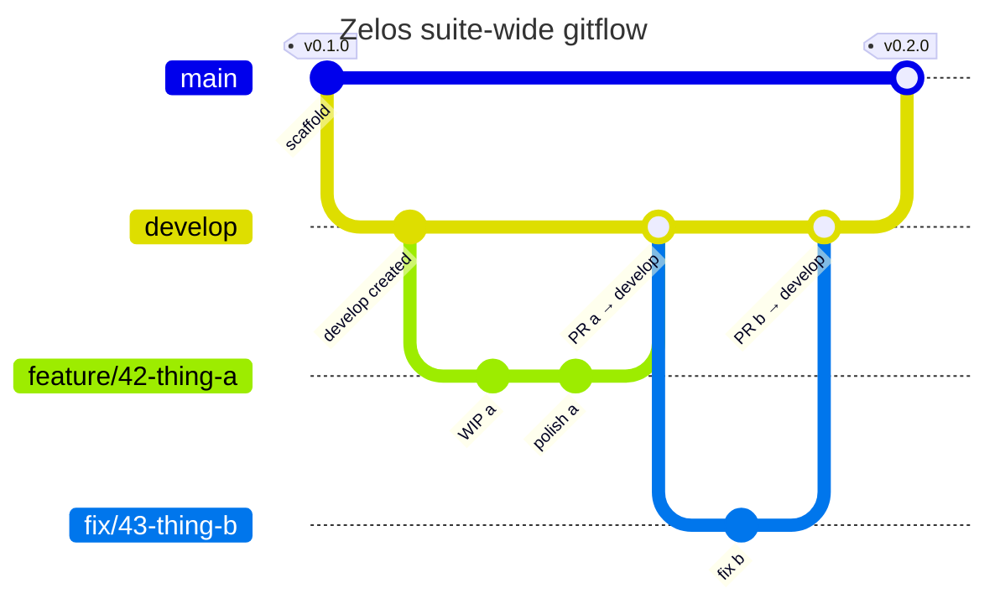

# 05 — Suite-wide gitflow

> **This is the canonical gitflow for every Zelos suite repository.** Every
> component repo's CLAUDE.md cites this page; the **Git / Workflow** section
> of the [CLAUDE.md template](../template/CLAUDE.md.tmpl) is byte-identical
> across the suite.

## Branches

- **`main`** — protected release line. Tags are cut from here. Never PR a feature
  branch directly into `main`.
- **`develop`** — integration branch. All feature work merges here first. If
  `develop` doesn't exist on the remote yet, create it from `main` before opening
  the first feature PR.
- **`<type>/<issue-number>-<slug>`** — every feature, fix, chore, or docs
  branch. Canonical pattern is enforced by the `branch-lint` workflow:

  ```
  ^(feature|fix|chore|docs)/[0-9]+-[a-z0-9-]+$
  ```

  - `<type>` ∈ `{feature, fix, chore, docs}` — matches the GitHub issue's Work
    type (`feature` covers `Feature`; `fix` covers `Bug`; `chore`/`docs` cover
    the rest).
  - `<issue-number>` — the GitHub issue this work resolves. Required so the
    issue ↔ branch ↔ PR chain is unambiguous in git history. The
    `tracker-in-progress` workflow parses this number on push to auto-flip the
    issue's project Status to `In Progress`.
  - `<slug>` — kebab-case extract from the issue title.

  Worked examples:

  - `feature/23-envelope-schema-validation`
  - `fix/61-docker-base-bump`
  - `chore/55-ci-template`
  - `docs/36-deployment-strategies-doc`

  `develop` and `main` are allowlisted on the `branch-lint` workflow so
  promotion PRs (`develop → main`) and back-merge PRs (`main → develop`) pass
  without the pattern.

## Flow



Read top-to-bottom: every feature lands on `develop` first via its own PR.
A separate **promotion PR** later batches one or more feature merges from
`develop` into `main`, and the `v<X.Y.Z>` tag is cut from `main` at the same
time. The `release.yml` workflow then builds + pushes the
`ghcr.io/zelosai/<repo>` image.

Rules:

- **One feature, one PR**, targeting `develop`. The PR body must include
  `Closes #<N>` (or `Fixes #N` / `Resolves #N`) referencing the same issue
  number that's in the branch name.
- **Never** open a PR directly from a feature branch into `main`.
- Promotion `develop` → `main` is its **own** PR, cut deliberately when a set of
  features has integrated cleanly on `develop`. Promotion PRs are blocked at
  the branch-protection layer unless the most recent `integration-tests` run
  on `develop` HEAD is green (`promotion-check` workflow + branch protection
  required-check).
- Tags (`vX.Y.Z`) are pushed to `main` only.

## Commit messages

Clear, descriptive, imperative. If Claude authored or co-authored the change,
add a Co-Authored-By trailer:

```
Co-Authored-By: Claude <noreply@anthropic.com>
```

(Or a more specific model identifier if the session's tooling provides one.)

Don't `--amend` past commits unless explicitly asked. If a pre-commit hook
fails, the commit didn't happen — fix the issue and create a **new** commit.

## Tagging

Semver: `v<MAJOR>.<MINOR>.<PATCH>`.

- `MAJOR` bump: backwards-incompatible API or contract change.
- `MINOR`: new functionality, backwards-compatible.
- `PATCH`: bug fixes only.

Tags are pushed to `main` after a promotion PR lands. Don't tag from `develop`
or feature branches.

For repos with shared-lib content (like `zelosai/schemas` once it exists),
the schemas have their own semver inside the repo even though the repo's
release tags follow the repo as a whole.

## Container builds

Every component repo that ships a container has `.github/workflows/release.yml`
(from [`zelosai/docs/template/release.yml.tmpl`](../template/release.yml.tmpl)).
It builds **multi-arch images** (`linux/amd64` + `linux/arm64`) to
`ghcr.io/zelosai/<repo>` so Apple Silicon Macs and ARM servers can pull the
same tags without translation.

### Triggers and tags

The workflow runs on three events. Tags applied per event:

| Trigger | Tags applied |
|---|---|
| Push to **`develop`** (PR merged into integration) | `:v<X.Y.Z>-dev` · `:latest` · `:sha-<short>` |
| Push to **`main`** (develop → main promotion PR merged) | `:v<X.Y.Z>` · `:latest` · `:stable` · `:sha-<short>` |
| Push of **`v<X.Y.Z>`** git tag (cut from `main`) | `:v<X.Y.Z>` · `:latest` · `:stable` · `:sha-<short>` |

Pointer semantics:

- **`:latest`** — most recent build of any kind. Bumped on every push
  (develop, main, tag). Useful for "give me the bleeding edge regardless of
  branch".
- **`:stable`** — head of `main`. Only `main` push and `v*` tag bump it.
  Useful for "give me the most recent release-quality build".
- **`:v<X.Y.Z>`** — immutable-ish; overwritten only if `main` is rebuilt
  at the same version.
- **`:v<X.Y.Z>-dev`** — overwritten on every develop merge that doesn't bump
  the version.
- **`:sha-<short>`** — always present for traceability.

### Version source

The workflow reads the version from a language-appropriate source file (the
`release.yml` workflow currently in each repo encodes the per-language
selection):

| Language | Source of version truth |
|---|---|
| Go services | `VERSION` (single line) |
| Python services | `pyproject.toml` → `[project] version = "X.Y.Z"` |
| TypeScript / Node | `package.json` → `"version"` |
| Ansible collections | `galaxy.yml` → `version:` |

The Go operator (`zelosai`) reads from `VERSION` as well.

On `v<X.Y.Z>` tag push, the workflow **validates that the tag matches the
in-repo version** and fails the build if they diverge. Bump
`pyproject.toml`/`galaxy.yml` *before* tagging.

### Image-reference policy

Image references in the suite (e.g. inside Helm values, deployment manifests,
or other components' configs) should pin to:

- A semver tag like `:v0.3.1` (for releases on `main`), **or**
- A digest like `@sha256:...` (for immutable pinning), **or**
- `:stable` if you specifically want "latest release on main, rolling".

**Do not pin to `:latest` outside of dev environments** — it bumps on every
develop merge.

## PRs

- **Do not create a PR unless explicitly asked.** Push branches; let the human
  open the PR.
- Use the standard [PR template](../template/pull_request_template.md) — checks
  for `make lint`, `make test`, `make test-integration` (if applicable),
  container build (if applicable), and the gitflow checks (targeting
  `develop`, branch shape matching `^(feature|fix|chore|docs)/[0-9]+-[a-z0-9-]+$`,
  `Closes #N` referencing the same issue number as the branch, no tag in the
  PR).

## CI gates and status automation

Every repo runs the same gate set (templates live in
[`docs/template/`](../template/)):

| Workflow | Trigger | Gate / effect |
|---|---|---|
| `branch-lint` | PR open / sync | Fails the PR if `head_ref` doesn't match the canonical branch regex. Allowlists `develop` and `main`. |
| `unit-tests` | PR open / sync, push to `develop` | Per-language unit tests (`make test`). **Required check** on PRs into `develop`. |
| `release` (existing) | Push to `develop`, `main`, or `v*` tag | Builds + pushes multi-arch container to GHCR. |
| `integration-tests` | `workflow_run` on `release` success on `develop` | Pulls `:vX.Y.Z-dev`, runs `make test-integration`. Reports `integration-tests` status on develop HEAD. |
| `tracker-in-progress` | Push to `<type>/<N>-<slug>` branch | Auto-flips issue `N`'s project Status to `In Progress`. |
| `tracker-ready-for-qa` | `workflow_run` on `release` success on `develop` | Parses `Closes #N` from merged PR body, flips Status to `Ready for QA`. |
| `promotion-check` | PR `develop → main` open / sync | Looks up most recent `integration-tests` run on `develop`; posts `promotion-gate` status. **Required check** on promotion PRs at branch protection. |

Status transitions through the lifecycle:

```
Todo  ──push <type>/<N>-... branch──►  In Progress
                                            │
                                            └── PR feature → develop merged + release builds dev container
                                                  │
                                                  ▼
                                            Ready for QA
                                                  │
                                                  └── promotion PR develop → main merged + integration green
                                                        │
                                                        └── auto-close on `Closes #N`
                                                              │
                                                              ▼
                                                            Done
```

## Why `develop` and not trunk-based?

The suite has multiple independently-releasable components and several
work streams in flight at once. A `develop` integration branch lets us:

- Validate feature combinations together before they hit `main`.
- Cut promotion PRs that batch a coherent release.
- Let multiple feature PRs land without each one tagging a release.

If a repo becomes mature enough that trunk-based makes sense, that's a
per-repo decision made later — the canonical gitflow stays as-is for the suite.

## Source of truth

The canonical phrasing of the gitflow rule that goes into every repo's
CLAUDE.md lives in [`zelosai/docs/template/CLAUDE.md.tmpl`](../template/CLAUDE.md.tmpl)
under the **Git / Workflow** section. If you change the gitflow, change that
template **and this page** in the same PR, then propagate to every consuming
repo.
