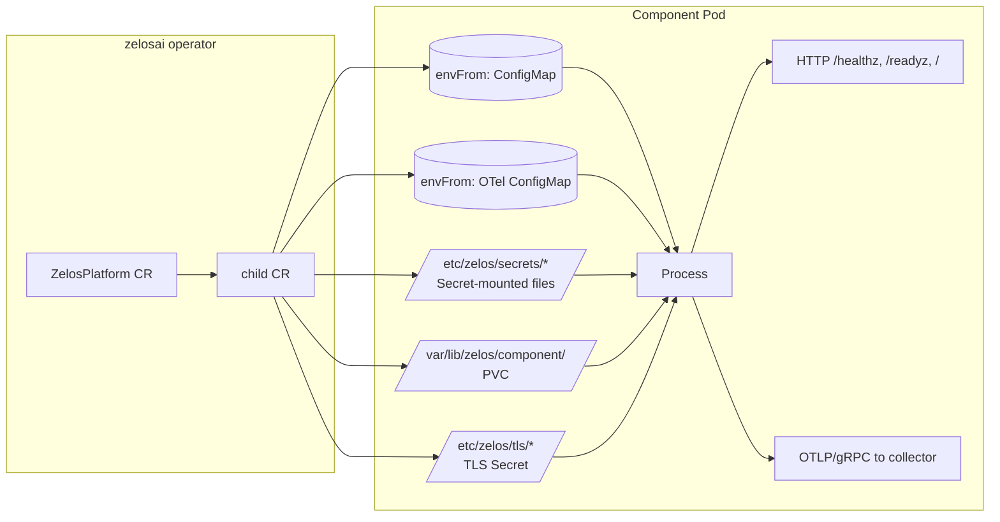

# 07 — Container Contract

This is the binding contract every Zelos component image must honor when
running in Kubernetes. The CRDs in `zelosai` (see [08-crds.md](./08-crds.md))
and the operator's render package
([internal/controller/render/](../../internal/controller/render/)) are built
on top of it. If you change anything here, you change the operator.

## Surface at a glance



## Standard surface

| Concern | Standard |
|---|---|
| **Image ref** | `ghcr.io/zelosai/<repo>:<tag>` |
| **Pull secret** | `kubernetes.io/dockerconfigjson` named `ghcr-pull-secret` (overridable per CR via `spec.imagePullSecrets`) |
| **Non-sensitive config** | Env vars with prefix `ZELOS<COMPONENT>_*` + suite-wide `ZELOSAI_*`. Operator-rendered ConfigMap consumed via `envFrom`. |
| **Sensitive config** | Files at `/etc/zelos/secrets/<key>` from a Secret. Each component reads the file path from `ZELOS<COMPONENT>_<KEY>_FILE`. |
| **Persistent state** | PVC mounted at `/var/lib/zelos/<component>/`. |
| **TLS material** | Mounted at `/etc/zelos/tls/{ca.crt,tls.crt,tls.key}`. |
| **Ports** | gateway/mcp/server = 8000; broker/backplane = 8080 (admin). NATS substrate (operator-installed): 4222 client, 8222 monitor. |
| **Probes** | HTTP `GET /healthz` (liveness) and `GET /readyz` (readiness) on the main port. |
| **Logging** | OpenTelemetry logs over OTLP/gRPC. See [11-telemetry.md](./11-telemetry.md). |
| **Service account** | `zelos-<component>`, namespace-scoped, no permissions unless declared in the CRD. |

## Image refs and pull secrets

Every component publishes to `ghcr.io/zelosai/<repo>` with the tag policy
defined in [10-image-registry.md](./10-image-registry.md). The operator
attaches a single pull secret by default — the conventional name
`ghcr-pull-secret` — to every Pod it renders. Operators of a Zelos cluster
create that Secret once at install time; see
[deploy/minimum/ghcr-pull-secret.example.yaml](../../deploy/minimum/ghcr-pull-secret.example.yaml).

## Config vs. secrets

The contract draws a hard line: **config goes in env vars; secrets go in
files**. Components MUST NOT read secret material from env vars directly —
that pattern leaks into pod-spec dumps, log lines, and shell history. Instead
each sensitive field has two accepted forms:

```bash
# 1. Direct env (allowed for local dev / tests):
ZELOSGATEWAY_OIDC_CLIENT_SECRET=...

# 2. File ref (the only allowed form in-cluster):
ZELOSGATEWAY_OIDC_CLIENT_SECRET_FILE=/etc/zelos/secrets/oidc-client-secret
```

Each repo's `internal/config/config.go` (or `config.py`) MUST implement a
helper that prefers the env value but falls back to reading the path in
`*_FILE` if the env is unset. See the per-repo `internal/config/` packages
for the canonical implementation.

## Persistent state

When a component needs durable state, the operator provisions a PVC named
`<component>-<instance>` and mounts it at `/var/lib/zelos/<component>/`.
Components MUST root all file-state code under that path.

Stateful components today:

| Component | What's persisted |
|---|---|
| zelosmcp | SQLite DBs (`auth.sqlite`, `savings.sqlite`, `assets.sqlite`), `auth.key` |
| zelosbroker | `/workspace/` asset cache |
| zelosbackplane | NATS JetStream data (one PVC per StatefulSet replica) |

## Health endpoints

Every component image must expose:

| Path | Status | Meaning |
|---|---|---|
| `GET /healthz` | 200 always (process alive) | Liveness probe |
| `GET /readyz`  | 200 once dependencies (substrate URL, PVC writable, etc.) verified; 503 otherwise | Readiness probe |
| `GET /`        | 200 with `{name, version, status}` JSON | Sanity check, used in `make verify` |

For components without an HTTP server (none today after the v0.2.0
realignment — `zelosclient` ships a tiny admin server), exec probes are
permitted.

## Service accounts

Each component runs as `zelos-<component>`. Service accounts and RBAC are
declared in the operator's `config/rbac/`. Components themselves never call
the Kubernetes API; only the operator does. This keeps blast radius tight.

## See also

- [08-crds.md](./08-crds.md) — CRD field reference (how this contract is exposed).
- [11-telemetry.md](./11-telemetry.md) — the OTel logs/metrics/traces contract.
- [10-image-registry.md](./10-image-registry.md) — GHCR conventions + pull-secret format.
