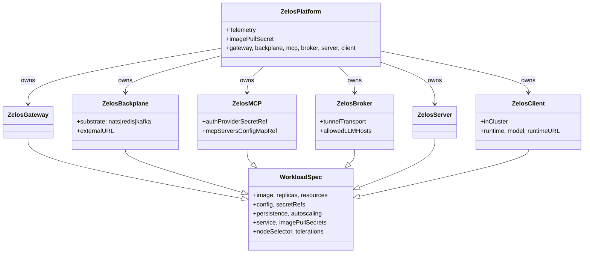

# 08 — CRDs

The `zelosai` operator defines one **umbrella** CRD (`ZelosPlatform`) plus
**six per-component** CRDs. Both APIs live in `zelos.zelosai.io/v1alpha1`.



## `ZelosPlatform` (umbrella)

Apply one `ZelosPlatform` per environment (dev, staging, prod). The
reconciler creates **owned** per-component CRs, materializes the OTel
collector + env ConfigMap, and reports overall readiness in
`.status.conditions`.

Top-level fields:

| Field | Type | Notes |
|---|---|---|
| `spec.imagePullSecret` | string | Defaults to `ghcr-pull-secret`. |
| `spec.defaults` | object | Applied to every component (image, resources, nodeSelector, tolerations). |
| `spec.telemetry` | object | OTel contract; see [11-telemetry.md](./11-telemetry.md). |
| `spec.gateway` | object | Per-component knob bag. |
| `spec.backplane` | object | Per-component knob bag + `substrate`, `externalURL`, `tlsSecretRef`. |
| `spec.mcp` | object | Per-component knob bag + `authProviderSecretRef`, `mcpServersConfigMapRef`. |
| `spec.broker` | object | Per-component knob bag + `tunnelTransport`, `allowedLLMHosts`. |
| `spec.server` | object | Placeholder; minimal. |
| `spec.client` | object | Per-component knob bag + `inCluster`, `runtime`, `runtimeURL`, `model`, `subscribeTopics`. |

Sample: [config/samples/zelos_v1alpha1_zelosplatform.yaml](../../config/samples/zelos_v1alpha1_zelosplatform.yaml).

## Common `WorkloadSpec`

Every component CRD embeds this envelope. It is the only thing per-component
controllers care about when rendering Deployments.

| Field | Effect |
|---|---|
| `image.{repository,tag,pullPolicy}` | Container image. Defaults to `ghcr.io/zelosai/<component>:develop`. |
| `replicas` | Deployment replicas. |
| `resources` | Container resource requests/limits. |
| `config` | Rendered to a ConfigMap and mounted via `envFrom`. Keys are passed through as env vars (callers provide uppercase names). |
| `secretRefs[]` | Each `{name, key, path?, env?}` projects a Secret key as a file at `/etc/zelos/secrets/<key>` (default) and exports the file path via `ZELOS<COMPONENT>_<KEY>_FILE` (default). |
| `persistence.{enabled,size,storageClassName,accessModes}` | Creates a PVC at `/var/lib/zelos/<component>/`. |
| `autoscaling.{minReplicas,maxReplicas,targetCPUUtilization}` | Creates an HPA targeting the Deployment. |
| `service.{type,port}` | Customizes the ClusterIP Service. |
| `imagePullSecrets[]` | Appended to PodSpec.imagePullSecrets (operator also appends the platform-wide `ghcr-pull-secret`). |
| `nodeSelector`, `tolerations` | Pass-through. |
| `logLevel` | Sets `OTEL_LOG_LEVEL` for the pod. |

## Standard pull-secret reference

CR samples reference the standard ghcr pull secret via:

```yaml
spec:
  imagePullSecrets:
    - name: ghcr-pull-secret
```

The operator additionally appends `ghcr-pull-secret` automatically when
`ZelosPlatform.spec.imagePullSecret` is set, so most users do not need to
repeat the field on every child CR. See
[10-image-registry.md](./10-image-registry.md) for the Secret creation
recipe.

## Per-component highlights

### ZelosGateway

Stateless HTTP entry point. Renders Deployment + Service + optional HPA.
Notable spec: `backplaneRef`, `mcpRef`, `authProviderSecretRef`.

### ZelosBackplane

Substrate selector + connection URL. When `substrate=nats` and no
`externalURL` is given, the operator installs a single-replica NATS
StatefulSet with JetStream enabled and reports the URL in
`.status.url`. For `redis` or `kafka`, the operator never installs the
substrate — `externalURL` is required and is documented in
[09-dependencies.md](./09-dependencies.md).

### ZelosMCP

Stateful Python service. The reconciler turns on `persistence` by default
(1Gi), injects `auth.key` + `providers.json` from the auth-provider Secret as
file mounts, and (optionally) wires the `mcpServers` ConfigMap.

### ZelosBroker

Stateful Go service with `/workspace` PVC for the asset cache. Supports
selecting a tunnel transport and restricting allowed downstream LLM hosts.

### ZelosServer

Placeholder. The operator currently renders a minimal Deployment + Service so
the image can be smoke-tested in cluster. Spec will grow when scope lands.

### ZelosClient

Default deployment is **off-cluster** (Ansible / `zelos.dgx`). When
`spec.inCluster: true`, the operator renders a DaemonSet that runs on nodes
matching `spec.nodeSelector` (typically GPU nodes labeled
`zelos.zelosai.io/gpu=true`).

## See also

- [07-container-contract.md](./07-container-contract.md) — the contract behind the spec fields.
- [11-telemetry.md](./11-telemetry.md) — telemetry CR shape.
- [config/samples/](../../config/samples/) — copy-pasteable CR samples for every kind.
