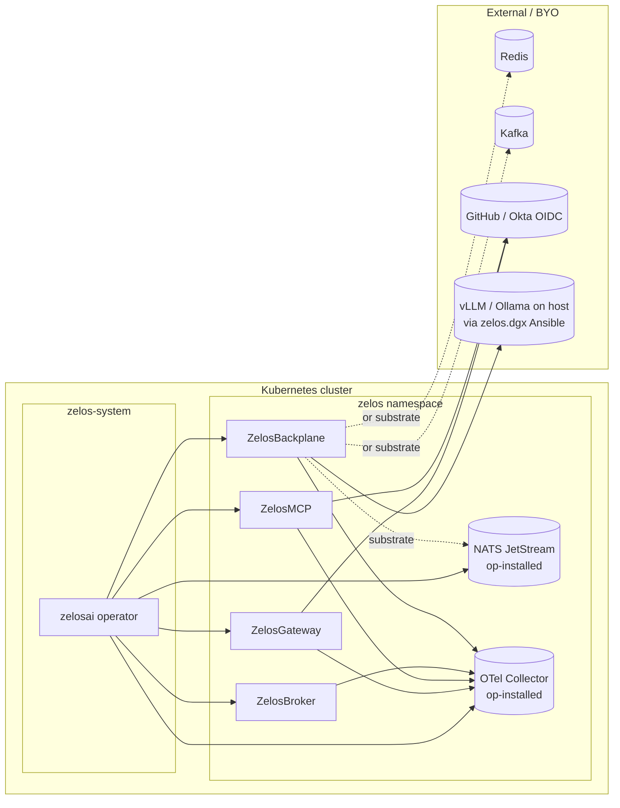

# 09 — Dependencies

Everything the Zelos suite needs that lives outside the in-cluster operator
+ component images. Some are operator-installed; others are bring-your-own.



## Dependency table

| Dependency | Required by | Provisioning | CRD field |
|---|---|---|---|
| **OTel Collector** | All components (logs/metrics/traces) | Operator-installed Deployment (1 replica) when `telemetry.enabled=true` and no `externalEndpoint` | `ZelosPlatform.spec.telemetry` |
| **NATS** (pinned for v0.x) | ZelosBackplane | Operator-installed StatefulSet (single-binary, JetStream). First-class substrate — backplane's NATS connector is the only one implemented end-to-end. | `ZelosBackplane.spec.substrate=nats` |
| **Redis** (alt substrate — skeleton) | ZelosBackplane | External — recommended [Bitnami Redis](https://github.com/bitnami/charts/tree/main/bitnami/redis). Connector remains a TODO stub in v0.x; not selectable at runtime. | `ZelosBackplane.spec.substrate=redis` + `externalURL` |
| **Kafka** (alt substrate — skeleton) | ZelosBackplane | External — recommended [Strimzi Kafka Operator](https://strimzi.io/). Connector remains a TODO stub in v0.x; not selectable at runtime. | `ZelosBackplane.spec.substrate=kafka` + `externalURL` |
| **WebDAV** (share protocol) | ZelosBroker (server), ZelosClient (mount) | Server-side: in-process `golang.org/x/net/webdav`. Client-side: native macOS / `davfs2` on Linux / `net use` on Windows. | `ZelosBroker.spec.enabledShareProtocols` (includes `webdav`) |
| **HTTP-FUSE** (share protocol) | ZelosBroker (REST API), ZelosClient (Go-FUSE driver) | Both sides in-process Go. No external mount tooling. | `ZelosBroker.spec.enabledShareProtocols` (includes `http-fuse`) |
| **Samba sidecar** (SMB share protocol, optional, v0.4) | ZelosBroker (sidecar container) | Operator-rendered sidecar in the broker Pod when SMB is enabled. Client-side: `cifs-utils` on Linux LLM hosts (or native on Windows / macOS). | `ZelosBroker.spec.sambaSidecar`, `enabledShareProtocols` includes `smb` |
| **WebSocket sync channel** | ZelosBroker (terminates), ZelosMCP + ZelosClient (peers) | In-process via `coder/websocket`. No external infra. | `ZelosBroker.spec.syncChannelListen` |
| **WireGuard** (optional traffic wrap) | ZelosBroker, ZelosClient | Kernel WG (mainline since 5.6) + `wireguard-tools` userspace. zelos.dgx Ansible can install the userspace package. | `ZelosBroker.spec.wireGuard.enabled`, `ZelosClient.spec.wireGuard.enabled` |
| **PVC storage class** | ZelosMCP, ZelosBroker, NATS | Cluster default (`storageClassName` unset) or override | `*.spec.persistence.storageClassName` |
| **OAuth providers** (GitHub / Okta) | ZelosMCP, ZelosGateway, ZelosBroker | User-provided Secret keyed by `providers.json` | `*.spec.authProviderSecretRef` |
| **TLS material** | Optional all | [cert-manager](https://cert-manager.io/) ClusterIssuer (self-signed / Let's Encrypt / Google Trust Services) or a user-managed Secret. Under the [DNS standard](./16-dns-and-hostname-standard.md), instances carry **two** wildcard certs — a public one (ACME or internal CA) and an always-internal-CA `.local` one. See the `full` overlay examples + [runbook](../runbooks/full-deployment-with-tls-dns.md). | `*.spec.tlsSecretRef` |
| **Public DNS zone** (optional) | ZelosGateway Ingress; ACME DNS-01; external-dns | A registered public zone — e.g. a [Google Cloud DNS](https://cloud.google.com/dns) managed zone delegated to your domain — used for ACME DNS-01 wildcard issuance and (optionally) [external-dns](https://kubernetes-sigs.github.io/external-dns/) record publishing. Manual A-record is the no-DNS-zone fallback. Example in `deploy/full/`. | Ingress host / `external-dns` |
| **Internal CA trust** (for `.local`) | LAN clients of any instance | The suite's internal CA chain signs the `.local` wildcard (no public CA will). To use the `.local` names from the LAN with valid TLS, the internal CA must be trusted on the client. | n/a (client trust store) |
| **GHCR pull secret** | All | `kubectl create secret docker-registry ghcr-pull-secret …`. See [10-image-registry.md](./10-image-registry.md). | `ZelosPlatform.spec.imagePullSecret` |
| **vLLM / Ollama** | ZelosClient | Host-side via [`zelos.dgx`](./03-provisioning.md) Ansible. Not Kubernetes-deployed. | `ZelosClient.spec.runtimeURL` |
| **VS Code (host)** | zelos-vscode extension | End-user IDE; extension installed via `.vsix` (Marketplace publish follows v0.2 of the extension). | n/a (not a CRD field) |
| **Postgres** (future) | (none today) | External | (placeholder field) |

## Substrate selection guide

The substrate is the connection point between gateway, broker, MCP, and
clients. Choose based on operational profile:

- **NATS** — pinned for v0.x. Lowest operational burden. Operator installs
  a 1-replica StatefulSet with JetStream; persistence sized via
  `spec.backplane.persistence`. Excellent for small/medium deployments
  (≤ ~50k msgs/sec). This is the only substrate the backplane connector
  implements end-to-end today; selecting `redis` or `kafka` will leave
  the bootstrap sidecar in admin-only mode (probes pass, but no pub/sub).
- **Redis** — skeleton only in v0.x. Connector interface defined; impl is
  a TODO stub. Pick once the v0.x+ Redis connector lands. Recommended
  install: Bitnami Redis chart with `architecture: replication`.
- **Kafka** — skeleton only in v0.x. Same situation as Redis. Pick once
  the Kafka connector is implemented. Recommended install: Strimzi
  Operator.

## OAuth provider Secret format

The `authProviderSecretRef` Secret must contain at minimum:

```yaml
apiVersion: v1
kind: Secret
metadata:
  name: zelos-mcp-auth
type: Opaque
stringData:
  auth.key: <Fernet key (32 bytes, urlsafe-base64)>
  providers.json: |
    {
      "github": {
        "client_id": "...",
        "client_secret": "...",
        "scopes": ["read:user"]
      },
      "okta": {
        "client_id": "...",
        "client_secret": "...",
        "issuer": "https://<your>.okta.com"
      }
    }
```

Generate `auth.key` once with:

```bash
python -c "from cryptography.fernet import Fernet; print(Fernet.generate_key().decode())"
```

The Secret name is referenced by the CR; the operator mounts the keys at
`/etc/zelos/secrets/auth.key` and `/etc/zelos/secrets/providers.json` per
the [container contract](./07-container-contract.md).

## See also

- [10-image-registry.md](./10-image-registry.md) — GHCR pull secret recipe.
- [11-telemetry.md](./11-telemetry.md) — OTel collector configuration.
- [03-provisioning.md](./03-provisioning.md) — host-side provisioning via `zelos.dgx`.
- [16-dns-and-hostname-standard.md](./16-dns-and-hostname-standard.md) — the DNS /
  hostname standard the dual-cert + public-DNS + `.local` dependencies serve.
- `zelos.kubernetes`
  [`docs/google-trust-services-cert-manager.md`](https://github.com/ZelosAI/zelos.kubernetes/blob/develop/docs/google-trust-services-cert-manager.md)
  — the Google Cloud DNS managed zone + `dns.admin` SA + GTS EAB setup for
  ACME DNS-01 issuance.
