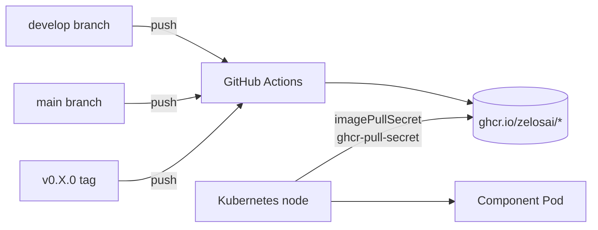

# 10 — Image Registry

All Zelos suite images live in GitHub Container Registry under the ZelosAI
organization. The release workflow in each repo
([example](https://github.com/ZelosAI/zelosbackplane/blob/develop/.github/workflows/release.yml))
publishes multi-arch images on every push to `develop` and `main`.



## Naming

| Component | Image |
|---|---|
| zelosai (operator) | `ghcr.io/zelosai/zelosai` |
| zelosgateway | `ghcr.io/zelosai/zelosgateway` |
| zelosbackplane | `ghcr.io/zelosai/zelosbackplane` |
| zelosmcp | `ghcr.io/zelosai/zelosmcp` |
| zelosbroker | `ghcr.io/zelosai/zelosbroker` |
| zelosserver | `ghcr.io/zelosai/zelosserver` |
| zelosclient | `ghcr.io/zelosai/zelosclient` |

## Tag policy

| Tag | Source | When to use |
|---|---|---|
| `develop` | latest `develop` branch build | dev / preview environments |
| `vX.Y.Z-dev` | every `develop` push | reproducible dev pin |
| `vX.Y.Z` | every `main` push | production |
| `stable` | latest `vX.Y.Z` on `main` | rolling production |
| `sha-<short>` | every push | exact bisection |

## Standard pull secret

The conventional Secret name is **`ghcr-pull-secret`**, of type
`kubernetes.io/dockerconfigjson`, in the namespace where Zelos is deployed.

### Create with kubectl

```bash
kubectl create secret docker-registry ghcr-pull-secret \
  --namespace=zelos \
  --docker-server=ghcr.io \
  --docker-username=<github-user-or-org> \
  --docker-password=<PAT-with-read:packages> \
  --docker-email=<email>
```

The PAT must have the `read:packages` scope (and `repo` if any of the
package visibilities are private to a private repo).

### YAML form

`ghcr-pull-secret.example.yaml` ships in
[deploy/minimum/](../../deploy/minimum/ghcr-pull-secret.example.yaml) and in
every component repo's `deploy/kubernetes/`. The shape:

```yaml
apiVersion: v1
kind: Secret
metadata:
  name: ghcr-pull-secret
  namespace: zelos
type: kubernetes.io/dockerconfigjson
data:
  .dockerconfigjson: <base64-dockerconfigjson>
```

To generate the `.dockerconfigjson` payload locally:

```bash
kubectl create secret docker-registry ghcr-pull-secret \
  --docker-server=ghcr.io \
  --docker-username=<user> \
  --docker-password=<PAT> \
  --docker-email=<email> \
  --dry-run=client -o yaml | yq '.data[".dockerconfigjson"]'
```

### Referencing it in a CR

```yaml
apiVersion: zelos.zelosai.io/v1alpha1
kind: ZelosPlatform
spec:
  imagePullSecret: ghcr-pull-secret    # name only; namespace is the CR's namespace
```

For a per-component CR (no umbrella), use the standard `imagePullSecrets[]`:

```yaml
apiVersion: zelos.zelosai.io/v1alpha1
kind: ZelosGateway
spec:
  imagePullSecrets:
    - name: ghcr-pull-secret
```

## Multi-namespace clusters

If you deploy Zelos in multiple namespaces, create the Secret in each. There
is no operator-managed Secret replication. The
[image-pull-secret-replicator](https://github.com/mittwald/kubernetes-replicator)
or kustomize patches are reasonable workarounds.

## See also

- [07-container-contract.md](./07-container-contract.md) — image refs and pull secrets in the contract.
- [09-dependencies.md](./09-dependencies.md) — full external-dependency inventory.
