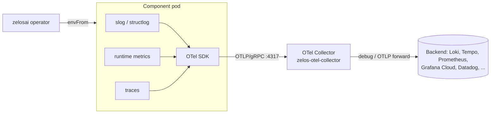

# 11 — Telemetry

The Zelos suite emits **logs, metrics, and traces via OpenTelemetry**,
exported over OTLP/gRPC to a collector. The operator deploys the collector
by default; users with an existing observability backend can point
components at an external OTLP endpoint instead.



## Standard env vars

The operator injects these on every Pod via `envFrom` of the
`zelos-otel-env-<platform>` ConfigMap. Components consume them through the
stock OTel SDK env-var contract — **no custom parsing**.

| Env | Default | Purpose |
|---|---|---|
| `OTEL_SERVICE_NAME` | `<component>` | service.name resource attribute |
| `OTEL_SERVICE_VERSION` | image tag | service.version |
| `OTEL_RESOURCE_ATTRIBUTES` | `deployment.environment=<ns>,k8s.namespace.name=<ns>,zelos.platform=<name>` | additional resource attrs |
| `OTEL_EXPORTER_OTLP_ENDPOINT` | `http://zelos-otel-collector.<ns>.svc:4317` | collector endpoint (gRPC) |
| `OTEL_EXPORTER_OTLP_PROTOCOL` | `grpc` | protocol |
| `OTEL_LOGS_EXPORTER` | `otlp` (or `console` when telemetry disabled) | logs exporter |
| `OTEL_METRICS_EXPORTER` | `otlp` | |
| `OTEL_TRACES_EXPORTER` | `otlp` | |
| `OTEL_LOG_LEVEL` | from `spec.telemetry.logLevel` (default `info`) | SDK + app log level |

Plus the downward env vars for pod identity (set by the operator on every
container):

```yaml
- name: POD_NAME
  valueFrom: { fieldRef: { fieldPath: metadata.name } }
- name: POD_NAMESPACE
  valueFrom: { fieldRef: { fieldPath: metadata.namespace } }
```

## Library choices

| Language | Logger | OTel SDK | Bridge |
|---|---|---|---|
| Go | `log/slog` (stdlib) | `go.opentelemetry.io/otel` | `go.opentelemetry.io/contrib/bridges/otelslog` |
| Python | `structlog` | `opentelemetry-sdk` + `opentelemetry-exporter-otlp-proto-grpc` | `opentelemetry-instrumentation-logging` |

Each component has a small `internal/telemetry/` (Go) or `telemetry.py`
(Python) module that:

1. Reads the standard OTel env vars at startup.
2. Builds the resource attributes from `OTEL_SERVICE_NAME`,
   `POD_NAME`, `POD_NAMESPACE`, and `OTEL_RESOURCE_ATTRIBUTES`.
3. Wires the logger of choice through the OTel bridge.
4. Returns a `Shutdown(ctx)` function called in main's defer.

## Standard log / span attributes

Components MUST set these when the data is available:

| Attribute | When |
|---|---|
| `corr_id` | Always (envelope / `X-Request-Id`). |
| `trace_id`, `span_id` | Auto, via OTel SDK. |
| `zelos.component` | Always. |
| `zelos.tenant` | When multi-tenant context exists. |

## Collector pipeline (operator-installed)

Defined in [internal/controller/render/telemetry.go](../../internal/controller/render/telemetry.go):

```yaml
receivers:
  otlp:
    protocols:
      grpc: { endpoint: 0.0.0.0:4317 }
      http: { endpoint: 0.0.0.0:4318 }
processors:
  batch: {}
  memory_limiter: { check_interval: 1s, limit_percentage: 80, spike_limit_percentage: 25 }
exporters:
  debug: { verbosity: basic }
service:
  pipelines:
    logs:    { receivers: [otlp], processors: [memory_limiter, batch], exporters: [debug] }
    metrics: { receivers: [otlp], processors: [memory_limiter, batch], exporters: [debug] }
    traces:  { receivers: [otlp], processors: [memory_limiter, batch], exporters: [debug] }
```

`debug` is the safe default. Production deployments should patch the
collector ConfigMap (or run their own collector via `externalEndpoint`) to
forward to Loki/Tempo/Prometheus/Datadog/etc.

## External endpoint mode

```yaml
apiVersion: zelos.zelosai.io/v1alpha1
kind: ZelosPlatform
spec:
  telemetry:
    enabled: true
    externalEndpoint: otel-collector.observability.svc:4317
```

When `externalEndpoint` is set, the operator skips the in-cluster collector
and points all workloads at the external endpoint. Cluster operators are
expected to ensure the network path + TLS configuration is correct.

## Local dev fallback

When `OTEL_EXPORTER_OTLP_ENDPOINT` is unset (running outside the operator,
e.g. `go run ./cmd/zelosgateway` on a laptop), each component falls back to
`OTEL_LOGS_EXPORTER=console` and emits OTel-formatted JSON to stdout. The
contract still holds — only the destination changes.

## See also

- [07-container-contract.md](./07-container-contract.md) — the broader pod contract.
- [render/telemetry.go](../../internal/controller/render/telemetry.go) — collector rendering source.
