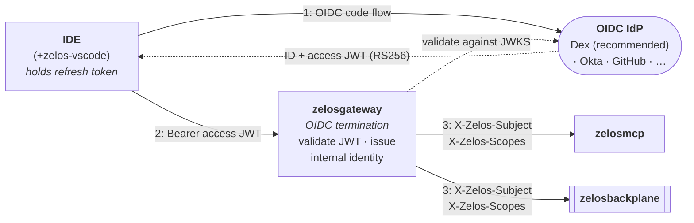
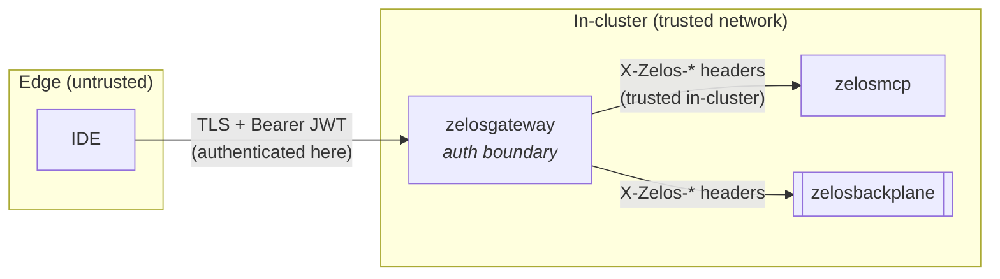

# 12 — Authentication & identity propagation

> **TL;DR.** [zelosgateway](./04-components/zelosgateway.md) is the single auth
> termination point. It runs the OIDC code flow against an external IdP
> (**Dex** is the recommended Early-Access provider, but any OIDC IdP works),
> validates the RS256-signed ID + access JWTs on every request, and then
> hands downstream control-plane services a *suite-internal* identity via the
> `X-Zelos-Subject` and `X-Zelos-Scopes` headers. Downstream services
> (`zelosmcp`, `zelosbackplane`) trust those headers because they only ever
> arrive over the in-cluster network behind the gateway — there is no
> propagated JWT and no service-to-service mTLS in EA. Single-tenant for EA;
> multi-tenancy is deferred to v1.0.

This page is the architecture decision that unblocks the gateway OIDC
implementation in [zelosgateway](https://github.com/ZelosAI/zelosgateway).
It pins one concrete provider recipe (Dex) so the v0.5 auth-recipe runbook can
document a single working path across all deployment strategies, while leaving
operators free to swap in any standards-compliant OIDC IdP.

## Where auth lives in the suite

The boundary is sharp: **OIDC tokens exist only on the edge** (IDE ↔ IdP ↔
gateway). Once the gateway has authenticated a request, everything south of it
speaks the internal-header identity dialect. This matches the gateway's stated
role — *"auth terminates here, and downstream traffic uses suite-internal
identities"* (see [zelosgateway](./04-components/zelosgateway.md#what-it-is-not)).

## Provider choice — Dex for EA

The suite **recommends [Dex](https://dexidp.io/)** as the Early-Access OIDC
provider, but does **not require** it. Dex is a small, self-hostable OIDC
issuer that federates to upstream connectors (GitHub, Google, LDAP, SAML,
static passwords), which makes it a good fit for every Zelos deployment
target:

| Deployment target | Why Dex fits |
|---|---|
| Large multi-node Kubernetes | Runs as one more in-cluster Deployment; federates to the customer's corporate IdP via a connector. |
| Single DGX on k3s | Self-contained issuer with no external SSO dependency — a static-password or GitHub connector is enough for a single-site dev bed. |
| Air-gapped / offline | Dex issues its own tokens; no round-trip to a public IdP required. |

Operators who already run Okta, Auth0, Keycloak, Azure AD, or GitHub OIDC can
point the gateway at that issuer instead — the gateway only needs the issuer
URL, client ID, client secret, and the JWKS endpoint. Dex is the *one recipe
we document end-to-end* so the v0.5 auth runbook has a concrete, reproducible
path; it is not a hard dependency. The existing OAuth-provider inventory in
[09-dependencies.md](./09-dependencies.md#oauth-provider-secret-format)
(GitHub / Okta) describes the same bring-your-own-IdP posture from the
dependency side.

## Token format — OIDC ID + access JWT, RS256

The gateway terminates the **OIDC authorization-code flow** (with PKCE for the
IDE public client). Two tokens come back from the IdP:

| Token | Audience | Carried where | Gateway use |
|---|---|---|---|
| **ID token** (JWT) | the IDE client | held by the IDE | proves *who the user is* to the IDE; surfaces profile claims (`sub`, `email`, `name`). |
| **Access token** (JWT) | the Zelos gateway | sent to the gateway as `Authorization: Bearer …` | the credential the gateway validates on every request. |

Both are **JWTs signed with RS256** (asymmetric). The gateway validates the
access token's signature against the IdP's published **JWKS** (fetched from the
issuer's `/.well-known/openid-configuration` → `jwks_uri` and cached with the
advertised TTL), and checks `iss`, `aud`, `exp`, and `nbf`. RS256 (not HS256)
is mandated so the gateway can verify tokens with the IdP's *public* key alone
and never has to share a symmetric signing secret with the IdP.

Claims the gateway relies on:

- `sub` — the stable subject identifier. Becomes `X-Zelos-Subject`.
- `scope` / `scp` — space- or array-delimited scopes granted to the access
  token. Become `X-Zelos-Scopes`.
- `exp` / `nbf` / `iss` / `aud` — standard validity + binding checks.

## Identity propagation — internal headers, not a forwarded JWT

After the gateway validates the access token, it does **not** forward the JWT
downstream. Instead it strips any client-supplied identity headers and injects
its own:

| Header | Value | Source claim |
|---|---|---|
| `X-Zelos-Subject` | the authenticated principal | `sub` |
| `X-Zelos-Scopes` | space-delimited granted scopes | `scope` / `scp` |

`zelosmcp` and `zelosbackplane` read identity **only** from these headers. They
do no token validation of their own — the gateway is the one place that talks
to the IdP and parses JWTs.

### Why internal headers instead of a propagated JWT

This is a deliberate EA simplification (see **Decisions** below):

- **No per-hop expiry handling.** A forwarded JWT can expire *mid-request* (it
  was minted before the request entered the gateway and could lapse while the
  request fans out to MCP and the backplane). Each downstream service would
  then need its own clock-skew tolerance, re-validation, and refresh-aware
  retry logic. For EA that complexity is not worth it: the gateway validates
  once, at the edge, and the internal identity is valid for exactly the
  lifetime of that one request.
- **No JWKS fan-out.** Only the gateway needs IdP connectivity and a JWKS
  cache. MCP and the backplane stay IdP-agnostic.
- **Smaller blast radius.** Downstream services never see the raw bearer token,
  so a compromised MCP or backplane pod cannot replay a user's JWT against the
  IdP or other services.

The cost — that the internal headers are only as trustworthy as the network
they cross — is acceptable inside a single cluster (see the trust boundary
below) and is the standard pattern for an authenticating reverse proxy.

## Trust boundary

- **Edge → gateway** is the only place authentication happens. The connection
  is TLS-terminated and the access JWT is validated. Everything north of the
  gateway is untrusted.
- **Gateway → mcp / backplane** crosses the **in-cluster network only**. For
  EA there is **no mTLS between control-plane services**: the `X-Zelos-*`
  headers are trusted because they can only originate from the gateway over
  the cluster's internal pod network, and the gateway strips any
  client-supplied `X-Zelos-*` headers before injecting its own (so a client
  cannot spoof identity through the gateway).
- **Enforcement that keeps the boundary honest** is the cluster network, not a
  cryptographic handshake: components MUST NOT be exposed outside the cluster
  except through the gateway, and a `NetworkPolicy` that only admits
  gateway-originated traffic to the MCP / backplane ports is the recommended
  hardening (left to the deployment; the operator does not render it in EA).

mTLS / SPIFFE-style workload identity between control-plane services is a
**post-EA hardening item**, not an EA requirement. It is the natural companion
to multi-tenancy (below) — both are deferred together.

## Multi-tenancy posture

**EA is single-tenant.** One Zelos deployment serves one tenant: there is no
tenant claim threaded through the headers, no per-tenant key isolation, and no
per-tenant routing in the gateway. `X-Zelos-Subject` identifies a *user* within
the single tenant, not a tenant.

**Multi-tenancy is deferred to v1.0.** When it lands it is expected to add:

- a tenant claim (e.g. `X-Zelos-Tenant`) propagated alongside subject + scopes;
- per-tenant scoping of MCP tool catalogs, backplane topics, and broker shares;
- workload identity (mTLS / SPIFFE) so the trust boundary no longer rests on
  network reachability alone.

Designing the EA header set with this in mind — subject and scopes as discrete
headers rather than an opaque blob — keeps the v1.0 tenant header an additive
change.

## Refresh tokens

Refresh-token storage stays at the **IDE / extension layer**. The
[zelos-vscode](./04-components/zelos-vscode.md) extension owns the OIDC client
session: it runs the code flow through VS Code's `AuthenticationProvider`
([see the extension page](./04-components/zelos-vscode.md#why-a-vs-code-extension-and-not-just-cli)),
caches the refresh token in the editor's secret storage, and silently refreshes
the access token when it nears expiry.

The **gateway does not persist tokens beyond a single request.** It validates
the access token presented on the request, derives the internal identity, and
holds nothing afterward — no session store, no refresh-token database, no
server-side cookie jar. This keeps the gateway stateless with respect to auth
(it scales horizontally with no shared session backend) and keeps long-lived
credentials in exactly one place: the user's IDE.

## Decisions

- **Dex recommended, not required.** Dex is the documented EA recipe across all
  three deployment targets; operators can point the gateway at any OIDC IdP
  (Okta, Auth0, Keycloak, Azure AD, GitHub) by supplying the issuer URL,
  client ID/secret, and JWKS endpoint.
- **Internal headers (`X-Zelos-Subject` / `X-Zelos-Scopes`), not a propagated
  JWT.** Re-validating a forwarded token at every hop — with its own expiry,
  clock-skew, and refresh handling — is not worth the complexity inside a
  single request in EA. The gateway validates once at the edge; the internal
  identity lives for the request.
- **RS256, validated against the IdP's JWKS.** Asymmetric signing means the
  gateway verifies with the IdP's public key and never shares a symmetric
  secret.
- **No mTLS between control-plane services in EA.** Internal headers are
  trusted because they only cross the in-cluster network behind the gateway;
  the gateway strips client-supplied `X-Zelos-*` headers. Workload-identity
  mTLS is a post-EA hardening item tied to multi-tenancy.
- **Single-tenant for EA; multi-tenant deferred to v1.0.** The header set is
  designed so a future `X-Zelos-Tenant` is an additive change.
- **Refresh-token storage stays at the IDE/extension layer.** The gateway does
  not persist tokens beyond a request and holds no auth session state.

## Dependencies

- **Blocks:** gateway OIDC implementation in
  [zelosgateway](https://github.com/ZelosAI/zelosgateway) (v0.3); the
  auth-recipe runbook (v0.5) that documents the concrete Dex setup across
  deployment strategies.
- **Related:** the gateway already declares an `ZELOSGATEWAY_OIDC_CLIENT_SECRET`
  surface in the [container contract](./07-container-contract.md#config-vs-secrets)
  (secret material is mounted as a file, never an env var); the OAuth-provider
  Secret format lives in
  [09-dependencies.md](./09-dependencies.md#oauth-provider-secret-format).

## See also

- [00-overview.md](./00-overview.md) — where auth sits in the suite.
- [04-components/zelosgateway.md](./04-components/zelosgateway.md) — the auth
  termination point.
- [04-components/zelos-vscode.md](./04-components/zelos-vscode.md) — the IDE
  client that runs the OIDC flow and holds the refresh token.
- [07-container-contract.md](./07-container-contract.md) — how the OIDC client
  secret is mounted (file, not env).
- [09-dependencies.md](./09-dependencies.md) — external IdP / OAuth-provider
  dependency inventory.
