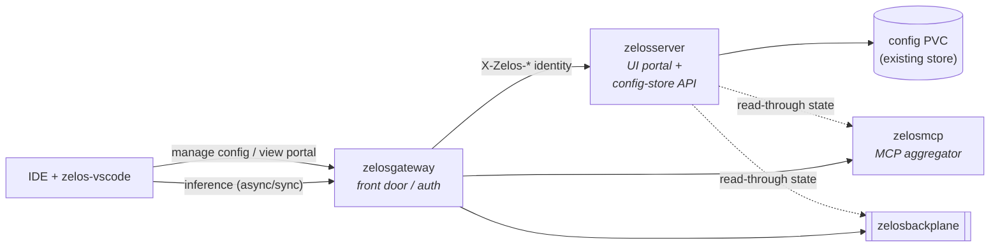

# 13 — zelosserver scope

> **TL;DR.** `zelosserver` is the suite's **operator-facing control portal**: a
> **dual-purpose** component that is *primarily* a **web UI portal** and ships
> the *thin **config-store API*** that the UI (and the IDE) read and write
> suite configuration through — IDE assets, rule files, agent definitions,
> hooks. It is **not** a monitoring backend (the
> [OpenTelemetry pipeline](./11-telemetry.md) already owns observability) and it
> introduces **no new database**: its persistence reuses the cluster's existing
> store. Single Python service, single image, one CRD slot.

This page closes the "scope TBD" that `zelosserver` has carried since
bootstrap (see [04-components/zelosserver.md](./04-components/zelosserver.md)
and the repo's `docs/SCOPE_TBD.md`). It is the decision that unblocks the
`zelosserver` MVP feature in v0.4 and closes the spirit of
[`ZelosAI/zelosserver#10`](https://github.com/ZelosAI/zelosserver/issues/10).
Per the issue, the decision is **made here, not deferred** — there is no
"TBD in doc" outcome.

## Role candidates considered

The four candidates carried in [04-components/zelosserver.md](./04-components/zelosserver.md):

| Candidate | What it would be | Verdict |
|---|---|---|
| **UI portal** | A web portal surfacing suite state (backends loaded in mcp, backplane queue, subscribed clients, token-savings) and letting an operator manage configuration. | **Chosen** (primary face). |
| **Monitoring backend** | A centralized Prometheus + Grafana / observability stack for the suite. | **Rejected.** Duplicates the existing OTel pipeline. |
| **Config-store API** | An HTTP API + persistence for IDE assets, rules, agents, hooks. | **Chosen** (the backend the UI is built on). |
| **Dual-purpose** | Some combination of the above. | **Chosen shape:** UI portal **+** config-store API. |

## Decision

**`zelosserver` is a dual-purpose UI portal + config-store API.**

- **Primary role — operator-facing web UI portal.** It is the suite's single
  human entry point: a read view of live suite state and a management view for
  the configuration the suite keeps between runs.
- **Backing role — config-store HTTP API.** The same service exposes the REST
  surface the portal renders over *and* that the
  [zelos-vscode](./04-components/zelos-vscode.md) extension uses to push/pull
  IDE assets, rules, agents, and hooks. The UI is a client of this API; so is
  the IDE.

These are one component, not two: the API is the portal's own backend, so
shipping them together avoids a second repo and a second image for what is one
trust domain and one release unit.

## Rationale

- **The monitoring slot is already filled.** [11-telemetry.md](./11-telemetry.md)
  pins an OpenTelemetry pipeline: every component emits logs/metrics/traces over
  OTLP to a collector that forwards to Loki / Tempo / Prometheus / Grafana /
  Datadog. Making `zelosserver` a monitoring backend would duplicate that and
  fork the observability story. **Observability stays in the OTel pipeline.**
  The portal *may* link out to an existing Grafana, but it does not host one.
- **The UI slot is genuinely empty.** Nothing in the suite presents human-
  readable state today. A portal is the real gap, and `zelosserver` is the
  only Python component besides `zelosmcp` — a good fit for a FastAPI + served
  front end.
- **A UI needs a config backend, and that backend has no other owner.** IDE
  assets, rule files, agent definitions, and hooks need to live somewhere
  between runs. `zelosmcp` *pushes* assets to the IDE but is not their system
  of record. Folding the config-store API into the same service the portal
  reads keeps the asset lifecycle in one place.
- **One component, one release unit.** UI and its API share auth context, data
  model, and deployment lifecycle. Splitting them buys nothing for EA.

## Non-goals

- **Not a monitoring/observability backend.** No Prometheus, no Grafana, no
  metrics scraping. Observability is the OTel pipeline ([11-telemetry.md](./11-telemetry.md)).
  `zelosserver` emits its *own* telemetry through that pipeline like every
  other component; it does not collect anyone else's.
- **No new database.** Persistence reuses an existing store in the cluster (see
  *Persistence* below). `zelosserver` does **not** introduce a new datastore
  dependency.
- **Not on the request hot path.** It is a control-plane portal, not an
  inference or routing component. It sits beside the async/sync paths, not in
  them — the IDE's inference traffic never transits `zelosserver`.
- **No auth of its own.** It sits behind the gateway and trusts the
  `X-Zelos-Subject` / `X-Zelos-Scopes` identity headers like every other
  control-plane service ([12-auth.md](./12-auth.md)). No second login.
- **Multi-tenant config isolation deferred to v1.0**, in lockstep with the
  suite-wide multi-tenancy posture in [12-auth.md](./12-auth.md).

## Surface

### HTTP endpoints

A small, stable REST surface (FastAPI). Indicative shape for the MVP — exact
paths firm up in the MVP feature:

| Method + path | Purpose |
|---|---|
| `GET /` | the portal SPA (static front end) |
| `GET /api/state` | read-only suite state aggregated for the dashboard (backends, queue depth, subscribed clients, token-savings) |
| `GET /api/assets`, `GET/PUT/DELETE /api/assets/{id}` | IDE asset config-store CRUD |
| `GET/PUT /api/rules`, `GET/PUT /api/agents`, `GET/PUT /api/hooks` | rule / agent / hook config-store CRUD |
| `GET /healthz`, `GET /readyz` | probes per the [container contract](./07-container-contract.md) |

The dashboard's *live* state (`/api/state`) is **read-through** — `zelosserver`
queries the gateway / mcp / backplane (or their telemetry) on demand and does
not persist it. Only the **config-store** half (`/api/assets`, `/api/rules`,
`/api/agents`, `/api/hooks`) is persisted.

### Persistence

- **Reuses an existing store; no new DB is introduced here** (per the issue's
  constraint). For EA the config-store is backed by a **PVC** through the
  component's `*.spec.persistence` surface (the same StorageClass story as the
  rest of the suite, [09-dependencies.md](./09-dependencies.md)) — a
  file/embedded store on a `ReadWriteOnce` volume, sized small. If a shared
  relational store is later wanted, the `Postgres (future)` placeholder already
  listed in [09-dependencies.md](./09-dependencies.md) is the path — still not a
  *new* dependency, just the one already reserved.
- Live dashboard state is **not** persisted (read-through, above), so the only
  persistent data is configuration.

## Boundary vs. mcp + gateway

- **vs. `zelosgateway`** — the gateway is the front door and auth terminator
  ([12-auth.md](./12-auth.md)); `zelosserver` sits *behind* it like any other
  control-plane service and never terminates auth itself. Portal and API
  traffic reach `zelosserver` through the gateway.
- **vs. `zelosmcp`** — `zelosmcp` is the runtime MCP aggregator that *pushes*
  IDE assets and compresses tool catalogs on the request path.
  `zelosserver` is the *system of record* for that configuration off the hot
  path: it stores the assets/rules/agents/hooks; `zelosmcp` consumes and
  applies them. They are complementary, not overlapping — `zelosserver` never
  proxies MCP traffic and `zelosmcp` never serves a UI.
- **vs. the inference paths** — `zelosserver` is not on the async
  ([01-async-path.md](./01-async-path.md)) or sync
  ([02-sync-path.md](./02-sync-path.md)) path at all.

## Decisions

- **Dual-purpose: UI portal (primary) + config-store API (backing).** One
  Python service, one image, one CRD slot.
- **Not a monitoring backend.** Observability stays in the
  [OTel pipeline](./11-telemetry.md); the portal may link to an existing
  Grafana but hosts no monitoring stack.
- **No new database.** Config-store reuses an existing store (PVC for EA; the
  reserved Postgres placeholder if a shared RDBMS is later needed).
- **Behind the gateway, no second auth.** Trusts `X-Zelos-*` identity headers
  like every control-plane service.
- **Off the request hot path.** A control-plane portal, beside the
  async/sync paths, never in them.
- **Single-tenant for EA**, multi-tenant config isolation deferred to v1.0 with
  the rest of the suite.

## Dependencies

- **Blocks:** the `zelosserver` MVP feature (v0.4). Closes the spirit of
  [`ZelosAI/zelosserver#10`](https://github.com/ZelosAI/zelosserver/issues/10).
- **Related:** [11-telemetry.md](./11-telemetry.md) (why monitoring is out of
  scope), [12-auth.md](./12-auth.md) (the identity it trusts),
  [09-dependencies.md](./09-dependencies.md) (the existing store it reuses),
  [04-components/zelosmcp.md](./04-components/zelosmcp.md) (the runtime that
  consumes the config it stores).

## See also

- [00-overview.md](./00-overview.md) — the component map this decision updates.
- [04-components/zelosserver.md](./04-components/zelosserver.md) — the
  component page (to be updated from "TBD" to this decision as part of the MVP).
- [04-components/zelos-vscode.md](./04-components/zelos-vscode.md) — the IDE
  client that reads/writes config through the config-store API.
