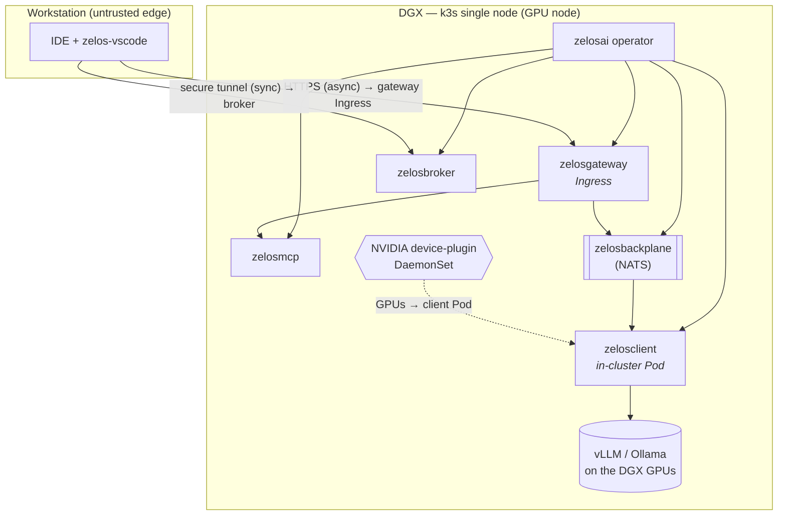
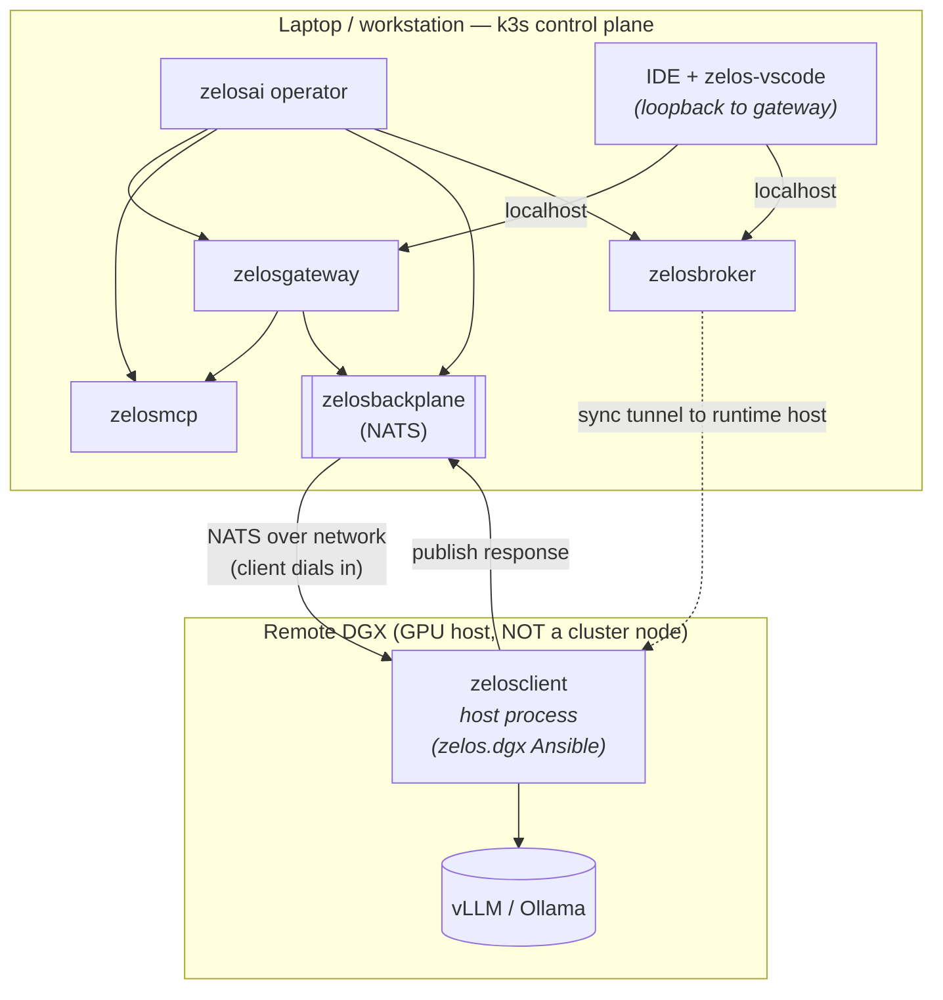
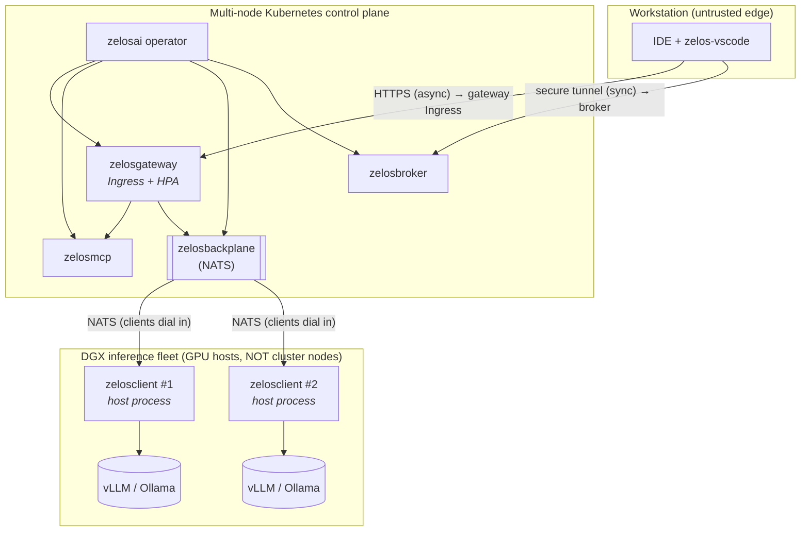

# 14 — Deployment strategies

> **TL;DR.** The Zelos suite ships in three pinned Early-Access topologies.
> **`solo`** = a single NVIDIA DGX running k3s with every component (operator,
> control-plane services, *and* the `zelosclient` worker) on that one box; the
> developer's workstation only connects in. **`split`** = a laptop running k3s
> as the control plane, with the DGX a remote inference host that the
> `zelosclient` runs on directly (not in the cluster). **`full`** = a
> multi-node Kubernetes control plane plus one or more separate DGX inference
> host(s). All three share the same images and CRDs; they differ only in where
> the cluster lives, where the workstation sits relative to it, where the
> `zelosclient` worker runs, and consequently in ingress, storage, and NVIDIA
> device-plugin placement. **There is no CPU-only flavor for EA.**

This page pins the topologies *before* the `deploy/solo/`, `deploy/split/`,
and `deploy/full/` overlays are authored, so each overlay is an honest
derivative of a documented design rather than an ad-hoc bundle of YAML. It is
also the reference the [zelos-vscode](./04-components/zelos-vscode.md) extension
guidance points at when it explains "which endpoint do I configure" for each
target.

Two facts from the rest of the architecture shape every strategy below:

- The four async/sync daemons (`zelosgateway`, `zelosbackplane`,
  `zelosbroker`, plus the `zelosmcp` aggregator) are **in-cluster workloads**
  the operator renders from CRDs.
- The **`zelosclient` always runs on a GPU host, never in the control-plane
  cluster** unless that cluster *is* the GPU host. It is a single long-running
  container provisioned onto the host by the [`zelos.dgx`](./03-provisioning.md)
  Ansible collection (see [04-components/zelosclient.md](./04-components/zelosclient.md)),
  bridging the backplane to a local vLLM / Ollama runtime. This is the single
  biggest difference between the three topologies.

## Strategy summaries

| Strategy | Control plane | GPU / inference host | Where `zelosclient` runs | Primary use |
|---|---|---|---|---|
| **`solo`** | k3s on the DGX itself | the same DGX | in-cluster Pod on the DGX | single-box developer / single-site bed; the simplest "everything on one machine" target |
| **`split`** | k3s on a laptop / workstation | a remote DGX | host process on the DGX (provisioned by `zelos.dgx`), **not** in the cluster | developer who keeps the control plane local and light but offloads inference to a powerful remote box |
| **`full`** | multi-node Kubernetes (≥ control-plane + worker nodes) | one or more **separate** DGX host(s) | host process on each DGX, **not** in the cluster | production / shared deployment with HA control plane and a scalable inference fleet |

The decision axis is *"where is the GPU relative to the cluster?"*:

- `solo` — the GPU **is** the cluster node, so the client is just another Pod.
- `split` / `full` — the GPU is **outside** the cluster, so the client is a
  host-resident process and the cluster only runs the control-plane services.

## Topology diagrams

### `solo` — single DGX, all-in-cluster

### `split` — laptop control plane + remote DGX inference

### `full` — multi-node cluster + separate DGX host(s)

## Networking model

Who reaches whom, on which port, over which network — by strategy.

| Edge | `solo` | `split` | `full` |
|---|---|---|---|
| **IDE → gateway** (async HTTP) | HTTPS to the DGX's gateway Ingress (LAN / VPN) | `localhost` to the laptop's gateway (NodePort or `kubectl port-forward`) | HTTPS to the cluster's gateway Ingress (public or VPN) |
| **IDE → broker** (sync tunnel) | secure tunnel to the broker Service on the DGX | `localhost` to the broker on the laptop | secure tunnel to the broker Ingress / LB |
| **gateway → mcp / backplane** | in-cluster pod network (ClusterIP) | in-cluster pod network (ClusterIP) | in-cluster pod network (ClusterIP) |
| **backplane ↔ client** | in-cluster (NATS ClusterIP) | **across the network**: the remote client dials the laptop's NATS endpoint (NodePort / LB / tunnel) | **across the network**: each DGX client dials the cluster's NATS endpoint (LB / NodePort) |
| **broker → runtime host (sync)** | in-cluster to the client Pod | tunnel to the remote DGX | tunnel to the DGX host(s) |
| **client → vLLM / Ollama** | localhost on the DGX | localhost on the DGX | localhost on each DGX |

The structural divide: in **`solo`** every edge is in-cluster. In **`split`**
and **`full`** the backplane ↔ client edge **leaves the cluster**, so NATS must
be reachable from the GPU host(s) and the client always **dials in** (the
cluster never dials out to the host — see
[01-async-path.md](./01-async-path.md)).

### Ingress / egress

- **`solo`** — one ingress surface: the gateway (and the broker's sync
  endpoint), exposed on the DGX to the workstation's network. k3s ships
  Traefik; the overlay may use it or a NodePort. Egress is only the IdP
  ([12-auth.md](./12-auth.md)) and any subscription LLM the IDE itself calls.
- **`split`** — no public ingress is required; the gateway and broker are
  reached over `localhost` / loopback on the laptop. The one cross-network
  surface is **inbound NATS** the remote client connects to (lock it to the
  DGX's address). Egress: the laptop reaches the remote DGX runtime host for
  the sync tunnel; the DGX client reaches the laptop's NATS.
- **`full`** — gateway and broker are exposed via a real Ingress controller /
  LoadBalancer (TLS via cert-manager, see
  [09-dependencies.md](./09-dependencies.md)). NATS is exposed to the DGX fleet
  over a LoadBalancer or NodePort scoped to the fleet's network. Egress mirrors
  the others (IdP, DGX runtime hosts).

In every strategy, **the gateway is the only authenticated front door** and
all control-plane components MUST NOT be exposed outside the cluster except
through it — the trust boundary from [12-auth.md](./12-auth.md) holds verbatim.
A `NetworkPolicy` admitting only gateway-originated traffic to mcp / backplane
ports is recommended in `full`, optional in `solo` / `split`.

## Secret surfaces

The Secret *set* is identical across strategies (the operator mounts the same
keys per the [container contract](./07-container-contract.md)); what differs is
*how many trust domains* the secrets span.

| Secret | `solo` | `split` | `full` |
|---|---|---|---|
| **GHCR pull secret** ([10-image-registry.md](./10-image-registry.md)) | one cluster | one cluster | one cluster (DGX hosts pull the client image via `zelos.dgx`, separately) |
| **OAuth / OIDC provider secret** ([09-dependencies.md](./09-dependencies.md#oauth-provider-secret-format)) | in-cluster Secret | in-cluster Secret | in-cluster Secret |
| **TLS material** | self-signed / optional (LAN) | usually none (loopback) | cert-manager-issued, required for the public Ingress |
| **Backplane ↔ client auth** | none beyond cluster network | **cross-host credential** the remote client uses to authenticate to NATS | **cross-host credential** each DGX client uses to authenticate to NATS |

`solo` keeps every secret inside a single node's trust domain. `split` and
`full` introduce a **second trust domain** (the GPU host(s)): the
backplane↔client link crosses a network, so it needs its own credential (NATS
auth token / TLS) provisioned to the host by `zelos.dgx`, not just cluster
network reachability.

## PVC + StorageClass expectations

| Concern | `solo` | `split` | `full` |
|---|---|---|---|
| **StorageClass** | k3s `local-path` (default) | k3s `local-path` (default) | a real cluster SC (Ceph / EBS / etc.); set `*.spec.persistence.storageClassName` explicitly |
| **Backplane (NATS JetStream) PVC** | local-path on the DGX | local-path on the laptop | network/replicated SC so the StatefulSet survives node loss |
| **MCP / broker PVCs** | local-path | local-path | network SC |
| **Client-side storage** | n/a (runtime data on the DGX's own disks) | on the DGX host's disks (not a cluster PVC) | on each DGX host's disks (not a cluster PVC) |

Per [09-dependencies.md](./09-dependencies.md), leaving `storageClassName`
unset uses the cluster default — fine for `solo` / `split` (k3s `local-path`),
**but `full` should pin a network-backed StorageClass** so the NATS PVC isn't
nailed to one node. No component needs `ReadWriteMany`.

## NVIDIA device-plugin placement

This is where the topologies diverge most sharply, because it tracks where the
`zelosclient` (the only GPU consumer) runs.

| | `solo` | `split` | `full` |
|---|---|---|---|
| **Who needs the GPU** | the in-cluster `zelosclient` Pod | the **host** `zelosclient` process | the **host** `zelosclient` process(es) |
| **Device-plugin location** | NVIDIA device-plugin **DaemonSet in the k3s cluster** (the DGX is a cluster node), so the client Pod can request `nvidia.com/gpu` | **none in the cluster** — the laptop control plane has no GPUs and runs no GPU workloads | **none in the cluster** — control-plane nodes are GPU-free |
| **How GPUs are exposed** | k8s device-plugin → Pod resource request | host NVIDIA driver + container runtime on the DGX; `zelos.dgx` installs the toolkit, client uses GPUs directly | same as `split`, per DGX host |
| **Operator implication** | client CRD renders a GPU resource request | client is **not** a cluster workload here; the operator renders no GPU request | same as `split` |

Put plainly: **only `solo` runs an NVIDIA device-plugin inside Kubernetes.** In
`split` and `full`, GPUs are owned by the host OS and the `zelosclient` reaches
them through the host driver + NVIDIA container toolkit that `zelos.dgx`
installs ([03-provisioning.md](./03-provisioning.md)) — the control-plane
cluster never schedules GPU Pods.

## Decisions

- **`solo` = single DGX, all components in-cluster (including the
  `zelosclient` Pod); the workstation connects in.** It is the only topology
  with an in-cluster NVIDIA device-plugin and the only one where every edge is
  in-cluster.
- **`split` = laptop k3s control plane + remote DGX inference.** The
  control-plane services run on the laptop; the `zelosclient` runs as a host
  process on the remote DGX (provisioned by `zelos.dgx`) and dials the laptop's
  backplane. No public ingress; the cross-network surface is inbound NATS.
- **`full` = multi-node Kubernetes control plane + one or more separate DGX
  host(s).** HA control plane behind a real Ingress + network StorageClass;
  the DGX fleet runs host-side `zelosclient` processes that dial the cluster's
  backplane.
- **The `zelosclient` is in-cluster only in `solo`.** In `split` / `full` it is
  a host-resident process, never a Pod, and the operator renders no GPU
  request for it.
- **No CPU-only flavor for EA.** Every strategy assumes at least one GPU host;
  a CPU-only target is out of scope until post-EA.
- **NATS is the pinned substrate across all three** (see
  [09-dependencies.md](./09-dependencies.md)); the only difference is whether it
  is reachable in-cluster (`solo`) or also from outside (`split` / `full`).

## Dependencies

- **Blocks:** the `deploy/solo/`, `deploy/split/`, and `deploy/full/` overlays
  (this repo, v0.4); the per-strategy [zelos-vscode](./04-components/zelos-vscode.md)
  endpoint-configuration guidance.
- **Related:** [03-provisioning.md](./03-provisioning.md) (how the DGX host and
  its `zelosclient` come online), [12-auth.md](./12-auth.md) (the trust
  boundary that holds in every strategy), [09-dependencies.md](./09-dependencies.md)
  (substrate, StorageClass, OAuth, TLS), and
  [10-image-registry.md](./10-image-registry.md) (pull secret).

## See also

- [00-overview.md](./00-overview.md) — the two deployment targets at a glance.
- [01-async-path.md](./01-async-path.md) — why the client always dials in.
- [04-components/zelosclient.md](./04-components/zelosclient.md) — the
  host-resident worker that the topology is built around.
- [04-components/zelos-vscode.md](./04-components/zelos-vscode.md) — the IDE
  client that connects in.
