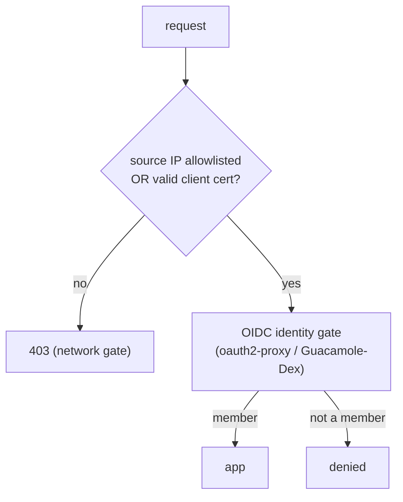

# 17 — Network access gate standard

The suite-wide convention for **gating who can reach a public Zelos endpoint at the network
layer**, before identity (OIDC) is even checked. This is the **source of truth**; the
component repos (`zelos.kubernetes`, `zelos.foundry`, `zelos.bastion`) implement it and link
back here. It generalizes the access gate proven on `zelos.bastion` to the cluster's Istio
ingress.

## The rule

A request is **admitted** when **either**:

1. its **source IP** is on the allowlist (known networks: home/office LAN, corporate egress
   CIDRs), **or**
2. it presents a **valid mTLS client certificate** signed by the bed's client CA (the
   *roaming escape hatch* — get in from any network),

…and is then still subject to the normal **OIDC** identity gate. Neither arm grants identity;
they gate *reachability*. A request with neither is denied (`403`) at the edge.

Two reachability arms because they cover different failure modes: the **allowlist** is
frictionless from trusted networks and survives a TLS-inspecting corporate firewall (which
strips client certs); the **client cert** works from anywhere but needs enrollment. Run both.

## Per-bed client CA

Each bed has **one** mTLS client CA, named **`zelos-client-ca`**, **separate from the server
trust root** (`zelos-root-ca`): trusting the server root for client auth would admit any
workload cert. Properties:

- **`rotationPolicy: Never`**, ~5-year CA. Rotating the CA key invalidates every issued
  `.p12`, so it must not auto-rotate; deliberate rotation overlaps old+new CA PEMs in the
  trust bundle, reissues clients, then drops the old PEM.
- **Leaf certs ~30 days.** Revocation = short lifetimes + removal from the GitHub team (the
  OIDC gate denies immediately, independent of the cert). No CRL/OCSP on the gateway.

### Normative client-cert profile

Per-admin certs **must** carry a SAN — the gateway derives the testable peer **principal**
from it; a SAN-less cert authenticates at TLS but matches no principal, silently failing the
cert arm.

| Field | Value |
|---|---|
| Subject CN | `<github-login>` (informational; OIDC stays authoritative) |
| EKU | `clientAuth` |
| SAN (URI) | `spiffe://<bed_domain>/client/<github-login>` |
| SAN (DNS) | `<github-login>.clients.<bed_domain>` |

The admin's **private key never leaves their device**: they generate key+CSR locally, the
operator signs the CSR with `zelos-client-ca`, and the admin bundles the `.p12`. The
`zelos.kubernetes` `scripts/mtls-client-cert.sh` (wrapped by `make client-cert BED=<bed>
USER=<gh-login>` in `zelos.foundry`) does this against cert-manager.

## Carve-outs

Hosts that self-authenticate or are gated by another mechanism are excluded from the gate
(`notHosts`):

- **`auth.<bed_domain>`** — always; OIDC must be reachable to complete login.
- **`harbor.<bed_domain>`** — registry robot/anonymous pulls self-authenticate.
- **`hooks.<bed_domain>`** — kept on its own GitHub-source-IP allowlist (webhook delivery),
  not the human allowlist.

`harbor`/`hooks` are foundry concepts, contributed by `zelos.foundry`'s `foundry_security`
role; the kubernetes layer carves out only `auth.*`.

## Implementation per layer

| Layer | Mechanism |
|---|---|
| **Cluster (Istio)** | A **DENY `AuthorizationPolicy`** on the public ingressgateway: deny when source IP ∉ allow+internal CIDRs **AND** no valid client cert (`notPrincipals: ["*"]`) **AND** host ∉ carve-outs. The cert arm needs `tls.mode: OPTIONAL_MUTUAL` on the public gateway server (`istio.gateway.client_auth`), trusting the SDS companion Secret `<credentialName>-cacert`. Istio evaluates **CUSTOM → DENY → ALLOW**, so the oauth2-proxy CUSTOM gate runs first (a blocked client may see the OIDC redirect before its 403 — UX only). `zelos.kubernetes.foundation.istio` (`gate.yml`), opt-in `istio.gate.enabled`. |
| **Bastion (Caddy)** | The same OR-gate in the Caddyfile `@blocked` matcher (`remote_ip` allowlist + `client_auth verify_if_given`), per realm. `zelos.bastion`. |

Both consume the **same CA**: a bed bastion harvests `zelos-client-ca`'s cert and seals it as
its `cas_ca_chain`, so **one admin `.p12` opens both the cluster gateway and the bastion**.

## Requirements & caveats

- **True client IP must reach the gateway** — no SNAT between client and ingress. The bed
  satisfies this with `externalTrafficPolicy: Local` + DNAT-only PVE PREROUTING + MetalLB L2;
  verify with the access log's `downstream_remote_address`. With SNAT the IP arm is moot
  (only the cert arm works).
- **Lockout guard** — enabling the gate with an empty allowlist *and* no client-cert arm
  denies everyone; the implementations assert against it. LAN/`.local`/mgmt-gateway and the
  bastion are the out-of-band recovery paths.
- **TLS-inspecting firewalls strip client certs** — rely on the allowlist arm (the corp
  egress CIDRs) from inside such a network; the cert arm is for roaming/clean networks.

## Status & future

Shipped: `zelos.bastion` (Caddy). Added opt-in: `zelos.kubernetes` (Istio) + `zelos.foundry`
(wiring + per-bed flip). Future: surface `spec.networkGate` on the planned **ZelosGateway**
CRD (suite tracker, project #2) so beds declare the gate declaratively; Google CAS as a
managed client-CA option.

See also: [16 — DNS & hostname standard](16-dns-and-hostname-standard.md) ·
[12 — Auth](12-auth.md).
