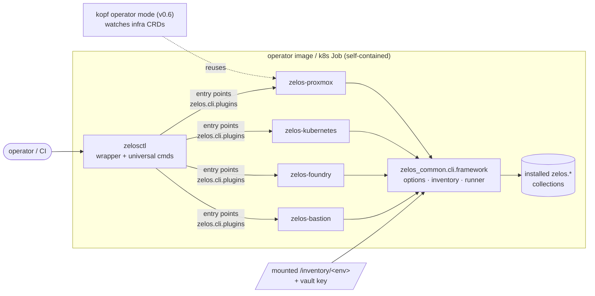

# 19 — Infra operator & plugin CLI (zelosctl)

How the Zelos infrastructure collections are **executed**: a plugin-based CLI
today, CRD-driven operators next — both sharing one implementation. Companion
to [15-ansible-collection-conventions.md](15-ansible-collection-conventions.md)
(§19 carries the binding rules; this doc carries the design + roadmap). Code
home: [`ZelosAI/zelos.common`](https://github.com/ZelosAI/zelos.common)
(`zelos-common` python package).

The same per-collection `VERBS` registry projects onto **four surfaces** with no
per-surface code: the CLI (below), the web console, the OpenAPI contract, and —
for AI agents — an **MCP server** (`zelos.mcp.plugins` is its optional third
extension group, mirroring `zelos.cli.plugins` / `zelos.web.plugins`). See
[21-mcp-surface.md](21-mcp-surface.md) for the MCP surface + its console integration.

## The shape

- **`zelosctl`** (in `zelos-common`) is the always-present wrapper and the
  operator-image **entrypoint**. Universal commands: `env new/list`,
  `secrets seal|unseal|save`, `doctor`, `versions`.
- **Each collection ships a thin CLI plugin package** — `zelos-<name>-cli`
  (pip) → console script `zelos-<name>` + an entry point in group
  **`zelos.cli.plugins`**. The entry-point name is the subcommand namespace;
  the value is `register(subparsers, framework)`. `zelosctl foundry deploy
  --env alpha` ≡ `zelos-foundry deploy --env alpha`.
- **Subcommands mirror the collection's playbook verbs** (§7 taxonomy) and call
  `framework.run_playbook("zelos.<name>.<verb>", args)` — FQCN playbooks
  against the installed collections. The framework owns the shared option
  surface (`--env/--inventory/--vault-pass-file/--tags/--check/-v`),
  per-environment inventory resolution, and actionable errors.
- **Discovery**: entry points first; PATH `zelos-*` executables not claimed by
  an entry point become pass-through subcommands (lets a non-python plugin or
  an older image participate).
- **Lockstep versioning**: a plugin package lives in its collection's repo and
  is versioned/tested/released with it — `zelos-proxmox-cli` is pinned to
  `zelos.proxmox`; only `zelosctl` itself is "always configured".

## Self-contained containers (the §19 rule, restated)

A pulled operator image or Kubernetes Job runs with **nothing but a mounted
`/inventory/<env>` and a vault key**: collections preinstalled, plugin
packages pip-installed, `ENTRYPOINT zelosctl`. No repo checkout, no Makefile,
no bespoke shell scripts at runtime — `make` and `scripts/` are image-build and
developer conveniences only. (Cutover tracked per image:
zelos.foundry#273, zelos.bastion#84.)

## Operator mode (v0.6) — design, stubbed today

- **Boundary:** the `zelosai` **Go** operator owns the app-suite CRDs
  (`ZelosPlatform` + component Kinds). The **python** operator family owns the
  **infra** CRDs — one API group `infra.zelosai.cloud/v1alpha1`, partitioned by
  layer: `ZelosEnvironment`, `ProxmoxHost`, `KubernetesCluster`,
  `FoundryDeployment`, `BastionGateway` (drafts:
  `zelos.common/src/zelos_common/crds/`).
- **CRD spec == role dict.** Specs mirror the collections' single
  inventory-facing dicts 1:1 (§5), so a CR is the same data as
  `inventory/<env>/<env>.config.yml` and the operator reconcile path reuses the
  CLI plugin command implementations unchanged. **Install the plugins an
  operator instance should handle and it reconciles exactly those Kinds** —
  e.g. a foundry operator with proxmox+kubernetes+bastion plugins processes
  all four layers' CRs.
- **kopf + the framework's runner** drive reconciliation; status conditions map
  the playbook outcome. A `zelosctl apply --context <cluster>` path submits CRs
  to a remote cluster, so a local workstation can drive a remote operator with
  the same schema it uses locally.
- Until v0.6 the operator package is an import-able stub
  (`zelos_common.operator`) and the CRDs are design drafts — schema review
  happens against the v0.4.8 refactor's stabilized role dicts.

## Decision log

- **Plugin CLI over monolith** — per-collection binaries pinned to their
  collection kill version skew; the wrapper presents one taxonomy (user
  decision, 2026-06-11).
- **stdlib-only framework** at scaffold stage — shells out to
  `ansible-playbook`/`ansible-vault`; `ansible-runner`/`kopf` deps arrive with
  the v0.6 operator slice.
- **Package home = zelos.common repo** (with the collection) — one repo, two
  artifacts; `galaxy.yml build_ignore` excludes `src/` + `pyproject.toml`
  (user decision over a separate repo, 2026-06-11).
