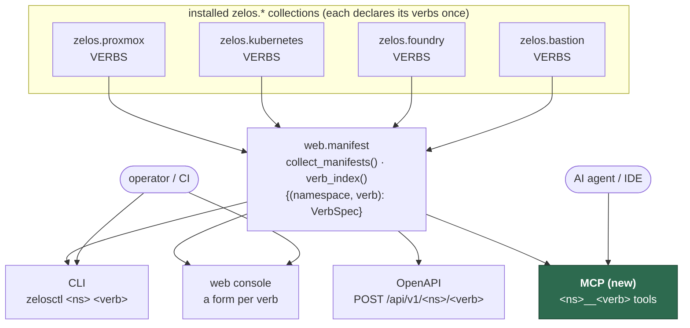
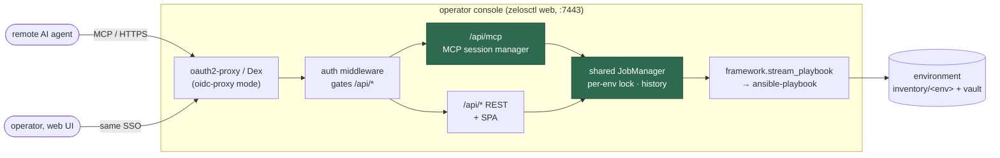
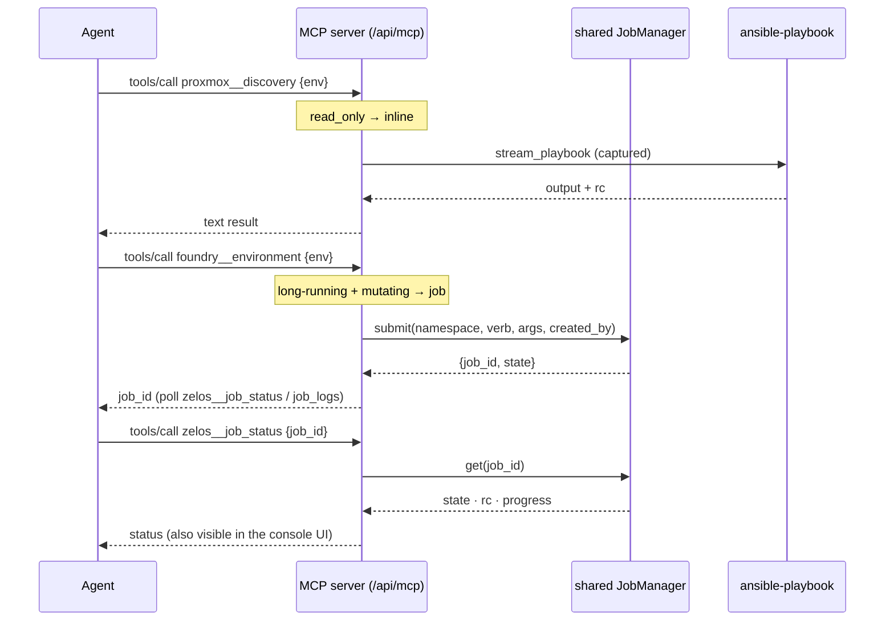
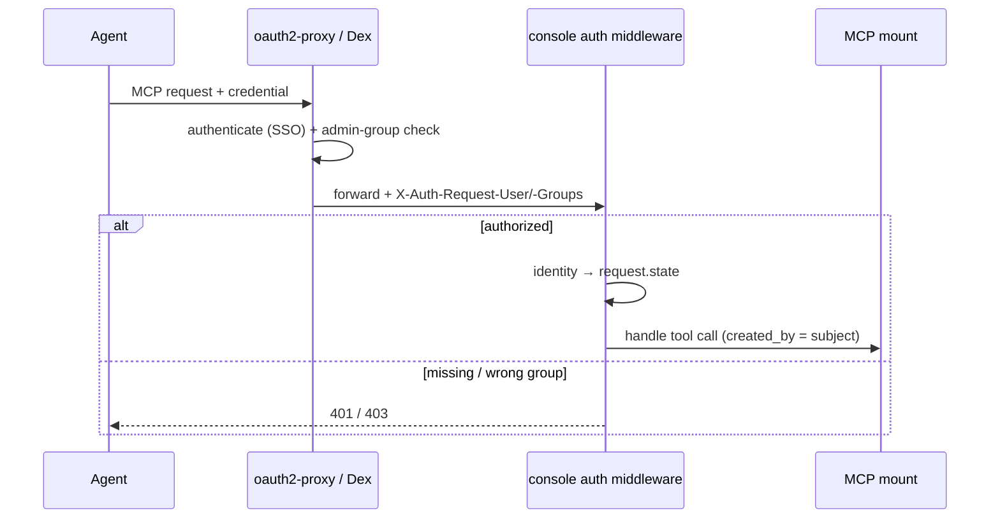
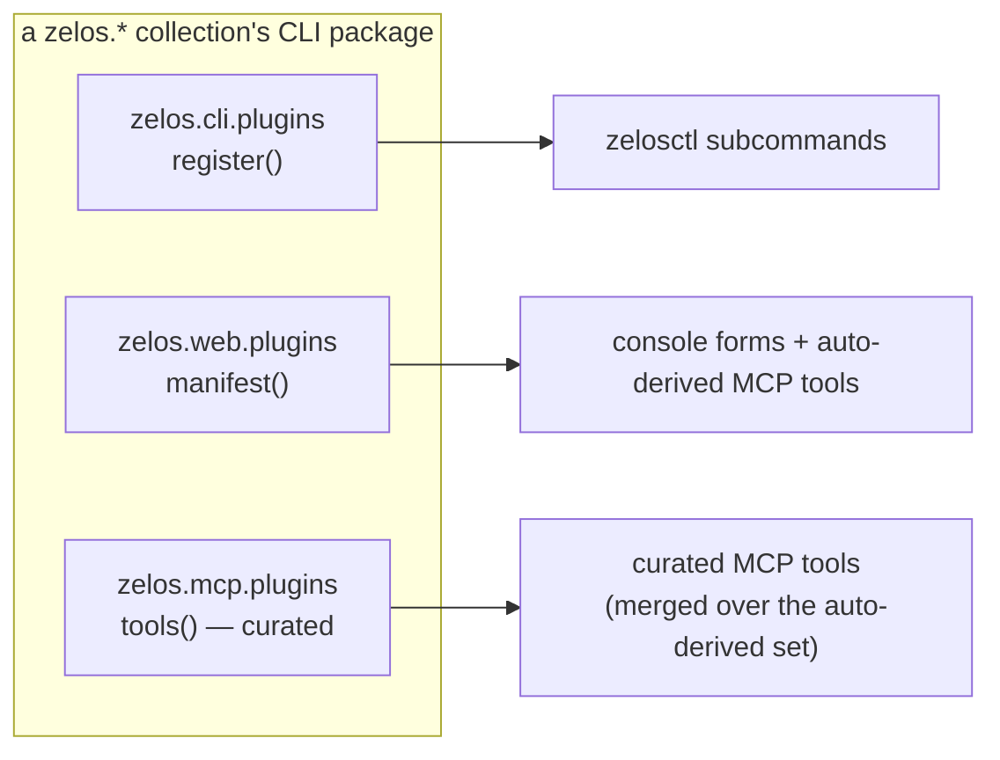

# 21 — The MCP surface (the fourth collection-extensible interface)

How an AI agent **drives the Zelos infrastructure** the same way an operator does: a Model Context
Protocol (MCP) server that layers one tool per verb of every installed collection, integrated into
the operator console. It is the fourth surface over the one verb registry — after the plugin CLI,
the web console, and the OpenAPI contract (companion:
[19-operator-and-cli.md](19-operator-and-cli.md)). Code home:
[`ZelosAI/zelos.common`](https://github.com/ZelosAI/zelos.common) (`zelos_common.mcp`).

## The four surfaces

Every collection declares its verbs **once** (a `VERBS` dict + a `web.py` manifest). Four surfaces
project that single registry — installing a collection adds its verbs to all four with **zero
per-surface code**, exactly as the OpenAPI projection already does.

A `VerbSpec` already carries everything a tool needs: `VerbSpec.to_json()` emits the verb's parameter
**JSON-Schema** (→ the tool's `inputSchema`) and the `read_only` / `danger` / `long_running` flags
(→ MCP `ToolAnnotations` and the inline-vs-job decision). The tool name mirrors the OpenAPI
`operationId` — `proxmox__host_prep`, `foundry__reconcile_gather`, `kubernetes__platform`.

## Console integration (the primary deployment)

The MCP server is **mounted inside the operator console** at `/api/mcp` (streamable-HTTP). It is not
a side-car: it shares the console's live `JobManager` and inherits its authentication, so a **remote
agent drives the remote console operator** — the runs it starts appear in the human's console job
list and obey the same per-environment locks.

- **One namespace of trust.** The agent and the human authenticate through the **same** Dex/oauth2-proxy
  SSO; the agent's identity flows to `created_by` on every job it starts (audit).
- **Shared `JobManager`.** A long-running verb an agent triggers is the same job object the console
  streams live; a second mutating verb on the same environment is refused (`JobConflict`) whether it
  came from the agent or the UI.
- **Non-fatal + optional.** The mount is skipped cleanly if the `mcp` SDK is absent or
  `ZELOS_WEB_MCP=off`; the console runs unchanged.
- **Standalone too.** `zelosctl mcp` runs the same server over **stdio** for a local IDE
  (Claude Desktop / Cursor / VS Code) or `docker run <image> mcp`, and as a backend the
  [zelosmcp](04-components/zelosmcp.md) aggregator can front.

## Executing a verb

A tool call reuses the console's exact execution seam (`web.adapter` + the shared `JobManager`).
Read-only or short verbs run **inline** and return their output; long-running mutating verbs return a
`job_id` the agent polls — mirroring how the web UI submits jobs.

Universal `zelos__*` tools cover the job lifecycle and context: `zelos__jobs_list`,
`zelos__job_status`, `zelos__job_logs`, `zelos__job_cancel`, `zelos__environments`,
`zelos__docs_search`, `zelos__docs_read`.

### Write scope + the danger gate

The tool set is filtered by intent. **Read-only** verbs and non-destructive mutating verbs are
exposed; **destroy-class (`danger`) verbs — `proxmox__wipe`, `*__destroy`, `foundry__reconcile_prune`
— are hidden by default** and only appear when the server runs with `--allow-danger`. Even then the
server re-enforces the console's gate: a danger tool call must pass `confirm_destroy` equal to the
environment name, or it is refused. A `--read-only` mode narrows the surface to inspection only.

## Authentication + audit

Two modes, identical to the REST console: **local-token** (`Authorization: Bearer <token>`, for local
`zelosctl web`) and **oidc-proxy** (the trusted identity headers in-cluster). stdio has no network
auth — its trust boundary is the process/container, the same as running `zelosctl` locally.

## Read-only state as resources

Beyond tools, the server exposes an environment's state as MCP **resources** (`zelos://` URIs) so an
agent can browse without side effects — each backed by the console's own read path:

| Resource | Backed by |
|---|---|
| `zelos://environments` | `web.envstate.list_environments` |
| `zelos://env/<env>/state` | `web.envstate.environment_state` |
| `zelos://env/<env>/reconcile` | `web.reconcile` (desired-vs-actual) |
| `zelos://env/<env>/status` | `web.envstatus` (per-layer facts) |
| `zelos://env/<env>/dns` | `web.dnsrecords` |
| `zelos://docs/<namespace>/<path>` | `web.docs` (paired with `zelos__docs_search`) |

## Extending the MCP — the third entry-point group

Breadth is automatic: a collection's verbs become tools with no code. On top of that, a collection may
contribute **curated** tools — LLM-optimized or composite — via a third entry-point group,
`zelos.mcp.plugins`, mirroring the CLI and web groups.

The reference provider is `zelos.foundry`'s `foundry__env_overview` — one read-only call returns an
environment's state + reconcile summary + DNS, instead of the agent stitching several resource reads.

## Documentation is generated

The per-collection **`interfaces/mcp.md`** reference (tool name, hints, input fields, the universal
`zelos__*` tools, the resource catalog) is emitted by `zelosctl docs generate` from the same manifest
+ the shared `mcp.tools` name normaliser — so the reference and the running server never drift, and
`zelosctl docs check` diffs it like every other generated page.

## Decision log

- **Fourth surface, not a new server** — derive tools from the existing `verb_index()` (the OpenAPI
  projection's precedent) so every collection joins automatically; no `zelos.mcp.plugins` is required
  for breadth (user decision, 2026-07-09).
- **Integrated into the console as the primary path** — mounted at `/api/mcp`, sharing the console's
  `JobManager` + SSO, so a remote agent and the human operate in one job/lock/identity namespace;
  stdio is the secondary local path (user decision, 2026-07-09).
- **Read + safe writes by default; danger opt-in** — destroy-class verbs hidden unless
  `--allow-danger`, always keeping the `confirm_destroy == env` gate (user decision, 2026-07-09).
- **Low-level `Server` + `StreamableHTTPSessionManager`** — the explicit-`inputSchema` path lets the
  tools reuse each verb's existing param JSON-Schema verbatim; `json_response` keeps calls a plain
  request/response that survives the console's auth middleware.
