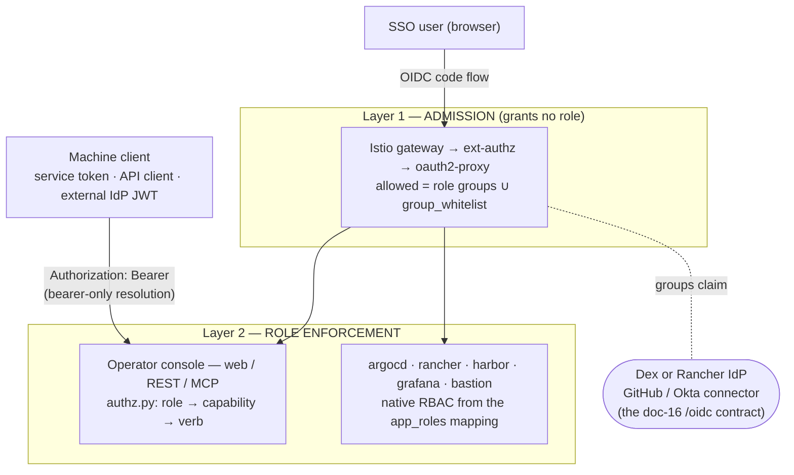
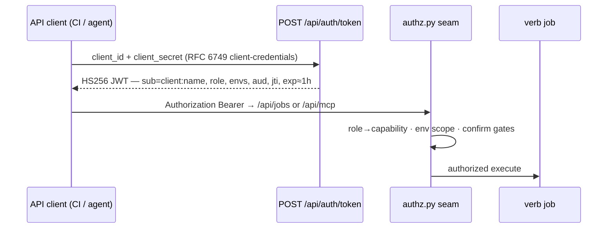

# 22 — Authentication, access control & RBAC (environment platform)

> **TL;DR.** `common.auth` (inventory **format 3**) is the single authentication + RBAC model
> for every Zelos environment. One auth-type **strategy** (OAuth2 or OIDC) with presets for
> **GitHub** and **Okta**; **four roles** (admin / power_user / support / observability) mapped
> from SSO group claims; a **group whitelist** admitted at the gate and forwarded downstream for
> app-layer mapping; and **token-based machine clients** (console-minted service tokens,
> persistent API clients, external IdP JWTs). Enforcement is layered: the SSO gate only
> **admits**, one seam (`web/authz.py`) authorizes every console / REST / MCP action by
> capability, and each downstream app **re-enforces natively** from a per-app role mapping.
>
> **Scope:** this page covers the *environment platform* — the Ansible collections, the
> operator console (web / API / MCP, doc 19/21), and the apps deployed into an environment.
> The zelosai product suite's gateway auth (zelosgateway EA) is a different subsystem:
> [12-auth.md](./12-auth.md).

## Status

| Wave | Content | Status |
|---|---|---|
| **1 — model + rebind** | `common.auth` schema, inventory format 2→3 migration, `environment_facts` derivation, console config form, GitHub **and Okta** presets end-to-end, all sibling collections rebound | **Shipped** (zelos.common ≥ 0.5.0; kubernetes / foundry / bastion rebinds) |
| **2 — enforcement + tokens** | the `authz.py` seam, verb capability annotations, per-caller MCP scoping, service tokens, API clients + `POST /api/auth/token`, console **Access** CRUD, the gateway machine-JWT path | **Shipped** (zelos.common ≥ 0.6.0; kubernetes / foundry / proxmox / bastion) |
| **3 — per-app admission + native RBAC** | dual ext-authz providers, per-app atomic widening, argo-workflows / rancher / harbor / grafana / argocd / bastion role mappings | Contract defined here; in progress |

Wave-1 behavior is **byte-identical** to the previous model: `environment_facts` still emits the
compatibility facts (`github_oauth_resolved_*`, the `oidc_*` parity set of doc 16), so no
downstream template changed.

Wave 2 is likewise **safe to land ahead of the inventory**: with no `ZELOS_WEB_ROLE_GROUPS` the
console falls back to `{"admin": [<admin group>]}` — exactly the pre-RBAC behaviour — and with no
`bearer_bypass_hosts` the gateway policy renders as it always did. What changes immediately is that
the *console* now enforces, so an environment that has only declared `roles.admin` keeps working
and simply has no other roles to grant.

**Until an app re-enforces natively (wave 3), a non-admin role grants nothing beyond the console.**
The SSO gate still admits only the admin group, so `power_user` / `support` / `observability` are
console/API/MCP roles today. Widening the gate before wave 3 lands would hand every admitted user
whatever the app's own default is — which is exactly the escalation wave 3 exists to prevent.

## The model — `common.auth`

Format 3 **replaces** `common.github_oauth` + `common.oidc` with one dict (hard cutover;
`zelosctl inventory migrate` / the console migration verb convert format-1/2 files in place,
preserving comments and `!vault` payloads — unknown sub-keys are nested verbatim and warned
about, never dropped):

```yaml
zelos_inventory_format: 3
common:
  auth:
    strategy: oauth2            # oauth2 | oidc
    preset: github              # github | github_app | okta | oidc | oauth2
    idp: dex                    # dex | rancher — which in-cluster IdP FRONTS the connector

    # Client credentials resolve env(<client_id_env>) → auth.client_id → the sealed
    # common_secrets key named by <client_id_secret_key> (the §9 chain of doc 15).
    client_id_env: GITHUB_OAUTH_CLIENT_ID
    client_secret_env: GITHUB_OAUTH_CLIENT_SECRET
    client_id_secret_key: github_oauth_client_id      # okta preset ⇒ okta_client_id
    client_secret_secret_key: github_oauth_client_secret

    github: { allowed_org: ZelosAI, allowed_teams: [zelos-admins] }   # github / github_app
    okta:   { issuer: "" }        # okta: https://<org>.okta.com/oauth2/default
    oidc:   { issuer: "" }        # generic OIDC preset
    oauth2: { authorize_url: "", token_url: "", userinfo_url: "" }    # generic OAuth2 preset

    groups_claim: groups          # token claim carrying group membership
    username_claim: ""            # "" ⇒ preset default (github: login; okta: preferred_username)
    scopes: ""                    # "" ⇒ derived per idp (Dex vs Rancher parity, doc 16)

    roles:                        # SSO groups granting each zelos role — see the role table
      admin:         { groups: [ZelosAI:zelos-admins] }   # MUST be non-empty (asserted)
      power_user:    { groups: [] }
      support:       { groups: [] }
      observability: { groups: [] }

    group_whitelist: []           # admitted + forwarded downstream; grants NO zelos role

    app_roles: {}                 # {} ⇒ built-in per-app defaults (see the mapping matrix)

    tokens:                       # machine access
      signing_key_secret_key: auth_token_signing_key    # HS256 key, minted by `make seal`
      service_tokens: { enabled: true, default_ttl: 720h, default_role: observability }
      trusted_issuers: []         # external IdP JWTs (Okta CC, GitHub Actions OIDC) — needs egress
      api_clients: []             # persistent, sealed, client-credentials API clients

    cookie: {}                    # optional oauth2-proxy session-cookie overrides
                                  #   {name_prefix, expire, refresh} — defaults __Secure-zelos_ / 8h / 1h
```

Key properties:

- **Strategy vs preset.** `strategy` picks the protocol family (OAuth2 vs OIDC); `preset`
  fills provider-specific defaults. `preset: github` (OAuth2 org/team model) and
  `preset: okta` (OIDC issuer + groups claim) are the two first-class recipes; `oidc` /
  `oauth2` are the generic escape hatches.
- **The IdP fronts the connector.** `idp` chooses which in-cluster IdP (Dex or Rancher, doc 16)
  terminates the suite OIDC contract; the preset configures that IdP's *upstream* connector.
  Dex's connector spec is derived as a fact (`auth_connector`) — credentials are resolved by
  the consuming role at render time and are **never** rendered into a fact.
- **Credential indirection.** `client_id_secret_key` / `client_secret_secret_key` name which
  `common_secrets` keys hold the upstream client credentials, so GitHub and Okta credentials
  keep their established key names (`github_oauth_client_id` / `okta_client_id`) and rotating
  providers is a config change, not a secrets migration.
- **Anti-lockout assert.** `environment_facts` preflight asserts `zelos_inventory_format >= 3`
  *and* `auth.roles.admin.groups` non-empty — an environment can never be deployed with no one
  able to administer it.

## Roles & capabilities

Four roles, ascending; a role is granted by membership in any of its `roles.<role>.groups`.
Verbs (doc 19/21) are annotated with the capability they require; `authz.py` (wave 2) maps
role → capability set at one seam for console, REST API, and MCP alike.

| Capability | observability | support | power_user | admin |
|---|---|---|---|---|
| `READ` — view state, config, jobs, docs | ✓ | ✓ | ✓ | ✓ |
| `DIAGNOSE` — reports, support-bundle, log/status tools | ✓ | ✓ | ✓ | ✓ |
| `OPERATE_SAFE` — restart / recover / kubectl / tunnel (the `tools` verbs) | | ✓ | ✓ | ✓ |
| `CONFIGURE` — config edits, deploys, reconcile, non-destructive apply | | | ✓ | ✓ |
| `DESTROY_TARGETED` — one feature / VM / node (confirm-gated) | | | ✓ | ✓ |
| `DESTROY_ENV` — env-wide destroy, host wipe, bulk prune | | | | ✓ |
| `SECURITY` — secrets lifecycle, auth/RBAC config, TLS/CA, token minting | | | | ✓ |

Enforcement rules (security invariants below):

- **Inference only tightens.** A verb's capability comes from its declarations
  (`security_class`, `destroy_scope`); the name-stem scan that follows can only *raise* the bar,
  never lower it, and a verb matching nothing resolves to `SECURITY` (admin-only). This is what
  catches the verb whose name says nothing about what it does — `proxmox host-prep` runs
  `pveum user token add`, and `bastion sync-users` grants standing gateway access; both are
  declared `security_class` and are admin-only. Only an explicit `destroy_scope: targeted` opens a
  destroy to `power_user`.
- **Confirmation is scoped:** `destroy_scope: environment` verbs require typing the environment
  name (`confirm_destroy`); `destroy_scope: targeted` verbs require typing the *item* id
  (`confirm_target`, checked against the verb's declared `target_param`). Neither satisfies the
  other.
- **Bootstrap stays admin:** the operator container's filesystem-gated `cert_dir/token` is
  break-glass and remains admin; named machine credentials carry an explicit role.
- **Environment scope is not a capability.** A credential scoped to `envs: [alpha]` may still list
  environments and read docs (`env=None` names no environment); it simply sees only `alpha`, and
  every environment-touching route re-checks. An inventory-backed verb invoked with no environment
  is refused for a scoped credential.

Today every collection's teardown verb is environment-wide (`foundry destroy`,
`reconcile-prune`, `proxmox wipe`, …), so `DESTROY_TARGETED` currently grants nothing: no verb
declares `targeted`. The capability exists so that a future single-node or single-feature teardown
can be delegated to `power_user` without also handing over the environment.

## Two enforcement layers — the gate only ADMITS

The SSO gate (Istio ext-authz → oauth2-proxy) is deliberately **not** an RBAC engine: it admits
any member of the role groups ∪ `group_whitelist` and forwards the identity headers. *Who may
do what* is enforced (a) at the console seam and (b) natively inside each app.



**Per-app atomic admission** (wave 3): because a shared oauth2-proxy has one global allow-list,
widening admission for *all* apps before each app re-enforces would be a privilege escalation.
Two ext-authz extensionProviders are registered — the legacy **admin-only** provider and the
**wide** provider (role groups ∪ whitelist) — and each host's require-oauth policy names one.
An app flips to the wide provider **in the same commit** that lands its native RBAC. The
console moves first (it enforces at the seam from wave 2).

**Machine clients skip the gate, on named hosts only.** A request carrying its own `Authorization`
bearer cannot follow the gate's 302 to a login page, so ext-authz is skipped for it — but only for
the hosts listed in `oauth2_proxy.bearer_bypass_hosts` (the operator console). A blanket bypass
would let `Authorization: Bearer x` reach *every* gated app, including one whose own auth mode does
not verify bearers. This is only safe because of security invariant 1 below: the console resolves
identity from the bearer **alone**, and an invalid bearer is a 401 rather than a fall-through to
the (now attacker-controlled) `X-Auth-Request-*` headers. The gateway policy and the console's
bearer-only rule are one change in two repositories; never ship one without the other.

## The group whitelist

`group_whitelist` exists for organizations whose SSO groups are managed centrally: those groups
are **admitted** at the gate and **forwarded** downstream (`X-Auth-Request-Groups`), so an app's
own mapping (`app_roles` or app-native config) can grant them app-level access — but they grant
**no** zelos console/API/MCP role. A whitelist-only user gets app SSO and a 403 at the console.

## App-layer mapping — `app_roles`

Built-in defaults (D6 — overridable per app via `common.auth.app_roles.<app>`), landing per-app
in wave 3:

| zelos role | argocd | rancher (GlobalRole + project) | harbor | grafana | bastion / guacamole |
|---|---|---|---|---|---|
| admin | `role:admin` | `admin` | projectAdmin | Admin | full (superadmins only) |
| power_user | `role:zelos-power` (custom) | `user` + `project-owner` | maintainer | Editor | read + connect |
| support | `role:zelos-support` (custom) | `user` + `project-member` | guest | Viewer | read (no saved passwords) |
| observability | `role:readonly` | `user-base` + `read-only` | guest | Viewer | read (view-only) |

Notes that shaped the matrix: `power_user` is deliberately **not** rancher `restricted-admin`
and **not** argocd `role:admin` — both escalate (cluster delete / RBAC + repo-credential edit).
argo-workflows re-enforces first (`sso.rbac.enabled: false` means every admitted user is
workflow-admin today). Grafana stays view-only until it is a first-class oauth2-proxy-gated
host (its `role_attribute_path` never fires behind the Rancher proxy). support/observability
must never receive guacamole `ADMINISTER` (superadmins can read saved connection passwords).

## Machine access — token clients

Three credential shapes, one seam. All three resolve to the same
`Identity(subject, role, envs)` and flow through `authz.py` exactly like an SSO user.

| Shape | Minted by | Persistence | Air-gapped | Use |
|---|---|---|---|---|
| **Service token** (`zelos_sat_<id>.<secret>`) | console UI / `zelosctl token create` | hashed in `cert_dir/service-tokens.json` | ✓ | ad-hoc automation against one console instance |
| **API client** (client-credentials) | **declared** in `common.auth.tokens.api_clients` + sealed secrets | inventory-as-code — survives rebuilds and fresh `docker run` | ✓ | CI jobs, agents, anything long-lived |
| **External IdP JWT** | Okta (client-credentials) / GitHub Actions OIDC | the external IdP | ✗ (needs JWKS egress) | cloud CI integrating with org SSO |



- **API clients are declared, not minted:** the entry lives in `<env>.config.yml`; `make seal`,
  the CLI, or the console mints the missing `common_secrets.auth_client_<name>_{id,secret}`.
  Because the console reads inventory directly, a client is *persistent by construction* — no
  extra store, and it works in the air-gapped corporate loop.
- **`POST /api/auth/token`** is the one unauthenticated POST in the API (it *is* the credential
  exchange): exact-match public path, TLS-only, rate-limited, constant-time compare, and one
  opaque `invalid_client` for a bad id, a bad secret, or a disabled client. Authentication
  compares against every enabled client without short-circuiting, so response time does not
  reveal which client ids exist.
- **Self-issued tokens need zero dependencies.** They are **HS256 JWTs signed with
  `auth_token_signing_key`** using only stdlib `hmac`/`hashlib`/`base64`. The `alg` header is
  *asserted*, never used to select a verifier (`alg: none` and algorithm confusion are rejected),
  and `exp` is mandatory. Verification accepts a *list* of keys, which is what makes signing-key
  rotation non-disruptive: sign with the new key, verify against `[new, old]` during the grace
  window. The request body is parsed with stdlib `urllib.parse` rather than FastAPI's `Form(...)`,
  which would drag in `python-multipart` — a dependency the air-gapped operator image does not have.
  Only *external* RS256/JWKS verification needs the optional `[auth]` extra (`PyJWT[crypto]`);
  absent, that one path disables with a clear error and everything else keeps working.
- **Revocation is real.** A service token is revoked in its store (the record is retained for the
  audit trail). An API client is disabled in inventory *and* its outstanding tokens are denylisted
  by `jti`/client — a rotation that leaves live tokens valid is not a rotation.
- **Dex registration (D12):** clients marked `dex_register: true` are also injected as Dex
  clients, enabling standard auth-code / device-code flows against the environment IdP. That
  requires Dex `storage: memory → kubernetes` (plus a ServiceAccount and RBAC), because in-memory
  storage drops every refresh token at the next restart. The switch is **not** automatic —
  it is one-way on a live bed, so the deploy *fails* with an actionable message when a
  `dex_register` client exists while storage is still `memory`. Dex has no client-credentials
  grant; the console endpoint remains the machine path.
- **Lifecycle is full CRUD in the web console** (the corporate vehicle — doc 19): an admin-only
  **Access** section lists/creates/edits/rotates/revokes both API clients and service tokens,
  with a copy-once secret reveal and a "pending apply" badge (a declared client is live for the
  token endpoint immediately; its Dex registration takes effect at the next apply). CLI parity:
  `zelosctl auth client list|show|create|update|rotate|delete` and
  `zelosctl token list|create|update|revoke|delete`.
- **Opaque GitHub PATs are rejected** — not JWTs, not verifiable air-gapped.

## Derived facts — `zelos.common.environment_facts`

Wave 1 derives the model once per run (extending the doc-18 fact table); consumers bind facts,
never the raw dict:

| Fact | Content |
|---|---|
| `auth_strategy` / `auth_preset` / `auth_idp` / `auth_username_claim` | the resolved model selectors |
| `auth_role_groups` | role → SSO group list (all four roles) |
| `auth_group_whitelist` | the pass-through whitelist |
| `auth_admitted_groups` | union of role groups ∪ whitelist — **the gate's allow-list** |
| `auth_app_roles` | per-app mapping (built-in defaults merged with overrides) |
| `auth_connector` | the Dex connector spec (`github` \| `oidc` for okta/generic) — **no credentials** |
| `auth_machine_issuers` | `tokens.trusted_issuers` for gateway JWT validation |
| `auth_api_clients` | declared API clients (Dex registration + reconcile) |
| `auth_signing_key_secret_key` | which sealed key signs machine tokens |
| `github_oauth_resolved_*`, `oidc_*` | **compatibility facts** — unchanged names, doc 16 parity |

## Security invariants

Held at every commit of waves 2–3:

1. An `Authorization` header present ⇒ **bearer-only** identity resolution; never fall through
   to the `X-Auth-Request-*` headers (they are attacker-controlled once ext-authz is skipped
   for bearer traffic).
2. Unannotated verb ⇒ `SECURITY` (admin-only). CI gates that every destructive/security verb
   declares `destroy_scope` / `security_class`.
3. Admission is never widened ahead of the admitting app's re-enforcement (per-app atomic).
4. Environment scoping (`envs` on a token) is enforced on the verb path **and** every non-verb
   router (config, editor, secrets).
5. MCP tool-list filtering is UX; `authorize_verb` is the enforcement. An unresolved identity
   denies.
6. `roles.admin.groups` non-empty (asserted) + the bootstrap token staying admin ⇒ no lockout.
7. Query-param tokens are accepted for the WebSocket handshake only, never REST, never logged;
   support-bundles redact tokens and auth headers.
8. `POST /api/auth/token` is the only unauthenticated POST: rate-limited, constant-time,
   short-`exp` tokens carrying `aud` + `jti`; a `jti`/client denylist enables revocation and
   the signing key rotates with dual-key grace.

## Migration

`zelosctl inventory migrate` (CLI) and the console migration verb apply the format ladder
(flat → 2 → 3). The 2→3 step merges `common.github_oauth` + `common.oidc` into `common.auth`,
re-homes the leaves (`oidc.admin_group` → `roles.admin.groups[0]`, `oidc.provider` → `idp`),
preserves comments/`!vault` values, nests unknown sub-keys verbatim with a warning, and stamps
`zelos_inventory_format: 3`. Secrets routing gains `auth_token_signing_key` and the
`auth_client_*` prefix (both → `common_secrets`). A `.bak` is kept; re-running is a no-op.

## Using it

```bash
# mint a role-scoped, environment-scoped credential for an agent or a CI job
zelosctl token create claude-agent --role support --env alpha --ttl 24h

# or a persistent, inventory-declared client that survives a fresh `docker run`
zelosctl auth client create ci-foundry --env alpha --role power_user --ttl 1h
curl -X POST https://<console>/api/auth/token \
  -d grant_type=client_credentials -d env=alpha \
  -d client_id=<id> -d client_secret=<secret>
```

Both drive `/api/jobs` **and** `/api/mcp` at exactly their declared role and environment scope.
The console's **Access** section does the same thing for operators who only have the web UI.
Connecting an agent (Claude Code) to the MCP surface with such a token:
[zelos.common `docs/operating/mcp-claude-code.md`](https://github.com/ZelosAI/zelos.common/blob/develop/docs/operating/mcp-claude-code.md).

## See also

- [12-auth.md](./12-auth.md) — the zelosgateway (product suite EA) auth boundary; different
  subsystem, same suite.
- [16-dns-and-hostname-standard.md](./16-dns-and-hostname-standard.md) — the `/oidc` +
  `/verify-auth` apex contract and the `oidc_*` parity layer this model feeds.
- [18-organization-model.md](./18-organization-model.md) — the variable registry, format-3
  rename rows, reserved names, secrets key inventory.
- [19-operator-and-cli.md](./19-operator-and-cli.md) / [21-mcp-surface.md](./21-mcp-surface.md)
  — the verb surfaces `authz.py` guards.
- [17-network-access-gate.md](./17-network-access-gate.md) — the network-layer gate in front
  of all of this.
